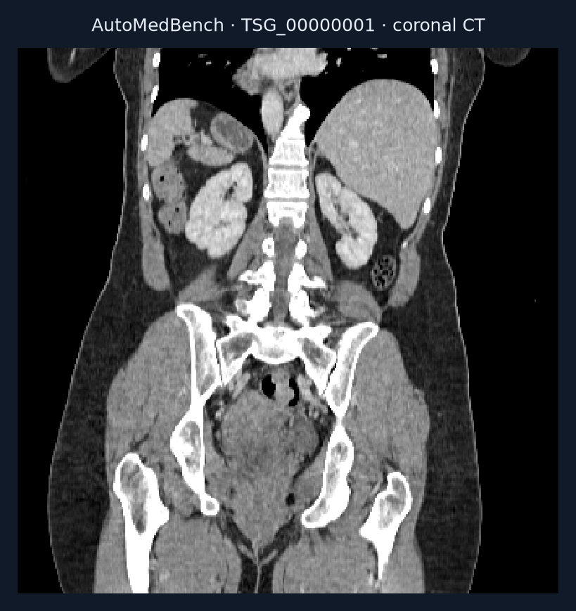
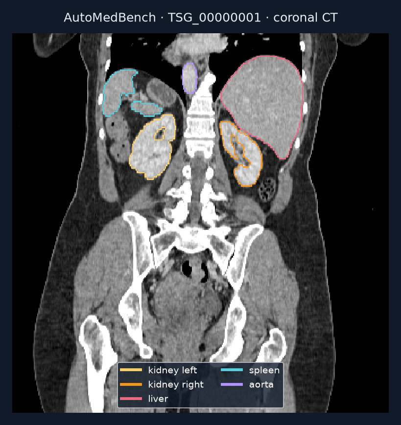

# Build a multi-organ CT segmentation pipeline

Produce a 3D integer-label map assigning CT voxels to 117 anatomical classes.

## Value

Organ masks localize anatomy for measurement or review. This task evaluates whether an agent can assemble and validate a working research pipeline.

## Given

### Original data

Forty CT cases in the packaged Lite release. This example is TSG_00000001, mapped by the release to TotalSegmentator source s1366.

### Supplied helpers

Lite instructions point to TotalSegmentator v2, explain installation/cache conventions, and describe remapping model labels to the benchmark scheme.

### Callable tools

A coding environment for setup and inference. Model weights and runtimes were not downloaded for this survey.

### Reference-only material

Masks in private/ are evaluator references, even though they are downloadable for offline scoring.

## Task specification

Plan, set up, validate, infer and submit within the configured 3,600 seconds. Preserve image geometry and remap labels correctly.

## Expected output

One dseg.nii.gz per CT, with integer values 0–117; 0 is background.

## Evaluation

The config specifies mean Dice over classes with nonempty reference masks per patient. Workflow evaluation is separate from this overlap score.

## Visual explanation

### Workflow

- CT + model guidance
- Set up, validate and infer
- Multi-class organ map

### Input

Native 1.5 mm CT, coronal plane 164; window −160 to 240 HU. This plane was selected post hoc using kidney references. One plane of a 333 × 333 × 336 volume; right increases rightward, superior upward.

### Supplied helpers

Model and label-remapping guidance are supplied; this patient's reference masks are not. The model's native label numbers must be converted before submission.

### Reference or output

Five downloaded references: both kidneys, liver, spleen and aorta. The release lists 78 classes present in this case, out of 117 possible. A partial illustration, not a complete reference set or agent prediction. TotalSegmentator via AutoMedBench Lite; CC BY 4.0.

## Conditions

| Condition | Supplied help | Work remaining |
| --- | --- | --- |
| Packaged Lite | TotalSegmentator guidance + label conventions | Set up, preserve geometry, remap labels and submit. |

## Difficulty

A plausible mask can fail if class numbers or geometry are wrong. The task requires much more output coverage than the five structures shown.

## Sources

- [Preview image notices](../../../presentation/task-explorer/assets/NOTICES.md)
- [Preview image manifest](../../../presentation/task-explorer/assets/manifest.json)

- [Pinned config and label map](https://huggingface.co/datasets/MitakaKuma/AutoMedBench-Lite-release/blob/8928073d5c3f3b842a4a4278d9b44f6e8ceaa9c5/benchmarks/AutoMedBench-segmentation/eval_seg/tsg-multiorgan-seg-task/config.yaml)
- [Lite supplied guidance](https://huggingface.co/datasets/MitakaKuma/AutoMedBench-Lite-release/blob/8928073d5c3f3b842a4a4278d9b44f6e8ceaa9c5/benchmarks/AutoMedBench-segmentation/eval_seg/tsg-multiorgan-seg-task/lite_s1.md)
- [Data card and attribution](https://huggingface.co/datasets/MitakaKuma/AutoMedBench-Lite-release/blob/8928073d5c3f3b842a4a4278d9b44f6e8ceaa9c5/DATA_CARD.md)
- [Sample download and rendering receipt](../samples.json)

## Coverage

One illustrated case from the 40-case Lite segmentation track. The Lite release has seven tracks; the separate Full release defines 48 tasks with Lite and Standard conditions.

## Gaps

Only five reference masks were downloaded. No model run, full-case scoring or private-reference isolation audit was performed.

## Cases

Forty scans share the Lite segmentation task. TSG_00000001 has a local illustrated example; the other scans are indexed only.
