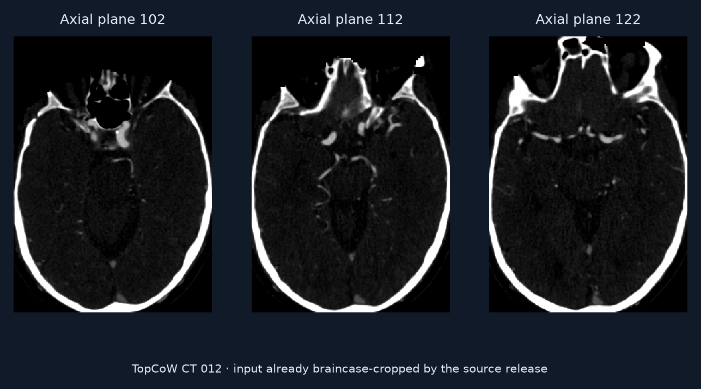
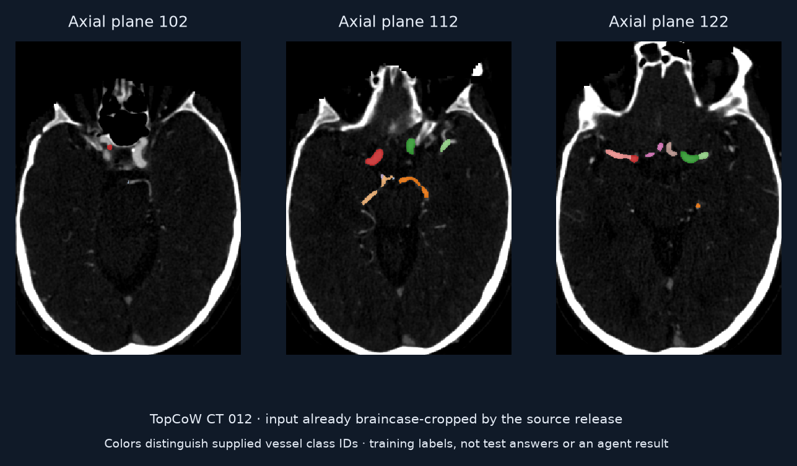

# Learn to label the brain’s arterial ring in CTA

Build a segmentation model that assigns anatomical vessel classes in Circle of Willis CT angiography.

## Value

Named vessel maps help describe cerebrovascular anatomy. This task tests medical ML engineering across training and unseen predictions.

## Given

### Original data

Labeled training CTA volumes and test CTA volumes.

### Supplied helpers

Training segmentation labels, the challenge description and submission conventions. Test labels are withheld.

### Callable tools

An ML engineering environment for preparing data, training models and producing competition submissions.

### Reference-only material

Training labels are supplied assistance; test labels are withheld for grading.

## Task specification

For TopCoW track 1 task 1, predict multiple vessel classes in the input image geometry.

## Expected output

submission.csv linking patient IDs to integer-label NIfTI masks in predictions/.

## Evaluation

The task description names mean Dice as its primary metric. A separate audit of the actual grader is still needed before exact replay.

## Visual explanation

### Workflow

- Training CTAs + labels
- Build and train a model
- Masks for test CTAs

### Input

TopCoW 2024 CT 012, reused from our retained download and rechecked against its hashes. Source volume is braincase-cropped. Planes are 5 mm apart; middle plane selected post hoc from training labels. Right increases rightward, anterior upward.

### Supplied helpers

Colors distinguish source vessel classes. Training labels help learn anatomy; they do not answer held-out cases. This is the named upstream dataset, but membership in ReX-MLE’s prepared split is unverified.

### Reference or output

No model training or held-out predictions were produced. The supplied-helper view is a training reference, not a test result.

## Conditions

| Condition | Supplied help | Work remaining |
| --- | --- | --- |
| Competition workflow | Labeled training cases + task definition | Develop, train, validate and submit a generalizing model. |

## Difficulty

The agent must develop a pipeline that generalizes beyond training examples; this is much larger work than inspecting one supplied scan.

## Sources

- [Preview image notices](../../../presentation/task-explorer/assets/NOTICES.md)
- [Preview image manifest](../../../presentation/task-explorer/assets/manifest.json)

- [TopCoW task description](https://github.com/rajpurkarlab/ReX-MLE/blob/b3d8f7c3ff1df5af46d8f3e5312760af3ad18a53/rex-mle/rexmle/challenges/topcow-track1-task1/description.md)
- [Challenge catalogue](https://github.com/rajpurkarlab/ReX-MLE/tree/b3d8f7c3ff1df5af46d8f3e5312760af3ad18a53/rex-mle/rexmle/challenges)

- [TopCoW release and terms, Yang et al.](https://zenodo.org/records/15692630)
- [Retained download provenance](../../../docs/evidence/br030-sources.json)
- [Sample download and rendering receipt](../samples.json)

## Coverage

Also: stroke, pancreas, dental, cell/pathology, enhancement and other vessel challenges; 20 challenge tasks in the inspected tree.

## Gaps

Native upstream example is available. Prepared split and grader still need inspection for exact replay. TopCoW requires source attribution and permission for commercial use; the retained derived PNG previews preserve those restrictions. Raw data are not bundled, and no benchmark run is represented.
