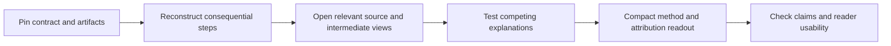

# Trace-analysis regression: investigation and proposed repair

2026-09-23 · Status: user accepted the repair; skill v1.1.0 implemented.
The model-by-skill comparison remains unrun. The investigation below records the
pre-repair state; implementation notes follow at the end.

**The regression is real in visual inspection, explanation structure and claim-level traceability. A concrete skill weakening is established; the independent effect of changing the driver model is not.** The WSI analysis contains useful calculations, so discarding its findings would be unjustified.

Sources: [Propose WSI agent tests](codex://threads/01a0cbf7-5068-7001-90be-102123fff079), [Review Longitudinal CT Cases](codex://threads/01a0c4d1-741f-76e3-9023-1064e5a9a0c5). Local [audit receipt](../.local/trace-analysis-regression-2026-09-23/receipt.json) pins observed session prefixes and source artifacts; [historical skill diff](../.local/trace-analysis-regression-2026-09-23/skill-v1.0.0-to-v1.0.1.diff) comes directly from Git.

## What changed

| Dimension | Older CT analysis | Newer WSI analysis | Assessment |
| --- | --- | --- | --- |
| Main driver | `gpt-6-astra`, xhigh | `gpt-6-sol`, xhigh | Verified in turn metadata; effort did not drop. |
| Scope | Two solver runs on one CT pair | Five conditions across four pathology tasks | Different breadth and modalities; uncontrolled comparison. |
| Image inspection during the dedicated trace turn | Four image opens: saved solver montage, two existing diagnostic views, one newly generated coordinate comparison | Zero image opens | Concrete workflow omission. Earlier WSI synthesis opened two overview figures; the whole session was not image-free. |
| Method reconstruction | Ordered mask construction/cleanup; before/after measurements; explicit candidate rejection and registration distinction | One workflow-table row per condition; derived geometry, class and matching statistics | WSI has mechanisms, but fewer intermediate examples and weaker reader visibility. |
| Evidence navigation | 30 selected ATIF steps with IDs, timestamps, exact calls/messages and source hashes | Attempt IDs and aggregate diagnostic counts; separate manifest hashes whole trajectories | WSI provenance exists, but lacks claim-to-step navigation. |
| Presentation | Method sequences, per-instance table, attribution matrix, targeted figure; still too much prose | Tables and two inherited overview figures; long paragraphs inside cells/sections | Adding tables alone will not repair this. Neither output has the desired concise flowgraph/pseudocode treatment. |
| Context compaction in dedicated trace turn | None | One, near the beginning | Additional confounder; no proof it caused the omission. |

The WSI solver was Astra medium. That is distinct from the Sol xhigh driver writing the analysis. The older CT trace compared Astra-medium and Sol-xhigh solvers; solver-model differences cannot diagnose driver quality.

## The skill history supplies a specific mechanism

Commit `8035485` introduced `explain-medical-evidence` v1.0.0. Commit `2693e1d` changed it to v1.0.1. The installed and repository copies currently match.

| v1.0.0 instruction | v1.0.1 change | Consequence for the contract |
| --- | --- | --- |
| Inspect actual source/result/GT artifacts when available | Explicit action deleted; weaker preference for source-derived visuals remains | Existing figures can be cited without reopening the evidence needed for a new mechanism claim. |
| Test explanations against data, GT, instruction, scorer, tools, runtime and agent behavior | Explicit cross-layer check deleted | The mode reference still names the layers, but provides no completion criterion for checking alternatives. |
| Prefer an at-a-glance table, compact bullets and decisive visuals | Replaced by generic compact structure | No explicit help resisting paragraph-heavy summaries. |

The change was labeled a patch but altered substantive behavior instructions. The surrounding docs still require inspection and mechanisms; this is weakened and fragmented guidance, not total removal of the evidence standard.

The v1.0.1 trace mode asked for a linked observable artifact and alternatives but had no explicit image-opening requirement, method reconstruction format, source-locator convention or efficiency diagnostic. Its instruction to read only the selected section could also hide the result mode's stronger representative/failure-view advice. The [current trace mode](../skills/explain-medical-evidence/references/modes.md) incorporates the repair.

**This was not the first invocation.** In the older CT task, the dedicated trace analysis preceded the skill. A later curation turn loaded **v1.0.0** at 2026-09-22 05:12 UTC (13:12 Shanghai) and subsequently opened its comparison figure. The newer WSI trace turn loaded **v1.0.1**. This supplies an earlier successful use, though not a controlled skill comparison.

## What is missing from the WSI readout

| Existing finding worth retaining | Missing explanatory evidence | Smallest useful repair |
| --- | --- | --- |
| HuBMAP: 13 missed centroids inside generated crop rectangles | Exact solver-displayed crop, resolution and object visibility; recognized/rejected versus simply unmarked | Inspect a missed and a matched object in their delivered views; trace their candidate/output status. |
| TIGER: two residual code errors at nearby centers | Local image/mask/point boundary view; compact account of the lookup | Show both centers and the mask boundary; explain the two-coordinate lookup in pseudocode. |
| CAMELYON: unhit polygons inside a broad low-resolution crop, absent from logged detail crops | Delivered low-resolution crop and overview of subsequent detail footprints | Link the display call and crop footprints; separate geometric containment, image delivery and review at useful resolution. |
| HiESD: broad polygons, two absent output codes, class confusion | Link inspected tissue/candidate decisions to drawing primitives and resulting class map | A focused source/reference/output crop plus compact confusion table; leave unresolved recognition-versus-drawing attribution explicit. |

The existing HuBMAP overview shows the lower-edge unmatched cluster clearly, but does not let a reader inspect disputed morphology. The old CT coordinate figure directly tests a proposed mechanism: the same scanner coordinate selects a different anatomical plane. These are different explanatory jobs, not merely different figure counts.

The WSI efficiency claim also needs narrowing. Manual transcription is observable; avoidable cost is not established by naming it. The analysis should identify repeated work, a failed operation, correction cost, discarded intermediates or a tested alternative. The out-of-bounds CAMELYON crop is a concrete cost; a generic assertion that hand marking is inefficient remains a hypothesis without a comparator.

## Proposed skill v1.1.0

Keep the single skill and existing finding/manifest architecture. Put common evidence obligations in SKILL.md; put trace-specific output details in the trace-mode reference. Avoid another parallel report system.



Proposed trace-mode contract:

1. **Reconstruct the method.** Input → selection/transform → intermediate → output. Use a small flowgraph for branches or comparisons, pseudocode for consequential calculations, compact bullets for a linear method. Omit routine chronology.
2. **Inspect the evidence that decides the claim.** Open source/result/reference or saved intermediate views at useful scale when available. State exact path, coordinates, crop/resize and role. Reuse a sufficient inspected view; do not manufacture an arbitrary figure quota. Mark unavailable evidence explicitly.
3. **Separate exposure levels.** Generated crop ≠ delivered image ≠ discernible target ≠ attended/recognized target. Establish each supported level from its own evidence.
4. **Give each material attribution a locator.** `claim → attempt + step/line + artifact → observation → alternatives → confidence → next discriminating check`. Hashes verify sources; step links make the explanation inspectable.
5. **Explain inefficiency separately.** Report measured repetition/corrections/discarded work and its consequence. Label suggested faster methods as untested; do not equate manual work or many calls with waste.
6. **Deliver a compact readout.** Condition key, method comparison, decisive visuals and attribution table; short phrases permitted. Put shared caveats once, and local caveats next to the affected claim. Keep detailed provenance/reproduction in linked material.
7. **Check explanation completeness before closeout.** A valid manifest or passing repository tests does not establish visual grounding or a useful explanation. Every requested task/condition must have a method and a supported attribution or explicit unresolved status.

Retain the existing boundaries on frozen scores, private references, scientific comparability and new launches. Add the user's feedback to the canonical ledger under invoked version **1.0.1**, status **open**; record the later resolution version only after implementation. The installed copy should then be synchronized and checked against the canonical skill.

## Example of the intended density

**TIGER tissue-supplied method** — enlarge ROI tiles → mark cell centers → map to ROI coordinates → sample supplied mask → submit.

```text
predicted_code = tissue_mask[predicted_center]
reference_code = tissue_mask[matched_reference_center]

nearby centers can cross a tissue boundary
    → localization match succeeds
    → compartment-code comparison fails
```

| Observation | Supported attribution | Unresolved |
| --- | --- | --- |
| Two roi3 mismatches; centers 1.4 and 3.6 pixels apart; each submitted code equals the mask at its predicted center | Different sampling positions across a compartment boundary | Whether the cell's preferred biological compartment agrees with either center convention |

This is a formatting example from the existing diagnostic receipt, not a new visual/clinical validation. A completed repair would place the actual boundary crop beside it and link the exact lookup command.

## Separate the model effect with a bounded comparison

The two historical tasks do not isolate model effects: model, skill, modality, breadth, context and output reuse changed together. Official [OpenAI model guidance](https://developers.openai.com/api/docs/guides/latest-model) likewise recommends evaluating prompting with the chosen model and workload; it cannot determine why these particular reports differ.

After the proposed skill is implemented, use one fixed saved WSI evidence bundle in fresh analysis contexts:

| Driver, both xhigh | Current skill v1.0.1 | Proposed v1.1.0 |
| --- | --- | --- |
| Astra | A | B |
| Sol | C | D |

Hold prompt, evidence, tools, budgets and all other instructions constant. Pin the skill bytes. These are **analysis-only** runs over saved outputs, not new medical solver trials. Four runs provide an initial screen, not a reliable ranking; repeat disagreements before adopting a lasting routing policy.

Blind review should judge: correct method reconstruction; actual relevant visual inspection; checkable claim-to-step links; alternatives/disconfirming evidence; efficiency claims supported by measurements; compact readable output. Do not score tool-call count, word count or figure count as quality by themselves.

Interpret within-driver changes to assess the skill; within-skill changes to assess the driver; differing skill gains to assess interaction. If an immediate operational fallback is needed, Astra xhigh is the previously observed stronger driver for this workflow, while still subject to the repaired evidence contract. No default model setting was changed by this investigation.

## Audit boundary and reopening

- Comparison anchored to WSI analysis final at local rollout line 3595, CT dedicated analysis final at line 1765, plus the later CT skill read at 3699/3703 and image open at 4262.
- The task reader returned empty item arrays for the latest WSI analysis, so the local rollout supplied the complete evidence. Selected session prefixes are hashed to tolerate later appends.
- Read saved reports, receipts, skill versions and observable tool calls; opened one WSI overview and the CT coordinate diagnostic. No new medical inference or raw-score recomputation.
- Preserved existing edits to AGENTS.md and source-package-quality.json. This proposal does not edit the skill, rewrite either scientific finding, or launch the comparison.
- Reopen when the user selects implementation, a same-evidence comparison is available, or a repeated omission survives the revised contract.

## Accepted repair — 2026-09-23

- **User decision:** “seems correct, go fix” in the [investigation task](codex://threads/01a0ccbc-553f-73b2-ae3c-978057811f8a).
- **Implemented:** skill v1.1.0 restores shared inspection, alternative testing and
  compact presentation; trace mode adds method reconstruction, exposure levels,
  exact claim locators and measured efficiency. Its completion check distinguishes
  explanation quality from manifest/test success.
- **Maintenance:** the feedback ledger retains the invoked version 1.0.1 and
  identifies 1.1.0 as the instruction repair. Shared evidence guidance links the
  trace contract; skill lifecycle guidance protects requirements during future
  consolidation. No duplicate report system or wording-matching test added.
- **Review scope:** checked against the four observed WSI explanation gaps and the
  CT intermediate-operation example. This is an instruction review, not a fresh
  model evaluation. The proposed matched comparison remains separate.
- **Concurrent work:** the other task's WSI specification/reference audit, findings
  and reviews remain with that owner.

### Follow-up: context, specification and reference attribution

The user explicitly restored the requirement from
[Consolidate research skills](codex://threads/01a0c710-a53a-7740-9d27-601f8cd9f07f):
context problems, instruction problems and GT problems remain live alternatives.
That discussion had already proposed a proportional reference-fitness check in
every result analysis, which the user accepted. A generic “test alternatives”
bullet was insufficient to preserve that decision.

v1.1.0 now checks the actual solver-visible package against instruction/scorer
semantics and the source annotation protocol. It asks what extra information
annotators had, whether the target is identifiable from the supplied input, and
whether geometry, label mapping, exclusions or reference coverage are defective.
Attributions retain supporting evidence, counterevidence, status and unresolved
gaps. Missing context can limit an endpoint without making the whole task
impossible; reference disagreement proves neither model failure nor bad GT.

The shared visual rulebook restores all seven requested perspectives: task,
success example, result quality, failure, run comparison, GT consistency and
agent methodology. Stage funnels locate observable losses; they do not identify
causes by themselves. GT claims use source provenance and counterevidence, with
technical proof or appropriate clinical adjudication as applicable.
