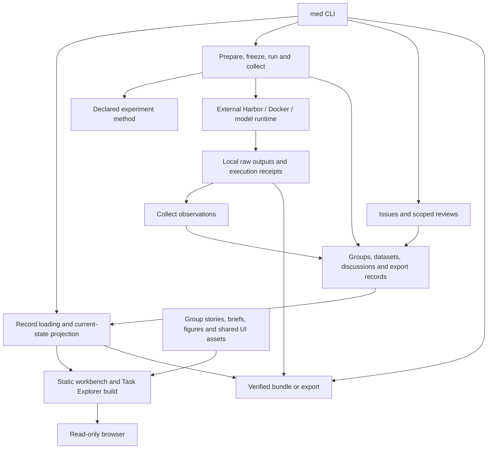

# Architecture

tb3-medical is a local, file-backed research workbench. Groups own the scientific
question and evidence; the Python package provides a common workflow; a static
frontend makes the records and explanations browsable. JSON, TOML and Markdown
source records are authoritative. There is no separate database or application
server holding research state.

Read this page for component responsibilities and data flow, the
[repository layout](repository-layout.md) for file placement, and the
[daily workflow](workflow.md) for commands. [Governance](governance.md) defines
evidence retention and ownership.

## System map

Arrows show service calls and data flow, not a strict import hierarchy. In
particular, method adapters call workflow services when a replay must append an
observation. A static page build is derived output; it does not execute studies or
write research decisions back from the browser.

## Research records and current state

| Entity | Responsibility |
| --- | --- |
| Group | Enduring question and ownership of ideas, methods, experiments, findings and presentation. |
| Idea and decision | Proposed work, prior findings, disposition and who accepted or recommended it. |
| Dataset | Source/release, sample selections, receipts and access/reference limits. Experiments own exact transformations and solver visibility. |
| Experiment | A defined condition or comparison, protocol, task inputs and declared execution/reproduction support. |
| Freeze and attempt | Exact task-file identity and one execution under a recorded model/runtime condition. |
| Evaluation | An observation about an attempt, such as execution status, scored result or saved-output replay. |
| Issue and review | A problem affecting named evidence and a scoped assessment of what conclusions remain supported. |
| Finding and export | A claim or package with explicit links to the experiments it depends on. |

[core.py](../src/tb3_medical/core.py) discovers records through `RECORD_GLOBS`,
validates their declared kind and required fields, and rejects duplicate IDs.
`projection()` combines stored decisions, evaluations and reviews into `current`
state for the CLI and presentation. [vocabulary.json](../src/tb3_medical/vocabulary.json)
defines shared status axes; the [status guide](status-vocabulary.md) explains them.

The latest execution/result observation governs an attempt. A replay or trace
analysis is a separate observation, not a fresh execution. Reviews propagate
attention through explicit experiment links without rewriting original scores.
Inspection reads stored metadata and timestamps; it does not poll jobs or audit
all raw files. Missing local inputs are reported by the operation that needs them.

## Package responsibilities

The installed entry point is `med = tb3_medical.cli:main` in
[pyproject.toml](../pyproject.toml). `core.workspace()` finds
[workbench.toml](../workbench.toml) above the current directory, or uses `--root`.

| Component | Owns |
| --- | --- |
| [cli.py](../src/tb3_medical/cli.py) | Argument parsing, service dispatch, printed results and exit status. `build_parser()` does not execute commands. |
| [core.py](../src/tb3_medical/core.py) | Record validation, relationships, current-state projection and idea/decision/issue/review writes. |
| [storage.py](../src/tb3_medical/storage.py) | Workspace path containment, serialization, SHA-256, atomic exclusive publication and explicit replacement writes. It knows nothing about experiments or runtimes. |
| [workflow.py](../src/tb3_medical/workflow.py) | Scaffolding, preparation dispatch, task snapshots, controls, execution, collection, qualification and replay provenance. |
| [methods.py](../src/tb3_medical/methods.py) | `ExperimentMethod` and explicit `landmarks` / `task_package` adapters for prepare, evaluate, replay and view. |
| [harbor.py](../src/tb3_medical/harbor.py) | Read external Harbor results and classify execution/result evidence for collection. |
| [landmarks.py](../src/tb3_medical/landmarks.py), [scoring.py](../src/tb3_medical/scoring.py), [score_ct.py](../src/tb3_medical/score_ct.py), [score_mri.py](../src/tb3_medical/score_mri.py) | Native landmark inputs and views, answer contracts and scoring. |
| [task_package.py](../src/tb3_medical/task_package.py), [packaging.py](../src/tb3_medical/packaging.py) | Portable task recovery/evaluation and selected-input exports with manifests and hashes. |
| [evidence.py](../src/tb3_medical/evidence.py) | Pinned evidence inventories and explanation artifacts. |
| [presentation.py](../src/tb3_medical/presentation.py), [task_catalog.py](../src/tb3_medical/task_catalog.py), [task_briefs.py](../src/tb3_medical/task_briefs.py) | Workbench build, composed task catalogues, validated briefs and the Task Explorer. |
| [presentation_contracts.py](../src/tb3_medical/presentation_contracts.py), [frontend.py](../src/tb3_medical/frontend.py) | Canonical typed browser payloads, runtime validation, generated TypeScript and verified frontend build assets. |
| [datasets.py](../src/tb3_medical/datasets.py), [dataset_previews.py](../src/tb3_medical/dataset_previews.py), [media.py](../src/tb3_medical/media.py) | Dataset source/receipt contracts, pinned previews and explicit local media operations. |
| [workload.py](../src/tb3_medical/workload.py) | Read-only, local workload report over an external Codex Usage Tracker index and workbench med results; generated output stays under `.local/`. |
| [presentation/](../presentation/README.md) | React/TypeScript views, shared styles, reusable teaching assets and tour renderers; scientific stories and internal briefs live with groups. |

`types.Document` represents extensible JSON/TOML objects. Checked function
signatures do not replace domain validation: `storage.read_object()` verifies
object shape, then the owning validator checks its fields. `storage.read()` also
supports arbitrary serialized payloads. `core` re-exports existing storage entry
points for callers. The `py.typed` marker ships package annotations; optional
imaging/model dependencies remain separately provisioned and are not validated by
local type checks.

## Execution, presentation and export boundaries

1. **Inspect:** `med list` and `med show` use the record projection. `med check`
   validates records and presentation contracts without launching a model.
2. **Execute an authorized study:** `med run` validates the selected task, checks
   controls for a nondiagnostic model run, freezes exact task bytes and launches
   the declared Harbor executable. A fresh attempt is recorded before execution;
   runtime config/logs/payloads stay under `.local/attempts/`. There is one attempt
   per launch and no automatic retry.
3. **Collect and assess:** collection retains attempt identity and appends changed
   observations; collecting the unchanged latest result is a no-op. Execution
   errors and partial results remain distinct from scorer failure. Issues and
   reviews change supported conclusions without replacing the retained outcome.
4. **Explain:** `med present` builds static pages and `records.json` from records,
   group stories and shared assets. It includes the Task Explorer; `med brief
   build` also builds that explorer independently. `--serve` serves generated
   files on localhost. Local-media inclusion is explicit; builds do not download
   missing scans or perform inference.
5. **Recover or export:** `med bundle` uses declared reproduction support;
   `med export` uses a recipe with pinned Git/artifact origins. Both target fresh
   destinations. `med verify-package` checks a package without discovering a
   workbench first. Verification or saved-output replay does not certify a fresh
   model run or submission readiness. See [reproduction](reproduce.md).

Task instructions and environment inputs are solver-visible; evaluator references
and oracle solutions have separate roles. Group authoring guidance and result
explanations must not silently become solver inputs. Dataset provenance alone
does not define that visibility boundary; the experiment/task contract does.

## Extending the system

Keep command syntax in `cli`, reusable operation logic in its owning service, and
scientific record fields with their validators. Add task-specific preparation,
scoring and inspection to a group method first. Extend `ExperimentMethod` when
another maintained method needs its operations, with explicit selection in
`method_for()`; keep execution and evidence writes in workflow/core services.
An authored task can also declare `task_path` and an explicit `prepare_command`
without introducing a new method adapter.

Use normal package imports for shared code. Two deliberate portability boundaries
remain: `task_package.py` is copied into bundles as `reproduce.py`, and the
[LiteMedSAM adapter](../src/tb3_medical/skills/litemedsam/scripts/segment.py) runs in
its separate runtime. Both stay free of workbench imports. Historical authoring
modules may mutate evidence on import and must not become inspection dependencies.

Update this map when entry points, storage boundaries or component ownership
change. Update the layout guide when a canonical home changes, and use the
[contribution checks](../CONTRIBUTING.md#checks) for the affected surface.
