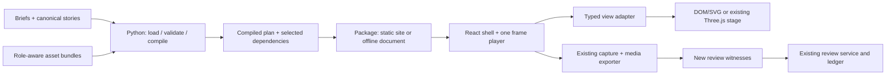

# Explainer review and simplification proposal

**Recommendation:** keep the Python compiler and React/TypeScript frontend.
Simplify their contracts, asset packaging and recipe ownership before changing
frameworks. The largest observed cost is that every story export embeds the
whole renderer/asset library.

**Status:** first vertical slice implemented on 2026-10-02, following the
[user decisions](codex://threads/01a0fa82-af84-78d0-a980-8084b2733954).
The user selected framework + packaging + four restoration explainers, served
loading plus selected offline exports, and a reader redesign. They delegated
reading/evidence/authoring choices and requested several variants followed by one
core design. See [the slice and comparison](#first-vertical-slice) below.
The review measurements remain historical baselines. No application server,
database or medical execution was introduced.

## Review findings

Baseline: `956fa392`. Counts and sizes below were measured locally on 2026-10-02,
not taken from the older completion snapshots. MB means decimal megabytes.

| Finding | Evidence | Consequence / priority |
| --- | --- | --- |
| The scoped authoring queue is complete | Live queue: **154/154 core accepted**, 51 excluded, 205 catalogue entries | Preserve acceptance receipts; this review does not reassign them. |
| Packaging is the first bottleneck | Export JS **113,974,329 B**; Explorer JS **114,028,261 B**; standalone Explorer **169,052,190 B** | **P1:** separate executable code from selected assets. Export JS gzip is 72,744,966 B using Python's gzip defaults; this is a size measurement, not a load-time benchmark. |
| Repeated full-page reloads are fragile | Chromium crashed during the broad source-drawer loop on the 169 MB file; [failure log](../.local/explainer-review-20261002/browser-final-03.log) retained | **P1, unresolved:** reduce payload and measure memory. Resource pressure is a hypothesis, not a diagnosed cause. The harness now checks the common reload path once while retaining exact content/download and Back/close checks for every source. |
| Recipe identity is too close to task identity | **163 bound stories / 159 recipes**, 1,132 scripted beats; 381 files in `task-visuals/` | **P1:** share mechanics by operation and keep scientific differences as typed data or explicit domain functions. Nine bound stories are outside automatic core scope. |
| One addition touches many shared owners | Compiler 8,141 lines; browser contracts 3,553; timeline 1,752; recipe metadata 2,152; view dispatch 1,114; shared visual CSS 5,617 | **P1:** feature-owned definitions with a small exhaustive composition root. Line counts locate concentration; they do not by themselves establish a defect. |
| Display state is partly implicit | Many panels repeat local controls, backward-seek resets and progress-to-frame searches | **P2:** separate canonical frame sampling from reader interaction; share the reset and seek contract. |
| Outer copy misclassified scoped stories | All figures said “not case-specific,” including retained case walkthroughs | Fixed: bound stories say “Task walkthrough · see stated scope”; detailed source warnings remain. |
| Chapter IDs leaked into controls | `Input-Masks`, `Fixed-Connectivity`, etc. | Fixed: readable words and full authored captions as accessible button names; source IDs and timing retained. |
| Scripted stories omitted the class-label disclosure | Full brain classification expected four labels; the broad browser regression found an empty disclosure | Fixed by sharing the existing label-space component between legacy notes and scripted transcripts. |
| Dark ABRA panels inherited light-page heading colors | Full-size mobile inspection of viewer-control showed a low-contrast heading; BI-RADS shared the rule | Fixed both headings to inherit their panel foreground. |
| Short chapter names need an authored field | Four stories use 28 generic `chapter-N` IDs; others expose long source IDs | **P2:** add short authored chapter labels in a future schema slice; keep complete captions and source IDs distinct. |
| Broad verification had drifted | One browser file failed formatting; source-preview check compared authored entities with normalized DOM; legacy motion, image-notice and static-renderer checks assumed entries that have since migrated | Fixed formatting and normalized comparison; explicitly derive a legacy-player fixture and select current native-preview/static entries while retaining the complete production-catalogue traversal. |
| Scope guide led with stale progress | September scope snapshot said 48 reviewed / 106 unfinished | Added a current closeout pointer and marked the old queue as historical. |

Reproduce the measurements and inspect captures in the
[local review inventory](../.local/explainer-review-20261002/inventory.json),
[desktop capture report](../.local/explainer-review-20261002/visual-baseline/index.html)
and [mobile/no-WebGL report](../.local/explainer-review-20261002/audit-baseline/report.json).
These generated files are local evidence, not portable repository fixtures.

**Coverage and limits:** the desktop harness captured all 205 entries (1,220
chapter/static images): 150 planar, 36 spatial and 19 static, with zero reported
browser errors. The 390 × 844 no-WebGL sweep traversed 1,104 available chapter
controls across all 205 entries with no page overflow or page errors. Static
fallbacks intentionally have no active chapter controls. Contact sheets provide
a catalogue-wide layout scan; selected full-size images provide closer visual
inspection. This does not re-adjudicate every scientific source, inspect every
animation frame, replay models or freshly decode all 154 accepted videos.

The freshly built route-only offline page is **114,468,952 B**. It demonstrates
that selecting a single story currently retains the whole export bundle; it does
not establish the future attainable size. The first packaging pilot should
measure its selected dependency closure before setting a reduction target.

### Validation record

- **Repository gates:** `make check PYTHON=python3.12` passed, including 477
  tests; `make js-check`, frontend build, contract drift, documentation and
  staged-artifact checks passed. The large diff in
  `tests/explanation_expansion_browser.cjs` is formatter-only; current bytes were
  compared with the formatter's output from the baseline.
- **Complete browser suite:** passed on the final build: 205 entries, 446
  conditions, 284 source records, 288 local source documents and 71 linked
  experiments. Navigation, exact source downloads, focus, mobile, Chinese player
  controls, fallback behavior, nested static hosting and review classification
  passed with no reported page errors or external requests. Repeated full-page
  reload stress remains unresolved as described above.
- **Canonical route:** the existing story browser suite passed against a fresh
  route export, including seek/capture, lifecycle, localization, mobile and
  fallback behavior. This is a browser/capture check, not a new video receipt.
- **Focused polish:** inspected final ABRA viewer/BI-RADS headings and the four
  brain-classification labels; retained screenshots and computed colors.
- **Evidence:** [review manifest](../.local/explainer-review-20261002/review.json)
  records capture hashes and check logs. Local outputs remain outside tracked
  artifacts. The acceptance ledger, scope JSON and scientific assets are unchanged.

## Preserve what works

- **Scientific ownership:** briefs, experiments and findings own claims; stories
  own narration and timing. Scope, historical acceptance and current render
  validity remain separate concepts.
- **Rendering:** keep one player, clock, stage and export capture bridge. Retain
  planar DOM/SVG, Three.js where spatial interaction helps, and explicit fallbacks.
- **Delivery:** keep a served static site and offline HTML. An optional future
  authoring API should call the same compiler; it should not own another record store.
- **Evidence:** source coordinates, units, missing-data warnings and solver-visible
  versus reader-reference roles stay typed and visible. A reader reveal is a
  presentation rule, not a security boundary for a downloaded file.

## Four small abstractions

| Concept | Owns | Does not own |
| --- | --- | --- |
| **Explainer definition** | Task binding, narrative, beats, family selection and family-specific scientific constraints | Browser lifecycle, capture or acceptance |
| **Asset bundle** | Named assets, hashes, licenses, coordinate metadata, evidence basis, and roles: input/helper/output/reference | Implicit downloads or inference from filenames |
| **Compiled plan** | Versioned browser data, integer timeline, explicit interpolation, selected asset references, display copy and dependency identity | A second scientific record or arbitrary executable authoring code |
| **View adapter** | Typed family content, rendering capabilities, controls and canonical fallback | Global timing, source discovery or ledger writes |

Use ordinary Python modules and a closed TypeScript map. This is an internal
composition boundary, not a runtime plugin system or a general slide language.
Entry ID, story ID, recipe family and asset identity must be distinct: two tasks
may share a view while retaining different assistance, geometry and scoring rules.



### Backend: compiler and packager

Extract the existing implementation along actual responsibilities:

```text
src/tb3_medical/explainers/
  compiler.py        parse story, validate beats, compile timing
  assets.py          resolve declared roles, files, hashes and coordinates
  packaging.py       choose served assets or inline selected assets
  families/          typed content and scientific validators
```

Keep `explanation_stories.py` as a thin import facade while its public callers
migrate. Keep CLI dispatch, batch execution and review services in their current
owners. The first extraction preserves accepted inputs and emitted plans byte
for byte; splitting files alone must not introduce schema 3.

Replace parallel pack-name sets and repeated policy branches with one explicit
family definition containing its content model, allowed scenes/channels,
asset-role requirements and validator. Keep medical constraints in named
functions: “no private reference available” and “reference may reveal only in
this scene” are different rules and must not collapse into a boolean.

Python remains the wire-contract authority. Initially keep generated TypedDict
contracts. For a later family migration, derive both runtime validation and its
generated TypeScript projection from that family's canonical model; retire the
duplicate declaration for that family only after parity checks. Do not maintain
three independently edited schemas or regenerate all old stories to make a
type refactor convenient.

### Frontend: shell, player, views

```text
presentation/frontend/explainers/
  shell/             heading, source notice, chapters, transport, transcript
  player/            absolute frame sampling + reader interaction lifecycle
  views/             family adapters and reusable visual primitives
  registry.ts        exhaustive family -> view mapping; no data imports
```

The shared player should receive **plan + assets + view**, rather than importing
every recipe's scientific payload itself. A view owns typed scene/output
components and capabilities such as spatial, planar or static fallback. Keep
specialized anatomy, reconstruction and WSI views where they teach different
operations; avoid a giant configurable component with hundreds of flags.

Useful shared primitives have concrete semantics: `ImagePlane` with axes/units,
`Comparison` with explicit roles and matched scales, `ArtifactSpec`, `MetricTable`
with denominators, `ReferenceReveal`, and a legend whose marks match the display.
Start with primitives demonstrated by two maintained views.

**Tests:** use three levels: compiler checks for every authored story, stable
family fixtures for playback/interaction semantics, and a complete catalogue
smoke sweep for bindings, source roles and layout. Source-specific assertions
belong beside their stories. Generic navigation checks should assert the declared
condition count and selected family, rather than assume an old medical sentence
or that only one task matches a common word.

**Timeline:** encode interpolation (`linear`, `smooth`, `hold`) on tracks in the
compiled plan. One pure sampler evaluates the absolute frame; the adapter
interprets its named values. Today `view` is linear in some recipes and eased in
others, so merging by channel name would change behavior. Schema-1 route behavior,
cuts, one-frame beats, reference thresholds and final-frame clamping need explicit
parity witnesses before replacing `story-timeline.ts`.

**Interaction:** canonical frame state is a pure function of plan and frame.
Reader controls are a separate state value, reset by documented chapter/backward
seek rules. Capture always uses canonical defaults. A small shared hook can own
resets and nearest-frame selection; a family owns the permitted choices and what
they mean. This prevents controls from accidentally affecting canonical exports.

**Layout:** introduce a few explicit shell layouts (split spatial view,
full-width inspection, protocol steps) with responsive rules and an independent
export composition. Replace task-ID CSS selectors incrementally. Preserve dense
scientific detail in the transcript or a detail panel while the current chapter
shows one operation and its output. Do not remove warning text to make a slide fit.

### Packaging is separate from rendering

| Target | Proposed delivery | Required invariant |
| --- | --- | --- |
| Served static catalogue | Small shell; selected plan/view and content-addressed assets loaded on demand | Relative URLs, nested hosting, missing-asset state, no application server |
| Offline selected story or selection | Build-time inclusion of selected view code and asset closure; inline data | Works from `file://` with network blocked and no runtime imports/fetches |
| Offline full catalogue | Explicit all-content package; deduplicate assets by hash | Completeness is intentional; report its size before export |
| Video / still capture | Use the selected-story package and existing frame bridge | Same canonical plan and renderer as the interactive view |

Changing IIFE output to ESM is insufficient while modules eagerly import asset
JSON and data URLs. First inject selected assets into views, then add separate
packaging modes. Do not count on runtime `import()` in a standalone file. A selected
export's dependency manifest must include only shared code plus its transitive
asset/view dependencies; whole-catalogue validation remains a separate build gate.

## Migration sequence and exit gates

These are proposed implementation slices, not promised completion dates.

| Step | Concrete slice | Exit gate / rollback point |
| --- | --- | --- |
| **0. Baseline and polish** | This review, measured sizes, catalogue/browser checks, wording/test fixes | Retained baseline and focused diff; no acceptance-ledger changes |
| **1. Establish ownership** | Extract compiler/assets/families behind current API; introduce exhaustive view descriptors behind existing player | Same schema-1/2 accepted/rejected inputs and JSON projections; build/type gates; old public calls still work |
| **2. Prove selected packaging** | Inject assets for one symbolic restoration view and one native-image view; emit fresh selected offline packages | No unrelated case assets; offline network-blocked checks, exact asset hashes, canonical-frame/reference parity; report raw/gzip bytes |
| **3. Share repeated mechanics** | CT-ORG, MRI-SR, MSD Pancreas and TotalSegmentator restoration protocols as first family | One layout/reset/step-seek implementation; task-specific shape, units, tiers, missing references and scoring text remain distinct |
| **4. Migrate harder views** | One spatial route/anatomy story, then WSI and mixed-source comparisons; generic timeline only after parity | Frame-state equality at every frame; first/decisive/last screenshots, camera/fallback/mobile/caption/reveal checks; keep legacy adapter until this passes |
| **5. Retire migrated plumbing** | Remove superseded dispatch branches, duplicate contracts and task-ID CSS for migrated families; add served loading | Fresh size report and complete catalogue regression; no silent replacement of historical exports |

**Success criteria:** adding another task in an existing family edits its content,
story and binding, with zero changes to the player, timeline or shared CSS. A new
family adds one backend definition and one frontend adapter; generated contracts
and an exhaustive coverage check connect them. Selected exports contain no
unrelated asset packs. Measure parse/load latency and memory before setting
numeric performance targets; the present audit measured bytes only.

**Rollback and evidence:** choose adapters by explicit family/version while both
implementations exist; retain the old implementation until that slice passes.
Write new exports and regression receipts to fresh locations. Keep old acceptance
receipts tied to their original renderer/source snapshots. Do not rewrite the
154 accepted rows merely because shared code or fingerprints changed; a current
regression receipt can explain the new renderer's coverage. Source disagreements
reopen their own scientific review independently.

## Decision and reopening conditions

The user selected the four restoration entries, framework and selected packaging
as the first release, with a reader redesign. The first slice below implements
that release boundary. The remaining roadmap covers deeper compiler extraction,
native-image families and retirement of the legacy dispatch.

Revisit a server only for an authorized requirement such as browser editing,
remote/private asset access or multiuser state. Revisit family boundaries if a
second migrated example requires many task-name branches. Revisit the timeline
design if parity cannot express a scientific operation without opaque hooks.
No framework/library replacement or wholesale content migration is selected by
this proposal.


## First vertical slice

**Default:** Guided. The assistant selected this after inspecting desktop,
mobile and canonical capture views. Compare and Focus remain available through
`?review=1`; they are review layouts over the same content and player, not
separately maintained products. `?layout=compare` and `?layout=focus` are direct
comparison links. Capture always selects Guided and resets reader controls.

| Variant | Useful property | Improvement comment / disposition |
| --- | --- | --- |
| **Guided** | Named chapters remain visible beside the current explanation | **Carry forward.** Dense metric paragraphs need a dedicated comparison pattern in a later family slice. |
| **Compare** | Adjacent input/output contracts make the relationship easier to scan | Keep as a review option. Promote its paired-contract arrangement when actual geometry or matched native images support it. |
| **Focus** | Wide reading column, larger chapter heading and a calm sequence | Keep as a review option. Number-only navigation loses orientation; do not make it the default. |

Essential source absence is visible before the task and beside the visual. Full
source limitations, units, coordinates, terms, file hashes and the transcript
live in **Evidence & methods**. The four symbolic stories do not acquire pixels,
execute restoration or imply that outputs/private references exist.

### Implemented boundaries

- **Definitions:** [restoration.json](../presentation/explainers/restoration.json)
  owns task-specific display geometry and requested-versus-checked format copy.
  Existing story Markdown still owns captions, narration and explicit timing.
  Adding content for this family does not require player, CSS or timeline edits.
  Automatic beat-duration inference is deferred; it must not silently regenerate
  accepted historical timing.
- **Compiler and bundle:** [explainers](../src/tb3_medical/explainers/) validates
  the selected symbolic closure and projects Python-owned browser types.
  View compilation leaves canonical plans unchanged. The existing schema-1/2
  parser and specialized scientific validators remain in `explanation_stories.py`;
  this slice extracts packaging, not the whole legacy compiler.
- **View composition:** [registry](../presentation/frontend/explainers/registry.ts)
  is a closed family map with no asset imports. Four restoration tasks share one
  reader, protocol controls and operation-frame search. Other recipes retain
  their compatibility adapter.
- **Player:** [use-frame-player.ts](../presentation/frontend/explainers/player/use-frame-player.ts)
  owns the existing clock and lifecycle with injected rendering capabilities.
  Legacy spatial and modern planar views both use it. Canonical capture resets
  reader-only state even when seeking to the same frame. The existing capture
  bridge is shared by both export entries.
- **Packaging:** `med story build STORY --output NEW_DIRECTORY` chooses the small
  restoration entry for migrated stories and emits `package.json` with sizes,
  module closure, selected hashes and dependencies. Legacy selected exports still
  use their full compatibility bundle; no broader size claim is implied.
- **Served catalogue:** `med brief build --delivery served --output NEW/index.html`
  emits relative ESM assets, lazy selected plan/view JSON and deduplicated images.
  Opening a migrated entry does not fetch the legacy renderer. Opening an
  unmigrated entry still fetches its large shared legacy chunks. `med present
  --serve` uses this delivery; ordinary `med present` and `--delivery offline`
  retain the explicit full offline publication contract.

The full served dataset/source index is still embedded; source downloads retain
exact bytes. Native-image family migration and finer legacy chunking are the
next packaging work, rather than a claim that all 154 core views now load cheaply.
The old four task-specific panel files remain temporary compatibility code for
legacy callers until the broader recipe-dispatch migration retires them.

### Verification and review

Run `npm run frontend:build`, `node tests/explainer_framework.cjs`, and the normal
repository/browser gates. The focused browser check builds all four exports and
a nested served catalogue in an ignored output directory. It exercises all five
chapters, three layouts, selection/reset, operation seeking, source reveals,
Chinese source-language disclosure, narrow/no-GPU layout, canonical captures,
missing-resource handling and the selected network closure. It retains full-size
screenshots and a size/request report for inspection.

Historical acceptance receipts remain tied to their original source and renderer.
This is a renderer regression and design comparison, not new scientific
adjudication or replacement acceptance for 154 entries.


**2026-10-02 verification:** `make check PYTHON=python3.12` passed with **484
Python tests**; frontend build/types and `make js-check` passed. The complete
catalogue browser suite passed **205 entries, 446 conditions and 288 exact local
source documents**, with no reported browser errors or remote requests. The
focused four-story suite passed all three layouts with WebGL explicitly disabled,
including every chapter's canonical 1280 × 720 capture and nested served loading.
All **163** canonical JSON projections match the pre-migration baseline when
compiler dependency identities are excluded.

The four selected HTML files are **318,129–319,235 B** raw and
**92,994–93,123 B** gzip (`mtime=0`). The selected renderer JS is **286,400 B**;
served entry JS is **384,870 B** plus the shared player and notice modules. These
are byte measurements, not measured latency or memory improvements. The source
and dataset index still contributes roughly **11 MB** of served HTML. Local
captures, request traces, size manifests and comparison page are retained under
`.local/explainer-framework-20261002/final/`; catalogue browser reports and gate
logs live in its parent. The historical accepted-story ledger is unchanged.
