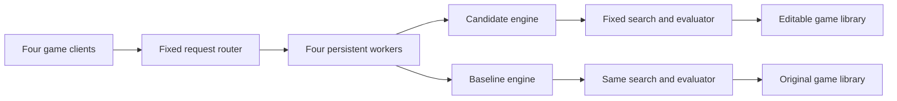

# BR-008 — Frozen server/library optimization: evidence and interpretation

Status: **retired as a hard candidate**. Terra/high passed v2 with 61/64 wins.
A separate post-submission test confirmed a real memory leak; it does not change
the frozen verifier pass. The v1 transport defect and all raw evidence are retained.
The [executable task](../../probes/xiangqi-game-kernel/instruction.md) defines the
intervention and grading contract. The [plan](BR-008-xiangqi-game-kernel.md) owns
the predeclared comparisons and stop rule. This is a user-requested successor, not a benchmark-backed failure.

## Task and hypothesis

Implement the game library beneath a supplied persistent concurrent server and
unchanged Xiangqi searcher. Preserve API/history/immutability/error behavior,
exact legal ordering and fixed-node Decision/progress outputs. Pass then requires
39 actual wins in 64 complete color-paired games against the original library
under the same search and 750 ms decision CPU. Four service workers retain
process-local library caches across games. Transport/scheduling are supplied.

Hypothesis: preserving caller semantics while diagnosing infrastructure cost is
more distinctive than replacing the whole engine. Difficulty remains empirical;
a simple permitted native port is a decisive counter-control.

Each worker runs one engine at a time on its assigned CPU. Request and game IDs
route out-of-order replies. Engine restarts after budget stops are recorded.

## Author reference and cheap control

Author work used the original Qi source and BR-006 insights. It is informed
implementation, not an unaided model trial or proof of a performance upper bound.
No native/search changes were made in Qi or the retired BR-006 task. The measured
wall interval from native work start through reference selection was 10 minutes
39 seconds, including substantial harness construction; active native work was
therefore below the predeclared 60-minute ceiling, but was not separately timed.

| Implementation | Median cold fixed-search CPU | Median repeated-search CPU | Relative cold speed |
| --- | ---: | ---: | ---: |
| B0: original Python library | 2.712 s | 0.266 s | 1.0x |
| P1: prior Qi Python geometry optimization | 0.447 s | 0.244 s | 6.1x |
| C0: direct native port, brute geometry loops | 0.094 s | 0.078 s | 29.0x |
| C1: native piece-directed generation/inverse attacks | 0.078 s | 0.072 s | 34.8x |

Each sample runs the frozen 1,024-node/depth-4 caller in a fresh process, followed
by two identical requests. Four author-validation positions, three repetitions
each: 12 cold and 24 warm samples per implementation. CPU excludes process import
but includes replay/search/result observation. Warm cache reuse changes the work
substantially; these are bounded workload measurements, not general engine speed.
All three optimized variants passed 93 author-validation API cases including
12 fixed-search comparisons. C1 was chosen by cold search CPU before any private
game outcomes; it then passed 124 private API/search cases.

A separate 160-position generation workload returned the same 5,843 legal moves
for all variants. Median cold CPU: B0 241 ms, P1 18.5 ms, C0 5.8 ms, C1 1.05 ms.
All four use the same board/side cache size; warm hits largely remove this cost.
These author-only generation diagnostics use explicit cache clearing.

C0's predeclared eight-family, 16-game validation screen: **15 W / 1 D / 0 L**,
all complete, 915 service requests, 261.5 seconds elapsed. The arena's generic
`pass` field is false because that field requires the final 64-game denominator;
this screen is not a failed control. It is strong evidence against needing a
sophisticated optimization to beat the default implementation.

C1's instrumented profile shows the bottleneck shifting toward the frozen
positional evaluator's king-safety scans and Python call overhead. Native legal
move generation is a small remaining component. Profiler instrumentation changes
absolute runtime; those profiled times are not the speedup measurements above.

## Independent checks and freeze

- Wrong controls rejected: reversed legal ordering, outcome caching solely by
  board/turn, and mutable `Game.apply`.
- Server smoke check: 12 interleaved requests, four distinct reused workers,
  legal outputs, unique routing IDs and clean shutdown. This is process-local
  shared-cache concurrency; same-instance threaded calls are outside the contract.
- 22/22 unchanged upstream static checks passed on a real directory copy.
- [88-file v1 freeze](../evidence/br008-xiangqi-v1-freeze.json):
  `1aeab4f5f951aaf71f286293e23a54c7f3dc158709e5747530258ddd56fc67c3`.
  Harbor 0.14 and 0.18 report the same checksum. BR-006's 84-file freeze is intact.
- [Author selection](../evidence/br008-author-selection.json) and
  [control receipts](../evidence/br008-author-controls.json) retain denominators.

## Transport correction before model trials

The first oracle control completed 63 valid games (61 W / 2 D / 0 L), with one
invalid game: JSON decoding found two concatenated response objects. The fixed
adapter's `print(JSON, flush=True)` could receive the CPU-deadline exception after
writing JSON but before the newline, then append its completion response to that
line. A deterministic interruption at that boundary reproduced the same class of
failure. This invalidates the control; it is a verifier defect, not a solution or
model failure. Raw v1 games, freeze and archive are retained.

The v2 repair uses one atomic small pipe write per fully encoded JSON line. The
same interruption test then returns four complete parseable lines. Exactly two
files differ: the environment and verifier copies of `frozen/engine.py`. All
library, search, books, budgets, thresholds and other task bytes are identical.
The concurrent service check and 22 static checks passed again.

- [Defect record](../evidence/br008-v1-transport-defect.json)
- [88-file v2 freeze](../evidence/br008-xiangqi-v2-freeze.json):
  `5757e6e83d69acb744f469183662ed7410639d8038bf633f1919837db4b36109`

The v1 full run also had many budget-triggered restarts for both players. These
are allowed by the task but reduce actual engine-cache persistence. Retain
per-player forced-stop counts separately from service-worker reuse; do not infer
that a live service worker means its engine never restarted.

## Official controls and model outcome

V2 oracle: **62 W / 1 D / 1 L**, 64/64 complete, reward 1, no infrastructure
exception; 3,615 service requests, 959.0 seconds of match time. Candidate mean
reported completed depth was 2.79 versus baseline 1.73. Candidate/baseline mean
CPU was 698.0/695.8 ms; forced stops were 603/558 across 1,823/1,792 decisions.
Both had a maximum sampled stop CPU of 790 ms. The supervisor rejects updates
observed after 760 ms, but process termination is not a hard real-time 750 ms
guarantee. This scheduling limitation is retained explicitly. Peak engine memory
was below 77 MiB.

V2 no-op: **24 W / 14 D / 26 L**, 64/64 complete, reward 0, no infrastructure
exception; 5,964 service requests, 1,376.1 seconds of match time.
[Full control receipts](../evidence/br008-v2-controls.json) retain both runs.
Terra/high completed normally in **327.2 seconds (5 minutes 27 seconds)** of
agent time. Its independent verifier passed all 124 contract cases, then returned
**61 W / 2 D / 1 L**, 64/64 valid games and reward 1. Verifier time was 810.1 s.

| Frozen v2 entrant | W | D | L | Reward |
| --- | ---: | ---: | ---: | ---: |
| Author reference C1 | 62 | 1 | 1 | 1 |
| No-op | 24 | 14 | 26 | 0 |
| Terra/high | 61 | 2 | 1 | 1 |

Terra used mean 647.1 ms CPU versus baseline 638.3 ms, with reported mean
completed depth 2.21 versus 1.25. Its engines had 37 budget-triggered stops across
1,640 decisions; baseline had none across 1,610. Terra peak RSS was 251.4 MiB,
close to the cap, versus baseline 39.4 MiB. All moves/results replayed successfully.
The observed trace and exact instruction match support execution provenance;
they do not prove provider-side identity or an abstract capability gap.

The snapshot is retired. **Sol was not run**, because the predeclared genuine
Terra-failure trigger was not met. [Final receipt](../evidence/br008-round-summary.json).

## Submitted Terra implementation and auxiliary memory finding

The observed agent is Codex 0.154.0, `gpt-5.6-terra`/high. Its two user messages
contain standard plugin/environment context and the exact frozen instruction.
The trace shows 17 completed commands, two file patches, no delegation, no
explicit profiler invocation and no network-fetch command. It implements a direct
C port of board primitives, retaining the original immutable Game/history logic
and Python LRU wrappers. Installed artifact size is 101,950 logical bytes.
[Trace receipt](../evidence/br008-terra-trace-summary.json).

An author-validation rerun measured median cold fixed-search CPU at 0.290 s for
C1 and 0.301 s for Terra; warm medians were 0.246/0.235 s. These close measurements
are machine/workload dependent and do not establish a meaningful speed ranking.
They were collected after submission; the earlier author selection was unchanged.

Source review found a native reference leak: `py_legal_moves` converts its temporary
list to a tuple but never releases the list. In an **additional diagnostic**, 5,000
distinct positions cycle through a 4,096-entry cache. Terra's RSS rose from 30.7 to
100.6 MiB over 5,000–45,000 calls while cache size remained fixed. C1 stabilized
near 29.9 MiB. The original failed an attempted 150,000 calls under a 256 MiB
address-space cap with `MemoryError`.

A copied artifact with only the missing `Py_DECREF(list)` added returned identical
ordered moves and check status on all 5,000 positions, held near 28.6 MiB, and
completed all 150,000 capped calls. This is a causal diagnostic control, **not an
assisted model submission**. No submitted file or frozen grading file was changed.
[Memory evidence and exact patch](../evidence/br008-terra-memory-diagnostic.json).

The extra diagnostic is not a new pass gate. The official outcome remains a clean
pass; this defect is not retrospectively counted as a genuine failed trial.
Budget-triggered engine restarts limit accumulation, so worker reuse alone is an
insufficient test of sustained bounded memory.

## Design conclusion

The frozen intervention boundary successfully required infrastructure work: Terra
kept the supplied search and state semantics, ported geometry to C and gained
strength under budget. It did not establish difficulty: the cheap C0 control was
strong, and Terra reached almost the author reference score in about five minutes.
One game of difference does not establish a strength ranking.

The server extension exposed a useful **verifier blind spot**. Reusing service
workers does not ensure long uninterrupted engine lifetime, because CPU stops
restart engines. A bounded Python cache also does not bound leaked native-owned
objects. A future, separately frozen server-reliability experiment could specify
and independently test sustained bounded memory without those resets. That is a
new experiment proposal, not a retrospective failure or an added gate here.

## Scope and remaining qualification

No broad Elo, mathematical upper bound or model capability separation is claimed.
The same development-derived opening partition as BR-006 is reused to control
lineage; it is not a fresh or certified training-disjoint suite. The supplied
simplified adjudication is the contract. Final human-authored metadata/README and
full benchmark qualification remain separate from these diagnostic runs.

Raw build/profile/search/game evidence: `runs/br008-author/`. No commits or
publication are implied by this study.
