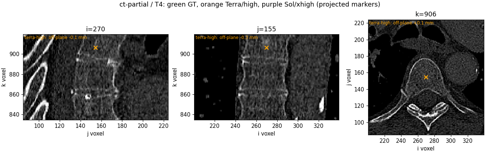
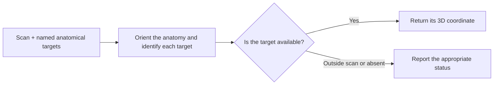
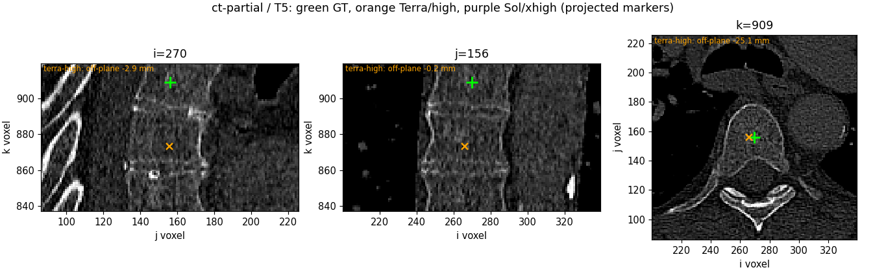

# Find the landmark—and know when it is outside the scan

**Anatomical localization · BR-040 · about 4 minutes**

**Guided illustration:** [interactive tour](../../../presentation/tours/index.html?tour=landmarks) · [landscape video](../../../presentation/tours/exports/landmarks-landscape.mp4) · [portrait video](../../../presentation/tours/exports/landmarks-portrait.mp4). [Sources and reproduction](../../../presentation/tours/README.md).

“Mark the center of this vertebra” sounds like a coordinate task. First, however, the agent must recognize the anatomy, assign the correct name, and decide whether the requested structure is visible at all.

**Sol combined image inspection with external anatomical guidance and atlas registration.** It placed more brain landmarks within the tested tolerances than Terra, while a cropped spine case showed both appropriate abstention and a missed visible target.

## See the task

*A cropped scan can contain real bone while excluding the requested level. This retained comparison shows why recognizing a structure and naming it correctly are separate tasks. Markers are projected into image planes; the scoring distance is fully 3D. VerSe-derived illustration, CC BY-SA 4.0. [Figure provenance](../../../presentation/assets.json).*

## Why this work matters

Named landmarks help align scans and check anatomical correspondence. A point near the wrong vertebra is still wrong, even if it sits neatly inside bone. Cropped images also require recognizing what the scan cannot show.

Human readers use anatomical definitions and multiple image planes. Software can transfer landmarks from a labeled reference brain, or **atlas**, after registering it to a new scan. The AFIDs protocol formalizes 32 brain landmarks and provides placement guidance. Its validation supports millimetric human placement in its study setting; it is not a matched human score on this experiment. [AFIDs study](https://pubmed.ncbi.nlm.nih.gov/31175816/) · [Placement protocol](https://afids.github.io/afids-protocol/afids_protocol/human_protocol.html)

## What the agent received and returned

The three conditions used a full VerSe spine CT, a crop of that same CT, and an AFIDs brain MRI. Each supplied a 3D array, named targets, and an explicit coordinate convention. Spine requests included outside-scan targets and genuinely absent levels under the source numbering system; all 32 MRI targets were visible.

The answer is a list of landmarks, each with a status and, where observed, a native zero-based voxel coordinate. Physical distance is then computed using image geometry. The CT experiment had **24 visible targets** in the full scan and **13** in the crop. [Frozen comparison](../../../docs/research-rounds/BR-040-results.md)

## How Sol worked

**Brain MRI: obtain a useful reference, then adapt it.** Sol consulted AFIDs illustrations and downloaded a labeled generic MNI brain template. It used affine registration—a global rotation, translation, scaling and shear—to transfer the atlas into the subject's space, followed by manual review. A more flexible B-spline refinement failed and was subsequently terminated without saved proposal files; the agent still completed normally.

This is allowed atlas-assisted performance. The preserved source audit found no target-subject annotation retrieval. It demonstrates orchestration of established resources rather than unaided visual localization. [Source-use audit](../../../docs/evidence/br040-source-audit.json)

**Cropped CT: abstain without losing sight of coverage.** Sol made no observed claims for the 11 outside-scan targets. But it missed the visible T5 center. Correct abstention and complete localization therefore need separate reporting.

*The visible-target counterexample complements the outside-scan example above. A quiet answer can avoid false detections while still omitting real anatomy. VerSe-derived illustration, CC BY-SA 4.0.*

## What worked, and what it cost

| Condition | Terra/high | Sol/xhigh |
| --- | --- | --- |
| Full CT: within 5 mm | 2/24 | 1/24 |
| Full CT: within 10 mm | 7/24 | 13/24 |
| Cropped CT: within 5 mm | 1/13 | 4/13 |
| Cropped CT: outside targets falsely located | 1/11 | 0/11 |
| Brain MRI: within 3 mm | 3/32 | 14/32 |
| Brain MRI: within 10 mm | 20/32 | 32/32 |

The MRI mean error was **9.40 mm** for Terra and **3.87 mm** for Sol. Sol's cropped-CT mean was **7.44 mm over 12 returned visible points**; success counts still use all 13 reference targets, including the miss. [Measured results](../../../docs/evidence/br040-results.json)

The MRI attempts used about **4.4 agent minutes for Terra** and **33.5 for Sol**. Atlas retrieval, registration and unsuccessful refinement belong to Sol's workflow cost. Better localization came with more work here, but both model and reasoning setting changed. We cannot isolate the atlas's contribution or call this a universal efficiency tradeoff.

## How the task became more informative

Full volumes retained the spatial context needed for localization. A correlated cropped view added a different requirement: determine when a requested target was unavailable, rather than forcing a coordinate for every name.

Both agents received the same frozen task bytes within each condition. There was one attempt per model and condition, on one CT subject and one MRI subject. The distinctive capability is combining anatomical references, computation and explicit availability judgments; surgical readiness and population performance remain untested.

## Inspect or reproduce

- [Task summary](../../../site_med/task_cards/med_lnd_br040_landmarks_fov.json), [comparison report](../../../docs/research-rounds/BR-040-results.md), and [configuration audit](../../../docs/evidence/br040-config-audit.json).
- [Scoring and local report guide](../../../probes/semantic-landmarks/authoring/br040/README.md); all-point tables and review panels remain in the retained comparison.
- Full source volumes and raw sessions are local-only. [Source, license and reproduction guide](../../../presentation/references.md).

[← Cardiac reconstruction](../../cardiac-motion/presentation/story.md) · [Sources and reproduction →](../../../presentation/references.md)
