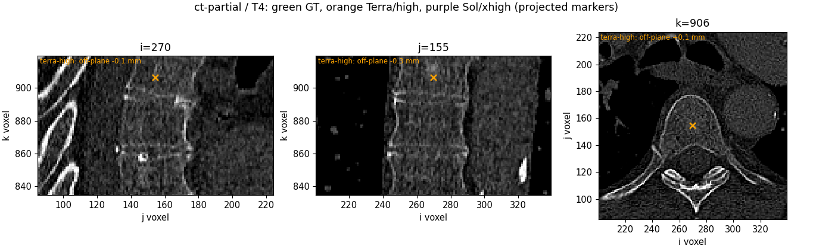
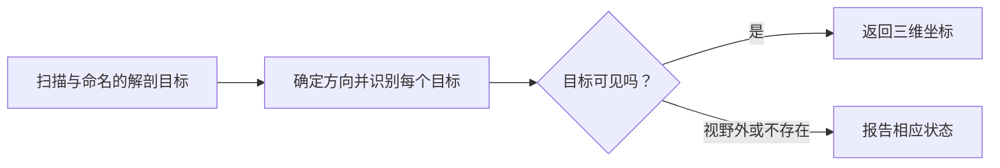
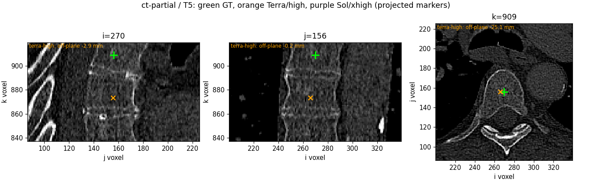

# 找到解剖标志点，也要知道它何时不在图像中

**解剖定位 · BR-040 · 约 4 分钟**

**图解导览：** [交互导览](../../../presentation/tours/index.html?tour=landmarks) · [横屏视频](../../../presentation/tours/exports/landmarks-landscape.mp4) · [竖屏视频](../../../presentation/tours/exports/landmarks-portrait.mp4)。[来源与复现](../../../presentation/tours/README.md)。

“标出这节椎骨的中心”看似只需一个坐标，但智能体必须先辨认解剖、命名正确，并判断目标是否出现在扫描范围内。

**Sol 将图像检查、外部解剖指导和图谱配准结合起来。** 在所测容差内，它放对的脑部标志点多于 Terra；裁剪脊柱病例则同时显示了恰当弃答和漏掉可见目标。

## 查看任务

*裁剪图仍可包含真实骨骼，却不包含所请求的椎体节段。这张保留的对比图说明，识别骨骼与正确命名是两项工作。标记投影到图像切面上；评分距离在完整三维空间中计算。VerSe 衍生示意，CC BY-SA 4.0。[图像来源](../../../presentation/assets.json)。*

## 研究意义

命名标志点有助于对齐扫描、检查解剖对应。即使点准确落在骨内，若认错了椎骨仍是错误答案。裁剪图还要求认清图像无法展示什么。

人工读片依靠解剖定义及多个平面；软件可将带标注的参考脑图谱配准到新扫描后迁移点位。AFIDs 协议规范了 32 个脑部标志点及放置指导。其研究环境中的验证支持毫米级人工放置，但不是本实验中的匹配人工分数。[AFIDs 研究](https://pubmed.ncbi.nlm.nih.gov/31175816/) · [放置协议](https://afids.github.io/afids-protocol/afids_protocol/human_protocol.html)

## 智能体收到并交付了什么

三个条件分别使用完整 VerSe 脊柱 CT、同一 CT 的裁图及 AFIDs 脑 MRI。各条件都提供三维数组、命名目标和明确的坐标约定。脊柱请求既含视野外目标，也含按来源编号规则真正不存在的节段；MRI 的 32 个目标都可见。

答案是标志点列表：每个目标有状态；可观察到时另有从零开始的原生体素坐标。再根据图像几何计算物理距离。CT 完整扫描有 **24 个可见目标**，裁图有 **13 个**。[冻结比较](../../../docs/research-rounds/BR-040-results.md)

## Sol 如何工作

**脑 MRI：取得有用参考，再适配到目标。** Sol 查阅 AFIDs 图示并下载带标注的通用 MNI 脑模板。它以仿射配准——整体旋转、平移、缩放及剪切——把图谱转到目标空间，然后人工复核。更灵活的 B-spline 细化失败，之后被终止且没有保存候选文件；智能体作业仍正常完成。

这是获准使用图谱的辅助表现。保留的来源审查没有发现获取目标受检者标注。它证明能编排现有资源，不能称为无辅助的视觉定位。[来源使用审查](../../../docs/evidence/br040-source-audit.json)

**裁剪 CT：恰当弃答，同时注意覆盖。** 对 11 个视野外目标，Sol 没有声称已观察到；但它漏掉了可见的 T5 中心。正确弃答与完整定位须分开报告。

*可见目标的反例与上方视野外示例互补。少报能避免假发现，也可能漏掉真实解剖。VerSe 衍生示意，CC BY-SA 4.0。*

## 结果与代价

| 条件 | Terra/high | Sol/xhigh |
| --- | --- | --- |
| 完整 CT：5 mm 内 | 2/24 | 1/24 |
| 完整 CT：10 mm 内 | 7/24 | 13/24 |
| 裁剪 CT：5 mm 内 | 1/13 | 4/13 |
| 裁剪 CT：错误定位视野外目标 | 1/11 | 0/11 |
| 脑 MRI：3 mm 内 | 3/32 | 14/32 |
| 脑 MRI：10 mm 内 | 20/32 | 32/32 |

MRI 平均误差为 Terra **9.40 mm**、Sol **3.87 mm**。Sol 的裁剪 CT 平均误差为 **7.44 mm**，仅统计其返回的 12 个可见点；成功数仍以全部 13 个参考目标为分母，包括漏掉的点。[测量结果](../../../docs/evidence/br040-results.json)

MRI 尝试耗时约 Terra **4.4 智能体分钟**、Sol **33.5 分钟**。图谱获取、配准和失败的细化均计入 Sol 的工作成本。这里较好的定位伴随更多工作，但模型及推理设置同时变化，无法分离图谱贡献或推断普遍效率权衡。

## 任务为何更有信息量

完整体数据保留定位所需空间背景。相关的裁剪视图增加另一要求：判断请求目标何时不可用，而不是对每个名称强制给出坐标。

在各条件内，两位智能体收到相同冻结任务字节。每个模型、每种条件仅有一次尝试，涉及一位 CT 受检者和一位 MRI 受检者。可见的能力是结合解剖参考、计算及明确的可用性判断；手术准备度和人群表现均未检验。

## 检查或复现

- [任务摘要](card.json)、[比较报告](../../../docs/research-rounds/BR-040-results.md)及[配置审查](../../../docs/evidence/br040-config-audit.json)。
- [评分与本地报告指南](../../../probes/semantic-landmarks/authoring/br040/README.md)；完整点位表及复核面板留在比较记录中。
- 完整来源体数据与原始会话仅在本地。[来源、许可与复现指南](../../../presentation/references.md)。

[← 心脏重建](../../cardiac-motion/presentation/story.md) · [来源与复现 →](../../../presentation/references.md)
