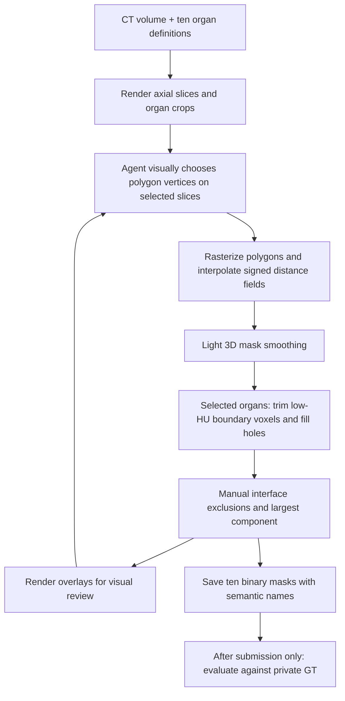

# How Astra/xhigh drew the organ masks

2026-09-21 · [User request](codex://threads/01a0c38d-fcff-7670-9ac7-80d0ca352c35)
· [Frozen result](ct-organ-segmentation-astra-xhigh.md)
· [Reconstruction receipt](evidence/ct-organ-methodology-astra-xhigh.json)

The method is primarily **visual polygon annotation on selected axial slices,
followed by interpolation through the volume**. Morphological operations serve as
cleanup. It is not an image-gradient-driven contour optimizer, and it does not use
a pretrained segmentation network. Poor edge alignment is consistent with this
design, but is not itself proof that morphology was absent: morphology changes a
mask and need not find the anatomical boundary in the image.

This account comes from the complete tool trace and saved `segment.py`,
`finalize.py`, `refine_small.py` and contour JSON files. A separate read-only
implementation reconstructed all ten final masks with **zero voxel differences**.
It never imported or executed the submitted scripts. Original masks, reference
bytes and frozen scores remain unchanged.



The trace includes 37 image-view calls over 36 unique images. Inspection and
manual edits were iterative, including smaller-organ and gastric-cardia edits.
Some final edits received structural validation without a fresh final overlay;
the trace does not establish exhaustive visual review of every submitted slice.

## What the code does

Each organ has 6–23 nonempty anchor slices. Median anchor spacing ranges from
4.5 to 9 mm in this 1.5 mm isotropic scan. The agent writes numerical polygon
vertices directly, with no reference mask. A polygon is converted to a binary
slice. Its signed distance is positive inside and negative outside. On intervening
slices the code interpolates these distances, then thresholds at zero. Empty end
anchors use a constant negative field of −3 rather than an ordinary distance map.

```python
CT = load_ct()
soft_CT = gaussian_filter(CT, sigma=0.6)  # voxel units

for organ in ten_organs:
    anchors = agent_drawn_polygons[organ]  # coordinates chosen by viewing CT
    for z in sorted(anchors):
        polygon_mask[z] = rasterize(anchors[z])
        D[z] = (EDT(polygon_mask[z]) - EDT(~polygon_mask[z])
                if polygon_mask[z].any() else constant_field(-3))

    mask = empty_volume()
    for consecutive anchor slices (a, b):
        for z in range(a, b + 1):
            t = (z - a) / (b - a)
            mask[:, :, z] = ((1 - t) * D[a] + t * D[b]) > 0

    sigma = 0.5 if organ_is_adrenal else 0.65
    mask = gaussian_filter(mask.astype(float), sigma) > 0.5

    if organ_has_HU_threshold:
        protected_interior = EDT(mask) > 2  # deeper than 3 mm
        mask &= (soft_CT > organ_threshold) | protected_interior
        mask = fill_holes_independently_on_each_axial_slice(mask)

    masks[organ] = mask

masks[liver] &= ~masks[gallbladder]
masks[liver] &= ~masks[stomach]
masks[pancreas] -= manually_specified_interpolated_tube

for organ in ten_organs:
    masks[organ] = largest_connected_component(masks[organ])
    save_binary_nifti(masks[organ], original_ct_grid, organ_name)
```

The HU thresholds are −5 for spleen/liver, −15 for kidneys, and −30 for
pancreas/adrenals. Gallbladder, stomach and duodenum receive no HU trimming.
The pancreas exclusion is a hand-specified sequence of circle centers and radii;
it is not automatic vessel segmentation. Label assignment is direct: the agent
decides which organ it is drawing and saves it under that organ's name.

| Operation | Evidence and role |
| --- | --- |
| Polygon rasterization + distance interpolation | Main 3D construction; independent of CT intensities between anchors |
| Gaussian mask smoothing | Small geometric adjustment, not CT edge fitting |
| HU boundary trimming | Removes low-intensity voxels within the existing outer band; deep interior protected |
| Slice-wise hole filling | Used after HU trimming; can restore internal holes |
| Largest connected component | Used; removes disconnected pieces |
| Binary erosion / binary closing | Imported but not called in the final construction path |
| Active contour, graph cut, learned segmenter | Not present in the retained execution |

## Why boundaries can remain misaligned

Between anchors, the contour follows interpolated geometry, regardless of where
the CT boundary bends. Sparse vertices can miss a thin adrenal limb, and a 6 mm
anchor interval is substantial relative to a small gland. Gaussian smoothing can
round a shape but supplies no anatomical evidence about where its edge should be.

The intensity rule supplies limited image information. Before hole filling it
only removes voxels from the current mask; it cannot grow an underdrawn contour
outward toward an omitted structure. Its broad negative HU threshold primarily
separates very low attenuation tissue from soft tissue. It does not reliably
separate neighboring organs with similar attenuation. An incorrect polygon can
therefore survive cleanup, while a missing extension remains missing.

The figure isolates the right adrenal. Blue indicates an anchor or interpolated
contour; amber indicates smoothing or final output. At slice 210, smoothing
changes no voxels. Green is the private reference, overlaid only in this post-run
analysis. This is an illustrative plane, not a full 3D clinical review.


## How much each numerical stage changes the score

These values hold the **final saved polygons fixed** and reconstruct successive
computational stages. They are not the model's chronological learning curve, new
model attempts, or evidence that one stage caused the model's reasoning errors.

| Reconstructed stage | Mean Dice across ten organs |
| --- | ---: |
| Polygon + signed-distance interpolation | 0.71414 |
| Add Gaussian mask smoothing | 0.71430 |
| Add HU trimming + hole filling | 0.73624 |
| Add interface exclusions + component cleanup | **0.73803** |

Most overlap is already present in the visually drawn/interpolated shapes.
Smoothing changes at most 105 voxels per organ and changes neither adrenal mask.
HU trimming plus hole filling makes the larger numerical contribution. The final
right-adrenal Dice remains only 0.38788; its raw interpolated Dice is 0.33889.
Cleanup improved agreement here, but did not repair the underlying contours.

## Reproduce and inspect

Raw scripts, final contour JSON, CT array and outputs are retained under
`.local/attempts/attempt-2668797075454e54/job/task__uW2TAwB/artifacts/app/`.
The full retained rollout includes image observations omitted by CLI stdout.
Parent trace review is `.local/ct-organ-segmentation-astra-xhigh/trace-review.json`.

The independent analyzer needs NumPy, SciPy, NiBabel, scikit-image and Pillow:

```sh
python groups/anatomy-audit/experiments/ct-organ-segmentation-astra-xhigh/authoring/analyze_method.py \
  --task .local/ct-organ-segmentation-astra-xhigh/task \
  --trial .local/attempts/attempt-2668797075454e54/job/task__uW2TAwB \
  --output .local/ct-organ-segmentation-astra-xhigh/methodology
```

Generated local figures are intentionally untracked. The compact evidence receipt
retains per-organ anchor counts, stage scores, contour hashes and exact final-mask
agreement. Reference disagreements remain research-reference discrepancies rather
than clinically adjudicated mistakes.
