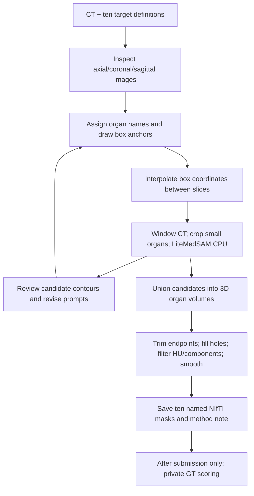

# LiteMedSAM condition: modest mean gain, substantial organ-specific differences

2026-09-21 UTC · [Protocol](../experiments/ct-organ-segmentation-astra-medium-litemedsam/protocol.md)
· [Evidence](evidence/ct-organ-segmentation-astra-medium-litemedsam.json)
· [Original three-condition comparison](ct-organ-three-condition-comparison.md)

The fresh Astra/medium + LiteMedSAM attempt completed normally in **17m 28s**.
Its ten submitted masks are valid. Independent replay of the unchanged answer
matches **every** original verifier field: semantic and label-agnostic matched
macro Dice **0.7569715596**, versus **0.7341910610** for standalone Astra/medium.
The difference is **+0.02278** (2.28 percentage points); seven organs improve and
three regress. All ten positive-overlap optimal matches retain their names, which
is conditional on geometry and does not certify every voxel or general recognition.
Foreground Dice is 0.92555, precision 0.96200 and recall 0.89176.

| Condition | Macro Dice | Matched Dice | Agent time | Input tokens, including cache | Cached input | Output tokens |
| --- | ---: | ---: | ---: | ---: | ---: | ---: |
| Astra/xhigh | 0.73803 | 0.73803 | 21m 04s | 2,468,203 | 2,375,424 | 33,537 |
| Astra/medium | 0.73419 | 0.73419 | 21m 29s | 3,603,190 | 3,471,488 | 29,126 |
| Sol/xhigh | 0.32907 | 0.34878 | 31m 13s | 7,214,819 | 7,056,128 | 47,773 |
| **Astra/medium + LiteMedSAM** | **0.75697** | **0.75697** | **17m 28s** | **3,790,358** | **3,660,416** | **26,885** |

The new condition takes 241.33 fewer agent seconds (18.7%) in this pair. Total
trial time is 1,092.22 seconds. Output includes 10,796 reasoning tokens; uncached
input is 129,942. Counts accumulate across calls. Dollar cost is unavailable for
the Astra conditions. Setup/download time is separate. No repeat estimates
variability, and the skill, runtime and model weights form a combined intervention.

| Organ | Astra/medium | + LiteMedSAM | Difference |
| --- | ---: | ---: | ---: |
| spleen | 0.9292 | 0.9407 | +0.0116 |
| kidney right | 0.8890 | 0.9597 | +0.0706 |
| kidney left | 0.8971 | 0.9472 | +0.0500 |
| gallbladder | 0.7613 | 0.6184 | -0.1430 |
| liver | 0.9220 | 0.9411 | +0.0190 |
| stomach | 0.6641 | 0.8881 | +0.2240 |
| pancreas | 0.7032 | 0.6379 | -0.0653 |
| adrenal right | 0.3115 | 0.1962 | -0.1153 |
| adrenal left | 0.5633 | 0.6634 | +0.1001 |
| duodenum | 0.7011 | 0.7771 | +0.0760 |


The largest gain is stomach (0.6641 → 0.8881). Both kidneys improve substantially.
Gallbladder (0.7613 → 0.6184), pancreas (0.7032 → 0.6379) and right adrenal
(0.3115 → 0.1962) are worse. The selected matched-plane overlays show a closer
stomach contour, but only a partial gallbladder envelope and a small right-adrenal
fragment. All ten organs have retained overlays; these selected planes are not
exhaustive clinical 3D adjudication.


[Other seven organs](../../../.local/ct-organ-segmentation-astra-medium-litemedsam/review/remaining-boundaries.png).
Each row uses the reference's largest axial cross-section and the same crop for
both predictions. White is reference, orange baseline, cyan tool condition;
matching line samples appear in the legend. Image coordinates increase with
native i/j (RAS); displayed Dice is the whole 3D organ score. Figure selection
was performed only after submission and was never solver-visible.

## What the agent actually did

The trace confirms that this was active tool use. It read the skill and adapter,
ran **two canonical adapter calls producing eight box masks**, and wrote its own
batch implementation using the same architecture and hash-verified checkpoint.
Thirteen completed batches retain **374 image encodings and 662 box masks**,
including reviewed tests and later corrections. Those are image/box evaluations,
not 662 independent organs. The batch implementation loads the model once per
process and reuses each slice embedding for all its boxes. Full-image inference
uses 265→256 resizing; smaller structures use square crops resized to 256.



```python
ct = load_native_CT()                         # shape 265 × 265 × 401
for organ in targets:
    anchors[organ] = inspect_CT_and_choose_boxes(organ)
    jobs += interpolate_box_coordinates(anchors[organ])

for slice_k, organ_boxes in jobs:
    image = uint8_window(ct[:, :, slice_k].T[::-1], -160, 240)
    crop, transformed_boxes = choose_documented_crop(image, organ_boxes)
    embedding = LiteMedSAM.encode(resize_and_normalize(crop, 256))
    for organ_id, box in transformed_boxes:
        logits = LiteMedSAM.decode(embedding, box)
        mask2d = resize_logits_back(logits) > 0
        candidates[organ_id, slice_k] |= undo_crop_flip_transpose(mask2d)

# Repeat image review and selected prompt revisions, without reference access.
for organ in targets:
    mask = union_candidate_batches(organ)
    mask = trim_reviewed_terminal_slices(mask)
    if organ in {spleen, gallbladder, liver, stomach, duodenum}:
        mask = fill_slice_holes(mask)
    if organ in {pancreas, right_adrenal, left_adrenal}:
        mask &= gaussian_blur(ct, sigma=0.55) > -55
    if organ in {right_adrenal, left_adrenal}:
        mask = binary_closing(mask, iterations=1)
    mask = threshold_gaussian_smoothed_mask(mask, organ_specific_parameters)
    mask = keep_selected_components(mask)
    save_named_mask_with_original_affine(mask)
# Actual final assembly also subtracts gallbladder from liver locally.
```

The label comes from the agent's organ-specific job ID. LiteMedSAM receives the
image and rectangle, not an anatomical label. All final geometry remains on the
native grid; PNG x=i, y=264−j is inverted on assembly. Candidate revisions are
united, not a clean replacement of every previous candidate. Final operations
include a largest-component choice for most larger organs and a 20-voxel minimum
for retained components. The full scripts, prompts, candidate masks and receipts
remain in the frozen attempt's `artifacts/app/work/`.

## Why morphology and a segmenter do not ensure aligned edges

Morphology **is present**: hole filling, closing and component selection accompany
Gaussian smoothing and HU filtering. Those stages transform the candidate mask;
they do not identify a missing anatomical region. The main boundary proposal in
this condition comes from a learned box-conditioned segmenter, whereas the
standalone baseline mostly interpolates visually drawn polygons.

Post-submission prompt diagnostics identify a localization limitation. The union
of boxes used for final assembly contains only **65.7% of gallbladder GT voxels**
and **23.7% of right-adrenal GT voxels**, versus 97.0% for stomach and approximately
98–99% for spleen/kidneys. These are diagnostic measurements, not prompts supplied
to the solver. A box is not a hard output constraint, so these fractions are not
formal score ceilings. They do show that contour refinement alone was being
asked to compensate for incomplete spatial prompts. HU filtering, endpoint
trimming and component selection may additionally remove thin/partial-volume
anatomy; no ablation separates those effects here.

We also computed a **post-hoc boundary diagnostic**, leaving the frozen scorer
unchanged: bidirectional nearest distances between 6-neighbour boundary voxel
centres at native 1.5mm spacing. The combined mean distance for stomach improves
4.05→1.33mm, while gallbladder worsens 2.16→3.41mm and right adrenal 4.43→8.20mm.
For the kidneys it improves 1.77→0.56mm (right) and 1.45→0.74mm (left).
The spleen gains volumetric Dice while its mean boundary distance worsens
1.08→1.31mm; Dice improvement alone is not proof that every edge improved.
These voxel-based distances and 3mm-tolerance surface coverage are exploratory,
unweighted by mesh area, and are not a clinical acceptance threshold.

## Execution, audit and limits

All original verifier fields replay exactly and native recorded evidence hashes
verify. There was no inference retry, continuation, feedback or time extension.
The trace contains 47 outer execution calls, 47 shell commands, 39 image views,
five process polls and two clock reads. Three shell failures were self-recovered:
a local `inspect.py` shadowed Python's standard module, and two review commands
ran before batch files existed. These did not fail the model trial. Full raw
trace and trajectory retain historical images, including reused display paths.

The 13 batch logs total **318.13 seconds of image-loop time**, including
preprocessing, inference and saving but excluding model import/setup. These
rounded loop times may overlap wall time and are not pure inference latency.
Canonical adapter receipts separately retain encode/decode/load timings.

No reference/scorer access, external retrieval or other model-weight use was
observed in the full tool-call trace. All nine live isolation checks passed;
the registered skill and adapter hashes matched. Transport records contain 62
allowed model-service connections, 18 denied telemetry and four denied CDN
connections, with all concatenated JSON records decoded and no leftover bytes.
Opaque model-service traffic and prior training exposure cannot be ruled out.

The same CT, taxonomy, GT and scorer were reused, but this task has its own digest
because the skill/runtime/instruction changed. Fresh exact oracle=1/no-op=0 and
a synthetic CPU tool call passed before dispatch. A slow online Docker build and
one checkpoint-inventory false positive were repaired before inference with
failure records retained. Account quota remained above the 20% reserve; no reset
was redeemed. Preparation and comparison results are separate from those costs.

This public CT was previously used for GT-box tool calibration; those boxes,
selected slices and results were not exposed to this agent. LiteMedSAM training
overlap is unknown. One selected case and one attempt per condition cannot
establish a population ranking, general tool benefit, clinical accuracy or a
causal speed advantage. The result supports a narrower statement: **in this
attempt the tool condition improved average overlap and several contours, while
agent localization and small-organ delineation remained limiting.**
