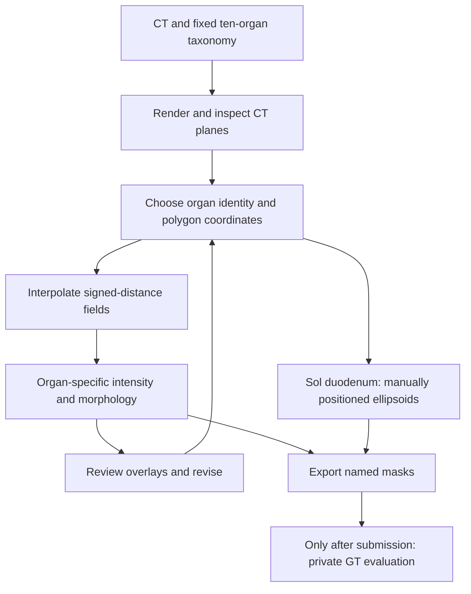

# CT-only organ segmentation: Astra efforts close, Sol localization weaker

2026-09-21 · [User task](codex://threads/01a0c38d-fcff-7670-9ac7-80d0ca352c35)
· [Prespecified comparison](../methods/ct-organ-three-condition-comparison/protocol.md)
· [Evidence receipt](evidence/ct-organ-three-condition-comparison.json)

All three fresh attempts completed normally on the **identical frozen CT-only
task**. Parent scoring independently reproduces every original verifier field.
Astra/xhigh and Astra/medium have close mean overlap but different organ-level
errors; Sol/xhigh has substantial localization failures in several central organs.
These are one-case observations, not a population ranking or a causal estimate of
reasoning-effort effects.

| Result | Astra/xhigh | Astra/medium | Sol/xhigh |
| --- | ---: | ---: | ---: |
| Semantic macro Dice | **0.73803** | **0.73419** | **0.32907** |
| Label-agnostic matched Dice | 0.73803 | 0.73419 | 0.34878 |
| Foreground Dice | 0.90108 | 0.89906 | 0.70308 |
| Foreground precision | 0.91043 | 0.91241 | 0.60656 |
| Foreground recall | 0.89191 | 0.88609 | 0.83615 |
| Correct names among positive-overlap assigned pairs | 10/10 | 10/10 | 6/9 |
| Agent time | 21m 04s | 21m 29s | 31m 13s |
| Total trial time | 21m 48s | 22m 40s | 32m 18s |

Identity assignment depends on geometry. Sol's zero-overlap assigned pair is not
identity-assessable, and some positive-overlap pairs are weak. The 6/9 statistic
must not be mistaken for general organ-recognition accuracy. Reassigning names
only improves its macro Dice by 0.01971, leaving geometry/localization limiting.

| Organ | Astra/xhigh | Astra/medium | Sol/xhigh |
| --- | ---: | ---: | ---: |
| Spleen | 0.90764 | 0.92917 | 0.77865 |
| Right kidney | 0.79744 | 0.88905 | 0.67555 |
| Left kidney | 0.81520 | 0.89712 | 0.76474 |
| Gallbladder | 0.66712 | 0.76135 | 0.01135 |
| Liver | 0.92690 | 0.92205 | 0.80537 |
| Stomach | 0.78122 | 0.66409 | 0.07335 |
| Pancreas | 0.72794 | 0.70324 | 0.02872 |
| Right adrenal | 0.38788 | 0.31150 | 0.15300 |
| Left adrenal | 0.60695 | 0.56328 | 0 |
| Duodenum | 0.76195 | 0.70108 | 0 |


Medium improves four organs versus xhigh (spleen, kidneys, gallbladder), while
xhigh improves six. Their mean difference is only 0.00383 and medium takes about
25 seconds longer in this pair. A single run at each setting supplies no estimate
of run-to-run variability. Both Astra runs remain weak on the thin adrenal glands.

Sol's stomach mask is 9.14 times the reference volume, while its duodenum and left
adrenal have zero same-name overlap. Those errors are much larger than imperfect
edge alignment. The matched-plane overlays show the spatial discrepancies without
altering source labels or claiming clinical adjudication.


[Larger-organ comparison](../../../.local/ct-organ-comparison/review/organ-contours-comparison-1.png)
uses the same layout. Each row selects the reference's largest-area axial plane;
the crop is the union across GT and all three outputs, with the same CT window
and orientation. These are representative selected planes, not complete 3D QC.

## Common method and meaningful differences

All three largely **draw sparse polygons by visually interpreting CT, interpolate
their shapes, then refine masks**. Morphological cleanup is present in all three.
It does not guarantee edge alignment: morphology transforms the chosen geometry,
and cannot by itself supply a missing anatomical identity or correct location.



| Stage | Astra/xhigh | Astra/medium | Sol/xhigh |
| --- | --- | --- | --- |
| Primary geometry | Visual polygons, signed-distance interpolation | Same, with separate traced parts united for some organs | Same for nine organs; duodenum is 11 hand-positioned ellipsoids |
| CT-based refinement | Low-HU trim in outer 2-voxel band; deep interior protected | Dilated candidate bands plus eroded interior; can grow and shrink boundaries | Organ-specific lower/upper HU bounds throughout polygon envelope |
| Morphology actually used | Hole filling, connected-component cleanup | Erosion, dilation, filling, component cleanup, liver opening | Binary closing, size-limited filling, component cleanup |
| Duodenum | Interpolated visual contours | Interpolated main and ascending-part contours | Ellipsoid union with no CT-intensity constraint |
| Image observations | 37 | 43 | 29 |
| Final review limit | Last small edits lacked fresh overlay | Final liver edits had overlay review; not exhaustive | Last component cleanup lacked fresh overlay |

```python
for organ in taxonomy:
    contours = choose_coordinates_by_viewing_CT(organ)
    mask = interpolate_signed_distances(contours)

    if condition == "Astra/xhigh":
        mask = smooth(mask)
        mask = trim_low_HU_outer_band_and_fill(mask, protected_depth=2)
    elif condition == "Astra/medium":
        # Larger solid organs; other organs have separate rules
        candidate = dilate(mask, organ_specific_radius)
        interior = erode(mask, 2)
        mask = intensity_refine(candidate, interior, CT)
        mask = smooth_and_cleanup(mask)
    elif condition == "Sol/xhigh":
        mask = close_and_fill(mask & organ_HU_interval(CT))
        if organ == "duodenum":
            mask = union_of_hand_positioned_ellipsoids()

    export_with_semantic_name(mask, organ)
```

This is a schematic; luminal organs and manual interface exclusions have distinct
rules in the retained code. The [original Astra methodology analysis](ct-organ-methodology-astra-xhigh.md)
provides exact pseudocode and a reconstruction that reproduces all ten masks.
With its final polygons held fixed, macro Dice is 0.71414 after interpolation,
0.71430 after smoothing, 0.73624 after trimming/filling and 0.73803 final. No
equivalent stage ablation was performed for the other two runs. Differences in
refinement may help explain the outputs, but their causal contributions are not
isolated from differing visual contours and decisions.

## Usage and fairness

| Cumulative tokens | Astra/xhigh | Astra/medium | Sol/xhigh |
| --- | ---: | ---: | ---: |
| Input, including cached | 2,468,203 | 3,603,190 | 7,214,819 |
| Cached input | 2,375,424 | 3,471,488 | 7,056,128 |
| Noncached input | 92,779 | 131,702 | 158,691 |
| Output, including reasoning | 33,537 | 29,126 | 47,773 |
| Reasoning output | 14,847 | 10,017 | 23,524 |

Counts accumulate across model calls and are not unique context size. Medium
uses fewer output/reasoning tokens here, but more input tokens and slightly more
time than xhigh. Harbor estimates Sol's cost at $4.4126752; both Astra costs are
unavailable, so no dollar-cost comparison is supported. Preparation and supervisor
effort are separate.

Each condition received the same scrubbed CT, fixed taxonomy and output contract,
with no reference masks, prior solution, score feedback or method hints. The exact
task digest is `fcf7827f7100d1ca54be84f6bc14fb320d27ca546fd5352ac45cb40b04110ab6`.
The original oracle/no-op controls score 1/0 on those exact bytes. Runtime images,
four-CPU cap, 12 GiB configured memory ceiling, no GPU/segmenter weights and
7,200-second agent limit are identical. Runs were sequential on the same Docker
host, whose actual RAM was about 7.74 GiB; caps are not guaranteed allocations.

All three have successful live isolation records and exact saved-output replays.
No external retrieval, private-reference/scorer access or additional pretrained
segmenter use was observed. Sol probed installed packages and weight files but
found no weights. Public-data pretraining exposure and opaque model-service
traffic cannot be ruled out. Two launcher failures occurred before either new
solver started and were retained separately; no inference retry occurred.

The GT comprises ten published, reviewed research masks for one selected public
case, not every visible structure or independent clinical adjudication. All
original bytes and scores remain frozen; no clinical pass threshold is invented.
More cases and repeated attempts would be needed to assess generality or effort
effects; they are not authorized or implied by this completed comparison.

## Reproduce the visuals

The tracked [renderer](../methods/ct-organ-three-condition-comparison/render_comparison.py)
reads the recorded CT and saved outputs without executing solver code. Use the
render manifest embedded in the comparison evidence receipt:

```sh
python groups/anatomy-audit/methods/ct-organ-three-condition-comparison/render_comparison.py \
  --root /path/to/tb3 --manifest /path/to/render-inputs.json --output /fresh/output
```

Raw volumes and generated media stay local. The manifest, hashes, native attempt
identities, trace audit and source receipts are retained. The two individual new
reports are [Astra/medium](ct-organ-segmentation-astra-medium.md) and
[Sol/xhigh](ct-organ-segmentation-sol-xhigh.md).
