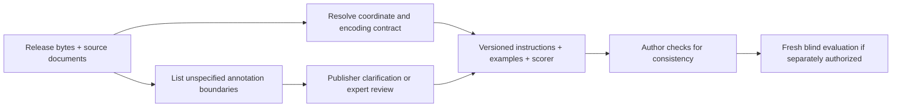

# ToothFairy3: dataset conventions missing from the agent contract

Date: 2026-09-22 (Asia/Shanghai). Actor: assistant, responding to the user's
request for a careful source audit. Source task:
codex://threads/01a0c3e5-6fb0-7321-a930-a7251047e7ad.

**The user's concern is supported, with an important distinction.** The original
orientation problem has an explicit publisher warning. The occupied-pulp problem
has no operational boundary rule in the public materials inspected. V2 improved
the task but did not fully establish the annotation contract. Writing a plausible
anatomical definition does not establish that the released masks follow it.

This audit proposes documentation changes only. It does not change the frozen
instructions, GT, predictions, scores, or completed trials. A
[separate contract draft](../methods/dental-dataset-contract/instruction-v3-draft.md)
contains reusable, target-blind wording and a table of unresolved decisions.

## What the primary sources actually establish

| Source | Finding and limit |
| --- | --- |
| [TF3 FAQ](https://toothfairy3.grand-challenge.org/faq/), general Q1 | Explicitly says NIfTI direction information is **not physically accurate**. Semantic orientation must not be inferred from the affine alone. This does not independently establish clinical acquisition laterality. |
| [Publisher orientation section](https://ditto.ing.unimore.it/toothfairy3/) and [conversion script](https://ditto.ing.unimore.it/static/toothfairy3/fix_orientation.py) | Calls the release RPI. The script flips axes 1 and 2 of a SimpleITK-derived array, copies the input image metadata, and processes both images and labels. This changes voxel ordering; it is not a metadata-only correction. |
| [TF3 structured challenge proposal](https://zenodo.org/records/15081727), pp. 29–30, Task 2 | Describes expert annotation plus another expert's review, saying “formal annotation guidelines were not strictly necessary.” It gives no voxel-level occupied-pulp rule. This March 2025 document describes 45 classes and predates the final taxonomy; its Task 1 is a separate intraoral-scan challenge, whose private 3Shape protocol must not be mistaken for TF3 CBCT instructions. |
| [TF3 paper](https://federicobolelli.it/media/publications/pdfs/2026MICCAI_TF3.pdf), §2 | Describes 77 classes, including 32 tooth-specific pulp cavities, and expert review rather than annotation fusion. It does not operationally define filled chambers, posts, calcified canals, or label precedence there. It reports 582 cases including 50 private cases; only 532 are public. |
| [TF3 announcements](https://toothfairy3.grand-challenge.org/) | The 30 June 2025 update added incisive/lingual annotations to the P subset. “ToothFairy3” alone is an insufficient release identifier. |
| [TF2 release history](https://ditto.ing.unimore.it/toothfairy2/) | Historical corrections cover HU conversion, spacing metadata, origin/direction, tooth IDs, canal side IDs, missing teeth, and crown/bridge standardization. These demonstrate version sensitivity, not proof those defects remain in this TF3 archive. |
| [Pinned public evaluator](https://github.com/AImageLab-zip/ToothFairy/blob/65b7f93796ac8f61046585dd5a52964b09890d0f/ToothFairy3/Multi-Instance-Segmentation/evaluation/evaluation.py) | Merges 32 pulp IDs into one evaluation class, averages 46 foreground classes, rewards both-empty Dice with 1, and calls HD95 without physical spacing. This differs from both our scorer and the challenge site's 77-class ranking description. It is evidence about this code revision, not proof of which scorer produced final competition results. |

The [local archive metadata](../../../runs/toothfairy3-partial-20260921/source/dataset.json)
has 78 entries including background, sparse IDs through 148, release string
`12/05/2025`, and `tensorImageSize: 4D`. The inspected F002/F008 images are
single-channel 3D volumes. The release string alone does not establish whether
the June P-label update is incorporated; no whole-P-subset completeness audit
was performed here.

## Caveats to put into the specification

**Confirmed** means supported by an inspected release/source. **Operational**
means an explicit choice for our task, not a claim about the original annotators.
**Unresolved** means a boundary needs publisher clarification or appropriate
review before we claim it matches the reference standard.

| ID | Caveat | Required instruction or author action | Status |
| --- | --- | --- | --- |
| C01 | Dataset editions and updates differ. | Pin image, annotation, dictionary, source location and per-file hashes together. Record whether the June P-label update is verified. Do not substitute TF1 sparse masks, TF2 labels, a viewer mask, or another archive under the same case name. | Confirmed version risk; package-specific validation required. |
| C02 | Header orientation is not semantic authority. | For the reviewed native package state explicitly: increasing NIfTI array `(i,j,k)` means Right, Posterior, Inferior for dataset labels. Preserve stored grid metadata for output. Distinguish this dataset naming contract from physically adjudicated laterality. | Source warning confirmed; exact package mapping previously reviewed. |
| C03 | Library axes and screen axes differ. | Define `nibabel[i,j,k]` versus `SimpleITK_array[k,j,i]`. Display transpose, slice origin and radiological left/right must be explicit; label every view. Do not assign tooth side from screen-left. | Operational coordinate contract. |
| C04 | Reorientation can corrupt otherwise correct masks. | Verify the released 0.3 mm isotropic grid in each package. Any internal permutation, flip, crop or resampling must have a recorded inverse. Apply paired transforms to image/reference; submit on the untouched target grid. Use nearest-neighbor interpolation for integer masks. Never run the publisher flip script twice or apply it only to one member of a pair. | Operational safeguard supported by inspected script and dataset page. |
| C05 | Intensity units do not define tissue identity. | Input is the released, HU-represented image after file scaling, not a windowed screenshot. Do not reconvert HU or globally clip/normalize without recording it. A bright voxel is not automatically restoration, and a dark voxel is not automatically pulp/canal. No universal threshold follows from the dataset description. | HU representation confirmed; threshold caveat is methodological inference. |
| C06 | Field of view and acquisition vary. | Segment only imaged anatomy, including truncated structures. Do not invent upper teeth/sinuses or require all dictionary labels. Match/reference-check physical scale, coverage and appearance, not just array dimensions. | Confirmed by publisher/FAQ. |
| C07 | IDs are sparse, semantic and side-specific. | Use the supplied dictionary, not contiguous 1–77. There are 77 foreground classes, not 148. Tooth IDs use FDI; pulp = corresponding tooth ID +100. Main canals are 3/4; small canals 103/104/105. Synthetic pooled pulp 150 is not a released output class. | Confirmed by archive and FAQ. |
| C08 | Missing tooth positions must not renumber the arch. | Preserve identity slots despite missing, impacted, tilted or partly imaged teeth. Do not assign FDI only by rank order of visible components. Define handling of retained roots and supernumerary/deciduous teeth not represented in the dictionary. | FDI slots confirmed; atypical-tooth policy unresolved. |
| C09 | “Pulp,” “pulp cavity,” and “roots/pulps” are not interchangeable operational definitions. | State whether the label means visible tissue, anatomical chamber/canal space, or inferred historical space. Specify filling material, posts, calcification, obliteration, open apices and partial-volume boundaries. Do not silently equate pulp with low attenuation. | **Unresolved; highest-priority semantic decision.** |
| C10 | Tooth/pulp/restoration/jaw masks compete for the same voxel. | Define tooth hard tissue versus complete tooth object and write an explicit precedence table at pulp, restoration, tooth and jaw interfaces. State whether remaining natural roots below restorations keep FDI labels. Our whole-tooth union is an evaluation construction, not a discovered publisher boundary rule. | Single integer map confirmed; detailed precedence unresolved. |
| C11 | Main canal extent and boundaries are underspecified. | Specify canal volume versus nerve versus centerline, lumen versus corticated wall, mandibular/mental openings, and the transition into the incisive canal. Define whether unclear intervals are interpolated or left unlabelled. | Named classes confirmed; endpoints/walls/gaps unresolved. |
| C12 | Small canals are not generic fixed-radius tubes. | Define left/right incisive extent and junction assignment; resolve whether “lingual canal/foramen” includes the opening, full tract, and multiple/accessory components. Do not require one component or a constant diameter without evidence. | Names confirmed; boundary/topology policy unresolved. |
| C13 | Jawbone is not simply a brightness threshold. | Confirm cortical plus cancellous compartment inclusion; define marrow spaces, sockets, lesions, canal subtraction and interfaces with other touching facial bones. V2's enclosed-cancellous rule was author-chosen. | Detailed rule unresolved. |
| C14 | “Sinus” can mean air or the whole anatomical cavity. | Specify air-only versus cavity including thickened mucosa, fluid or opacification; define septa, wall exclusion and ostium/nasal boundary. V2's whole-cavity definition was not verified against a public manual. | **Unresolved**, especially diseased examples. |
| C15 | “Pharynx” needs an anatomical extent rule. | Specify air lumen versus soft tissue, oral/nasal communication cutoffs, inferior extent and image-edge termination. Do not let region growing merge all connected airway spaces. | Detailed boundary rule unresolved. |
| C16 | Restoration names leave mixed constructions ambiguous. | Define single crown, bridge retainers/pontic, implant body/abutment/crown, root fillings/posts and ordinary fillings. State where unlisted materials go and how underlying natural tissue is labelled. Brightness/connectivity alone must not decide subtype. | Historical crown/bridge fixes documented; detailed mapping unresolved. |
| C17 | Artifacts and unclear anatomy need a positive policy. | Decide whether to label only visible boundaries, infer a continuous anatomical structure, or use a predeclared ignored region. State how beam-hardening streaks and saturation are treated. Never silently convert uncertainty into background truth. | Operational choice needing alignment with GT. |
| C18 | “Complete annotation” is not a guarantee of visibility, continuity or perfection. | Declare per-class annotation coverage and whether omissions are supervised negatives. Distinguish absent, outside-FOV, unannotated and unresolved. Keep uncertain omissions penalized only if that scoring contract is explicit. | Dense release intent confirmed; exhaustive case-level correctness unproved. |
| C19 | Scores depend on evaluation conventions. | Freeze class set, pooling, empty-class handling, object matching, aggregation, distance definition/units, invalid-output rules and timeout policy. Name the custom evaluator; do not present its score as a competition score. | Confirmed code/site/task mismatch. |
| C20 | A normal reference does not specify abnormal boundaries. | State which annotation conventions it demonstrates and which it does not. Absence of a restoration example is not an instruction to infer subtype conventions. A reference is neither a required tooth inventory nor a geometric template guaranteed to fit another patient. | Supported by the retained example review and method diagnosis. |
| C21 | Dataset family overlap can leak subjects. | Separate patients, not just dataset names: P/F overlap TF2. Check target/reference identity and derivative sources before any later split or learned baseline. Training-set cases used as our targets are not the official hidden test set. | Publisher overlap confirmed. |
| C22 | Challenge track and resource rules differ from our task. | Name the automatic multiclass track. Do not import interactive IAC IDs 1/2 or GT-derived simulated clicks. State our CPU/time/tool/weight/reference limits explicitly; they are custom conditions, not the original challenge's full permitted training setup. | Confirmed by templates, FAQ and frozen protocol. |
| C23 | Provenance has conflicting metadata. | Record licensing and acquisition-source conflicts in author records, not as solver inference problems. Resolve redistribution terms before export; do not use a permissive archive string to erase the publisher's noncommercial condition. | Conflict documented; no legal adjudication made. |

The boundary questions in C08–C18 are a **coverage audit**, not claims that each
phenomenon occurs in F002 or that its GT is wrong. Several are natural consequences
of asking an agent to reproduce an exclusive multiclass annotation without an
operational manual. Public names alone cannot decide them.

## Source conflicts that must remain visible

| Topic | Conflicting evidence | Treatment |
| --- | --- | --- |
| Taxonomy | March proposal and current repository overview describe 45 classes; released dictionary/FAQ/paper describe 77 foreground labels. Pinned evaluator scores 46 after pooling pulp. | Use per-package dictionary for outputs; separately pin scorer semantics. Do not merge these counts. |
| Scanner provenance | Publisher and FAQ distinguish S acquisition from P/F. The paper's acquisition prose describes all public cases as NewTom. | Preserve the discrepancy; do not assign scanner identity to a case from generic prose. The present pair both belongs to F, so this is not evidence that its intensity-transfer failure was caused by a scanner change. |
| FOV description | Publisher calls S similar to P; FAQ calls S intermediate between P and F. | Use per-image extent. A prefix is provenance, not a precise crop specification. |
| Release state | Archive metadata says `12/05/2025`; announcement reports a 30 June update. | Hash actual inputs. Do not claim either that local P labels are outdated or that they are updated without inspecting/version-matching them. |
| License | Archive says CC-BY-SA 4.0; publisher/challenge say CC-BY-NC-SA. | Retain both statements and keep raw data local pending clarification for any redistribution. |
| Physical geometry | Dataset direction metadata is expressly inaccurate; page supplies RPI and a conversion utility. | Native array semantics and header preservation are separate contract fields. Neither a NIfTI axis-code display nor a filename proves physical laterality. |

The publisher's historical TF2 changelog also distinguishes a spacing-header fix
from resampling: its June 2024 change corrected recorded spacing from 1 to 0.3 mm
without changing the image samples. Never apply that historical correction
automatically to an already corrected TF3 volume.

## Scorer audit: what should be made explicit

Inspected public GitHub revision:
`65b7f93796ac8f61046585dd5a52964b09890d0f`.
No authoring/evaluator module was imported to inspect it; the class count was
obtained by parsing its literal dictionary.

| Rule | Pinned public code | Our completed v2 comparison |
| --- | --- | --- |
| Pulp | All pulp IDs merged into 150 internally | Per-tooth pulp macro **and** pooled geometry reported separately |
| Both-empty Dice | 1, included in fixed class average | Excluded from active-label average |
| One-empty Dice | 0 | 0 |
| Surface distance | `binary.hd95(pred, gt)` without spacing; voxel coordinates | Physical millimetres; defined directed-surface aggregation for canals |
| Empty surface distance | Both-empty 0; one-empty array diagonal | Missing-side status rather than an invented finite distance |
| Tooth identity | Same-ID overlap | Additional whole-tooth matching and identity diagnostics |

The [ranking webpage](https://toothfairy3.grand-challenge.org/ranking-prizes/)
describes 77 classes and time-weighted ranking, while distinguishing live and final
ranking. Neither averaging policy nor runtime inclusion should be inferred from
the word “Dice.” The original v2 outputs and metrics remain valid observations
under their own frozen evaluator; this discrepancy is not a reason to overwrite
them or retroactively claim competition equivalence.

## How to make the next specification defensible

1. **Promote confirmed mechanics now:** exact release hashes, explicit native
   coordinate semantics, library indexing examples, label dictionary, output
   round-trip, crop/scale/intensity representation, and exact scoring policy.
2. **Resolve semantics in an author-only decision table:** for each boundary
   above, record the intended rule, supporting source or reviewed examples,
   reviewer, and what remains uncertain. The first priorities are occupied pulp,
   canal walls/endpoints/gaps, restoration precedence, and sinus contents.
3. **Use examples to illustrate resolved rules.** Normal examples explain normal
   boundaries; a short, separately reviewed edge-case atlas can illustrate treated
   spaces, prostheses, truncation and unclear canals. This is a documentation
   recommendation, not authorization to add examples or launch another trial.
4. **Keep development evidence out of future blind inputs.** If decisions are
   informed by this target's GT, record that contamination and use fresh held-out
   targets for later inference. Do not turn F002 error locations, thresholds or
   per-case findings into the solver prompt.

The [fine-structure diagnosis](dental-fine-structure-failure-analysis.md) still
demonstrates misplaced canal paths and destructive prior-based pulp filtering.
Clearer instructions would make attribution fairer; they are not evidence that
those algorithmic errors would disappear. The earlier statement that v2 “fixed
annotation rules” should be read narrowly: it made several author rules explicit,
but did not establish their equivalence to all original annotation conventions.

## Audit coverage and evidence

Read the publisher pages and linked orientation code; challenge homepage, FAQ,
dataset and ranking pages; March 2025 structured proposal (CBCT sections rather
than the separate IOS task); 2026 TF3 paper; historical TF2 proposal/changelog;
official GitHub overview, track templates and evaluator; and local archive
dictionary. The TF2 results paper was also consulted for annotation limitations.
Its [§3](https://doi.org/10.1016/j.media.2026.104095) discusses metal artifacts,
weak boundaries, canal discontinuities and restoration annotation imperfections;
these are supporting context, not a substitute for TF3-specific adjudication.

No private annotation manual, author correspondence, clinical review, or
exhaustive 532-mask inspection was available/performed. “Not specified” here means
not operationally specified in these inspected public materials, not proof that
the annotators never had an internal convention. A planned inter-annotator study
in a proposal is not a measured human ceiling for F002.

Raw source captures, text extraction and receipts remain local under
`.local/dental-dataset-contract-audit-20260922/`.
The [compact source receipt](evidence/dental-dataset-contract-audit.json) records
URLs, retrieval time, hashes, code revision and unresolved issues.
