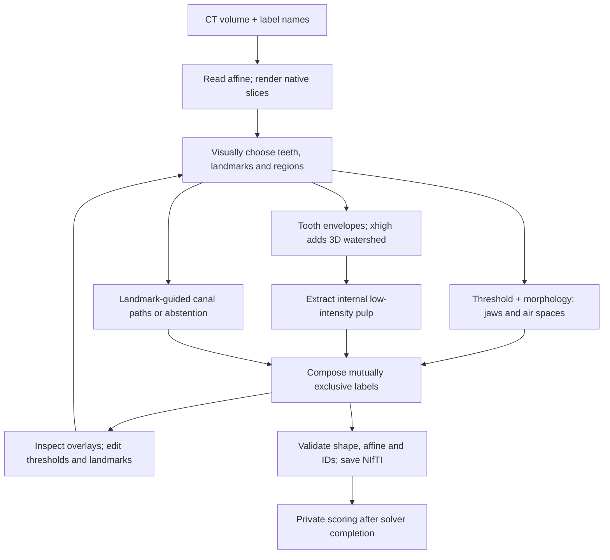

# Dental CT trace audit: identity convention, annotation contract and method limits

2026-09-21 · Assistant analysis requested in
[this task](codex://threads/01a0c3e5-6fb0-7321-a930-a7251047e7ad), following
[Research dental CT agent tasks](codex://threads/01a0c25e-4b08-7552-8379-90a2b50ad40f).
[Reproduction method](../methods/dental-trace-audit/README.md) ·
[Evidence receipt](evidence/dental-trace-root-causes.json).

The very low original score is dominated by a systematic side-ID disagreement.
There are also substantial independent errors in canal location, pulp extraction,
restoration semantics and some tooth boundaries. The available evidence does not
support calling the task impossible, declaring all GT wrong, or treating the
original 4–5% Dice as a clean measure of the agent's segmentation capability.

This review reads three completed solver sessions, their actual code and saved
arrays. It recomputes every frozen per-label Dice and foreground metric, then
adds explicitly post-hoc diagnostics. Original task, GT, prediction, code, trace
and score hashes are retained and verified unchanged. No inference, historical
authoring script, fixture conversion or publication was performed.

| Attempt | Agent time | Original macro Dice | Fixed L/R ID diagnostic | Foreground Dice |
| --- | ---: | ---: | ---: | ---: |
| F018 medium | 15m47s | 3.94% | 69.25% | 96.86% |
| F018 xhigh | 31m22s | 4.48% | 70.34% | 97.08% |
| F002 medium | 15m46s | 4.96% | 46.34% | 87.45% |

Foreground Dice merges every nonbackground class and is dominated by large
structures. A jaw voxel labeled as a tooth still counts as foreground agreement.
It cannot establish correct tooth identity or fine anatomy. The side diagnostic
changes IDs in a confusion matrix, never spatial positions or the saved answer.
It is not a replacement score or accepted correction.

## 1. The largest cause is an unresolved orientation contract

All three agents explicitly used the input affine for patient laterality.
NiBabel reads F018's viewer affine as LPI and F002's archive affine as LPS;
in both, increasing native index i maps toward patient-left under NiBabel's
RAS+ world-coordinate convention. This is a defensible reading of the supplied
metadata. [NiBabel coordinate documentation](https://nipy.org/nibabel/coordinate_systems.html).

The GT's semantic sides oppose that reading. For example, F018 GT upper-right
central incisor 11 has i-centroid 214.32, while upper-left 21 has 190.23. The
medium agent places 11 at 189.22 and 21 at 213.63. Teeth, pulp, sinuses and main
canals show the same systematic opposition. This is not an array mirroring error:
the tooth regions occupy essentially the same native positions.


The publisher explicitly documents a special RPI orientation and provides a
[conversion script](https://ditto.ing.unimore.it/static/toothfairy3/fix_orientation.py).
Inspection on 2026-09-21 found that it flips axes 1 and 2 of a SimpleITK array
(native j and i), then copies the original image information. Thus it changes
the voxel-to-world association; it is not a physical-coordinate-preserving
reorientation inferred solely from a trusted header. The
[publisher's orientation explanation](https://ditto.ing.unimore.it/toothfairy3/)
and these files need reconciliation. The script was downloaded for inspection,
not executed. Its hash is in the evidence receipt.

There is an independent warning sign: F018 archive and viewer CT/GT arrays match
exactly, but their z-axis metadata differ. F002's solver independently reported
maxilla at low k and mandibular base at high k despite a superior-positive header
(session line 51). Matching image/mask affine matrices proves registration to
each other, not correct patient orientation.

**Assessment:** the delivered task lacks a trustworthy, accessible specification
for translating voxel direction into the dataset's side labels. The source-specific
convention was withheld with the dataset context. A clean anatomical-identity
test should not make the solver guess it. This is stronger evidence for a
fixture/contract problem than for three independent failures to recognize sides.
Original acquisition orientation and annotation laterality still require source
owner or appropriate expert adjudication; this audit does not decide which
physical side is clinically correct. The publisher script alone does not justify
an automatic repair, especially given its different handling of axes.

The macro metric amplifies the problem: a correctly located tooth gets almost
zero same-ID overlap when numbered on the opposing side, and its pulp receives
another zero. F018 has 29 tooth/pulp pairs. Classes empty in both arrays are
excluded, so the fixed permutation also changes the evaluated inventory from
70 to 68 for F018 and 62 to 57 for F002. The diagnostic score delta should not be
interpreted as a fixed-denominator causal percentage of error.

## 2. The remaining errors are localized and substantial

All values below use the single predefined L/R permutation; other IDs and
geometry are unchanged. These are diagnostic means over active labels in each
group, not new official scores.

| Structure | F018 medium | F018 xhigh | F002 medium |
| --- | ---: | ---: | ---: |
| Jawbones | 86.1% | 84.8% | 79.6% |
| Sinuses | 72.6% | 93.3% | 77.2% |
| Pharyngeal air | 97.7% | 97.3% | 92.4% |
| Tooth tissue, excluding pulp | 80.6% | 81.2% | 72.5% |
| Pulp | 66.0% | 63.5% | 26.7% |
| Inferior alveolar canals | 18.4% | 42.8% | 0.0% |
| Incisive and lingual canals | 1.9% | 15.1% | 0.0% |
| Restorations | N/A | N/A | 18.1% |

N/A means absent from both arrays, not a zero score. A separate one-to-one
maximum-Dice assignment of whole-tooth objects (tooth plus pulp), ignoring FDI
identity and counting unmatched objects as zero, yields 82.0%, 82.3% and 73.9%.
That is an optimistic geometric diagnostic, not evidence that identities are
correct or a directly comparable benchmark result.

**Canals:** both F018 agents intentionally omitted the two incisive canals.
F002 omitted all five canal IDs. In F018, the main canal algorithms start from
visually chosen waypoints and grow a constrained tube. A plausible dark marrow
space can pull a centerline away from the annotated canal. Sampled cross sections
show genuine location differences after pooling left/right identity.


Gold is GT and cyan is xhigh prediction. Native j=145 shows large centerline
offsets; j=205 shows closer but imperfect correspondence. These sampled sections
illustrate reference disagreement, not a comprehensive clinical adjudication.

**Pulp:** F002's extraction rule is conservative in a measurable way. Against
side-paired reference pulp, its retained intermediate arrays show:

| Decision stage | Remaining overlapping reference voxels |
| --- | ---: |
| All GT pulp | 12,242 |
| Within the corresponding predicted tooth envelope | 10,728 |
| More than 1.6 voxels from the tooth surface | 10,433 |
| Smoothed intensity below 1180 | 4,074 |
| Within its hardcoded crown/root slice limits | 3,795 |
| In the final correctly paired pulp label | 3,746 |

The intensity cutoff alone removes 6,359 candidate GT voxels—61.0% of those
surviving the distance gate. Thus many pulp misses arise after a tooth envelope
already covers the reference location. Final component/core filters, closing and
cleanup follow; that last step is not strictly monotonic. This quantifies why
the implementation disagrees with GT. Raising a cutoff could also add false
positives, so these counts are not proof of a simple successful fix.

**Restorations:** F002 gives Bridge=8 to 62,073 voxels while GT contains no 8.
Of 69,816 GT Crown=9 voxels, 41,028 are predicted as bridge and 12,408 as implant;
none overlap the agent's Crown=9. Pooling all restoration types gives 64.4% Dice,
versus 18.1% mean separate-class Dice. This includes a semantic disagreement as
well as boundary errors. The agent's method explicitly interpreted an implant-supported
prosthesis as a bridge and two other restorations as crowns. The bare class names
do not explain the dataset's treatment of these situations.


F002 also omits a GT tooth object (37), and the whole-tooth matches for GT 15,
34 and 45 remain below 50% Dice. These cannot all be explained by laterality.
Visible metal streaks and the chosen tooth envelopes are plausible contributors;
the single case does not establish their separate causal effects.

## 3. What the agents actually did

These were image-guided programming loops: the model inspected rendered CT
slices, selected numerical landmarks, wrote classical segmentation code, inspected
overlays, and adjusted its code. No learned dental segmenter or pretrained weights
were available. The executable work, not hidden reasoning, supports this account.



Shared high-level pseudocode, reconstructed from saved scripts:

```python
ct, affine = load_native_scan()
label_side = infer_side_from_affine(affine)  # conflicts with reference convention
show_multiplanar_slices(ct)
regions, tooth_paths = choose_landmarks_from_images()

bone = threshold_in_regions(ct, regions.jaws)
bone = connected_components_close_and_fill(bone)
air = connected_air_regions(ct, regions.sinuses_and_pharynx)
for tooth in visually_identified_teeth:
    envelope = interpolate_cross_sections(tooth_paths[tooth])
    tooth_mask = extract_tooth(ct, envelope, method_for_this_run)
    pulp = interior_dark_components(ct, tooth_mask, empirical_cutoffs)
    assign(tooth_mask, tooth_id); assign(pulp, tooth_id + 100)

canals = trace_constrained_paths(ct, selected_landmarks)  # or leave unresolved
compose(bone, air, teeth, pulp, canals, restorations)
inspect_overlays_and_adjust()
save_and_check_integer_ids_shape_affine()
```

The three implementations differed in important details:

| Run | Tooth extraction | Canal extraction | Trace activity |
| --- | --- | --- | --- |
| F018 medium | Interpolate circular tooth regions; nearest-center ownership; intensity ~1100–1250; component selection, filling and limited expansion | Minimum-cost path near landmarks; intensity and distance penalties; smooth and expand the path | 35 exec calls; 36 image-view expressions |
| F018 xhigh | Branch-aware elliptical regions, tooth/background markers, 3D watershed using gradient, intensity and distance | Interpolated foraminal landmarks, bounded local intensity adjustments, then radius/intensity-constrained tube | 56 exec calls; 72 image-view expressions, including 3 in an aborted first plotting call |
| F002 medium | Elliptical envelopes; normalized-distance ownership; root/crown thresholds around 950/800 with local exceptions | All five canal labels deliberately omitted | 37 exec calls; 21 image-view expressions |

An image-view expression is an attempted tool invocation in the recorded code,
not a count of unique slices. Each image can contain many slices. Xhigh's first
plotting call failed because `inspect.py` shadowed Python's standard module;
the next call renamed it and continued. This small repaired code error does not
explain the final segmentation scores.

The core algorithmic differences can be expressed as:

```python
# Medium tooth partition (F002 uses normalized elliptical distance).
owner[v] = argmin_tooth(distance_to_interpolated_center(v))
mask[t] = owner_is_t & inside_envelope_t & (smooth_CT > threshold_t)

# Xhigh tooth partition: q is squared normalized distance to a tooth path.
background_seed = (q > allowed_radius) | (smooth_CT < 400)
tooth_seed = (q < 0.3) & (smooth_CT > 1300)
elevation = 0.55 * gradient - 0.25 * smooth_CT + 45 * clip(q, 0, 3)
mask = watershed(elevation, seeds, bounded_envelope)
mask = fill_and_smooth(mask & (smooth_CT > 1000))

# F018 medium canal route within a landmark-guided corridor.
cost[v] = 1 + clip(smooth_CT[v], 0, 1800) / 300 + 0.08 * distance_to_path[v]**2
centerline = minimum_cost_route(cost, start_landmark, end_landmark)
canal = expand_smoothed_path(centerline, radius_and_intensity_limits)

# F002 pulp rule, before component filtering and final cleanup.
pulp = (distance_inside_tooth > 1.6) & (smooth_CT < 1180)
pulp &= selected_crown_root_slice_range
keep_components_with_at_least_18_voxels_and_a_deeper_darker_core()
```

Thresholds are the agents' case-specific choices in stored intensity units.
They are not general dental criteria. Many small hardcoded coordinates/radii
make these per-case constructions, not demonstrated transferable algorithms.

Xhigh spends roughly twice as long and makes more inspections. Its side-paired
main-canal Dice improves by 24.4 percentage points and sinus Dice by 20.8 points,
while pulp falls by 2.5 points and tooth tissue improves by only 0.7 points. The
macro improvement of 1.1 points hides those changes because the many tooth/pulp
classes dominate the average. One attempt at each effort cannot establish a
general effort effect.

## 4. Is the prompt underspecified, GT wrong, or the task too hard?

| Hypothesis | Assessment and evidence |
| --- | --- |
| Missing output format | No. Filename, integer labels, native grid and affine were explicit; all outputs passed. |
| Missing orientation convention | Strongly supported. Affine-derived sides disagree with GT, with source-specific orientation documentation unavailable to solvers. |
| Missing annotation rules | Supported as a specification gap. Label names alone do not define crown/bridge boundaries, implant/abutment scope, sinus cavity versus aerated lumen, or when an indistinct canal should be inferred. Their exact contribution needs adjudication. |
| Entire GT is wrong | Not established. GT broadly aligns with teeth and bone. Side conventions and restoration semantics need review; fine boundaries are not clinically certified here. |
| Evaluator arithmetic bug | No reproduced evidence. Independent confusion-matrix calculations reproduce every stored Dice. Correct arithmetic does not validate the reference semantics. |
| Model method limitations | Directly observed: approximate tooth envelopes, misplaced canal tubes, restrictive pulp gates, omissions and restoration disagreement. |
| Timeout or resource termination | No. All three finished voluntarily in 16–31 minutes of a two-hour allowance. They were not shown to exhaust CPU/RAM/time. |
| Intrinsically impossible segmentation | Not supported. These runs already recover substantial geometry. The ambiguity in absolute side identity cannot be reliably solved from roughly bilateral anatomy alone when orientation metadata is untrusted. |

The scope is unusually demanding for this setup: full-volume, up to 77 semantic
structures, CT alone, no pretrained segmentation weights, no examples of the
annotation convention, no GT feedback. It tests whether an agent can invent a
case-specific segmentation system, rather than whether it can operate a proven
dental tool. The [dataset paper](https://federicobolelli.it/media/publications/pdfs/2026MICCAI_TF3.pdf)
describes expert annotation with separate review and learned baselines trained
for 300 epochs on large GPUs. Its reported best aggregate Dice is 74.06% on a
different hidden test set. This supports feasibility under a different condition;
it is not a fair numerical comparator for our post-hoc two-case diagnostics.

The prompt asks for visible anatomy and uncertainty notes. Choosing to abstain
on unresolved canals is consistent with that wording, but the private metric
scores every populated GT label and has no abstention channel. That mismatch
matters: careful uncertainty reporting earns no credit in dense-mask Dice. It
should be declared in a future task, without revealing which canals exist here.
The two-hour limit was a ceiling, not a minimum; finishing early is not itself
noncompliance, and more time is not proven to solve the missing convention.

The separate STS audit concerns a different dataset. Its corrupt full-image
planes are not evidence that these ToothFairy references contain the same defect.

## 5. Recommended next experiment boundary

These are assistant recommendations, not a user decision or authorization to run.

1. Resolve the orientation contract before interpreting FDI accuracy. Obtain
   authoritative convention/acquisition evidence and verify landmarks. Version
   a corrected fixture or explicit axis contract; preserve all original scores.
   A normal canonicalization call cannot fix an already incorrect header.
2. Supply dataset-wide annotation rules: tooth/pulp exclusivity, jaw/cavity
   boundaries, restoration categories and handling of uncertain structures.
   General rules are necessary task specification; per-case counts, coordinates,
   hints, GT overlays and scoring feedback remain evaluator-only.
3. Split the report into localization/shape, tooth identity, pulp, canals and
   restorations. Add geometry/surface and canal-path measures with a declared
   reference convention. Do not let large-organ occupancy stand in for accuracy.
4. For a bounded causal test, change only the generic contract and repeat fresh
   blind attempts on adjudicated fixtures with fixed budgets. Use repeats and
   more cases before comparing reasoning effort; do not retroactively rescore
   the old attempt as though it saw the repaired specification.
5. Separately test the clinically useful tool-assisted condition: a frozen,
   overlap-audited segmenter plus agent review/correction, against the segmenter
   alone. Provision and validate it only after explicit authorization. This asks
   a different question from segmentation code written from scratch.

Current review issues remain open. This diagnostic adds evidence; it does not
reinstate the experiments or adjudicate clinical labels. Reopen after orientation
and annotation rules are resolved, or when a controlled additional study is
authorized.
