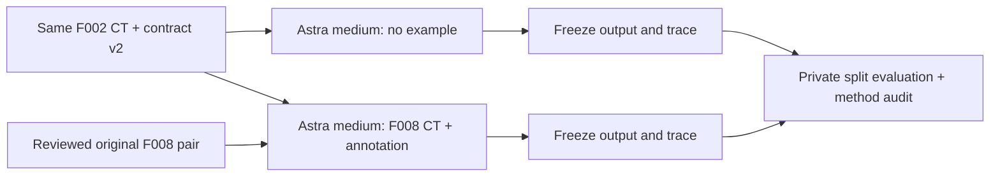

# Dental annotated-example comparison, contract v2

**Closed:** both authorized conditions and their saved-output reviews are complete.
See the [final comparison](../../findings/dental-reference-example-comparison.md)
and [fine-structure diagnosis](../../findings/dental-fine-structure-failure-analysis.md).
The execution section below describes the retained study; it is not a live queue.

User authorization: two fresh Astra/medium attempts, one without an example and
one with an apparently normal original-dataset CT/annotation pair; no extra tools.
The user selected F_002 for both targets. Source task:
codex://threads/01a0c3e5-6fb0-7321-a930-a7251047e7ad (2026-09-21).
This follows the [trace review](../../findings/dental-trace-root-causes.md).

## Frozen design

| Condition | Target | Extra reference | Model / effort |
| --- | --- | --- | --- |
| `dental-f002-contract-v2-astra-medium` | F_002 | None | `openai/gpt-6-astra` / medium |
| `dental-f002-reference-v2-astra-medium` | Same F_002 bytes | F_008 CT + original annotation | Same |

One fresh Codex 0.155.1 solver attempt per condition, 7200 agent seconds maximum,
4 CPUs, no GPU, configured 12 GiB container ceiling on a roughly 8 GiB Docker VM.
Run sequentially in table order. Same installed libraries, no new segmentation
model, interactive segmenter, weights or external data. Same public common
[instruction](instruction.md), except the availability paragraph for the example.
All target inputs/GT and common evaluator are byte-identical between conditions.
Neither solver inherits previous traces, methods, target findings or scores.
There is no feedback from the first attempt to the second. Target and example
are renamed neutral paths; source identities stay in author records.

The selected example F_008 is from `/Users/zhangqy/Downloads/ToothFairy3.zip`.
Original CT SHA-256 `777a4e7e780733508c4a44c0072b60cd1c1d69e4dd3c02fec0b947bdc2213c32`;
GT SHA-256 `81c4e5b1e504e3d58f038598882db42e68fce381e72e32b58ad5819a3297f454`.
Selected member reads verify ZIP CRC. Both arrays are 410×410×270 on matching
0.3 mm grids. All 32 tooth and matching pulp labels, five canal labels, both jaws,
both sinuses and pharynx are present. No restoration labels occur. Native
multiplanar and sampled canal/pulp overlays were reviewed, with no gross destructive
lesion or obvious restoration artifact seen. This is an apparently uncomplicated
example with complete label inventory, not clinical certification or exhaustive
voxel-level adjudication. It cannot teach restoration subtypes. Third-molar eruption
and subtle pathology remain unadjudicated. Candidate F_031 was rejected before
any freeze or attempt after closer review found very bright treated-looking tissue
within pulp 146; its preliminary preparation is retained locally as superseded.
Example text header fields are stripped; arrays, affine and qform/sform are retained.

## Changes 1–3 and their limits

1. **Versioned orientation contract.** Native array axes increase Right,
   Posterior, Inferior for dataset semantic naming. This explicitly overrides
   legacy header direction for assigning labels; output keeps the original grid
   and header. The [publisher](https://ditto.ing.unimore.it/toothfairy3/) documents
   RPI; the inspected source arrays/label sides are consistent with that convention.
   This resolves the experiment's naming instruction. It does not adjudicate
   acquisition-side clinical laterality or repair the original reference/header.
2. **General boundaries and uncertainty.** Tooth tissue excludes pulp; jaw labels
   include enclosed cancellous bone; named air/canal spaces exclude their walls.
   Omitted reference voxels count as misses, with no abstention exemption. General
   prosthetic categories and uncertainty reporting are specified. These are
   operational author rules. Publisher material does not fully settle all crown/
   bridge/implant voxel boundaries, so subtype agreement remains under review.
3. **Separated evaluation.** Keep original macro Dice as a comparable descriptive
   measure. Independently report whole-tooth union geometry, FDI identity, pulp,
   main and small canals, jaws, airspaces and pooled restoration geometry. Never
   relabel GT or postprocess submitted masks to improve agreement.

`score.py` is private to the verifier. Whole-tooth shape uses one-to-one maximum
Dice assignment of tooth+pulp unions, with unmatched objects scored zero. Report
FDI accuracy among matches with Dice >= 0.5, object precision/recall and correctly
identified GT recall. This detects identity error without hiding missed objects.
Pulp/main-canal/small-canal macro and pooled Dice remain separate; five canals also
get surface distances in mm (mean of the two directed means, maximum of the two
directed 95th percentiles). Absent on one side is marked missing, not zero distance.
Dice includes labels present on either side and omits both-empty labels. Restoration
subtype and pooled scores remain descriptive under the unresolved subtype rules.

## Validation and execution

`check_score.py` covers exact, empty, identity-swapped, pulp-merged, missing,
wrong-shape, wrong-affine, unknown and fractional-label controls. Both frozen task
packages must also pass native `med run --agent oracle` (1.0) and `--agent nop`
(0.0), plus input/network preflight before model dispatch. No model control calls.

Existing runtime identity:
`sha256:3de5f01c3d98a0ed47c9c6ac2ef202807e2761e0ece826d0b514c994f033f107`.
Build from verified local tag `tb3-dental-runtime:v1`, without installation or
network-enabled build steps; pin resulting solver/verifier image IDs before freeze.
Separate evaluator, internal solver network and model-only transport proxy;
no repository, Docker socket, target GT, evaluator or source ZIP in solver mount.
Treatment exposes exactly the additional CT and mask under `/app/reference`.
Retain actual network/mount/image snapshots and proxy logs, not just declarations.

Use `launch.py EXPERIMENT` and the local operation packet at
`.local/dental-reference-ablation-20260921/HANDOFF.md`. Exclusive dispatch marker,
shared advisory lock and active-solver checks prevent duplicate or overlapping
launch. No automatic inference retry, extension or continuation. Bounded repair
before inference is allowed with retained evidence and invariant checks. A poor
score does not cancel the second condition. Stop only verified owned processes
on user stop or <=20% remaining account quota; no reset credits or purchases.
Monitor owns queue/monitor records; launcher owns operator-state/log. Heartbeat
checks approximately every 15 minutes and stays quiet when unchanged. Review each
terminal boundary, independently replay scoring, audit access, and actually launch
the next authorized condition once ready. Freeze and retain every original result.

## Interpretation and report

This is a one-target, one-attempt-per-condition exploratory comparison. Report
within-pair deltas without population claims or attributing all differences to
reference exposure; solver randomness and reference suitability remain limits.
The old F002 run is context only: both prompt and evaluation protocol changed.
After both terminal reviews, report actual time/tokens, method pseudocode and a
process diagram; illustrate fixed native-coordinate overlays for shape, identity,
pulp and canals. Include an example-use audit: did it actually read/learn from
F_008, and did the derived method change? Unused reference exposure is not proof
that a useful reference cannot help. Do not change an answer after scoring.

Local receipts: source screening and selection, superseded preparation, final
preparation manifest, image pins, scorer controls, preflight, lifecycle controls,
queue and operator states. Raw data/images/traces stay local. Compact native
attempt/freeze records belong to the two experiments; neither is a clinical or
submission qualification claim.
