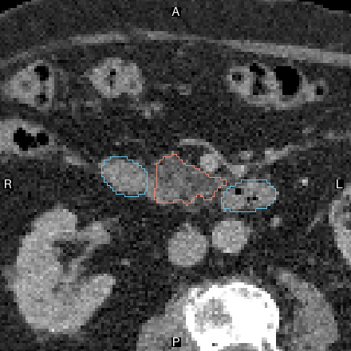
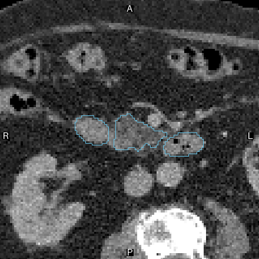
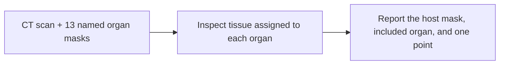

# Did this organ label swallow part of its neighbor?

**Auditing organ segmentations · BR-017 · about 4 minutes**

**Guided illustration:** [interactive tour](../../../presentation/tours/index.html?tour=segmentation) · [landscape video](../../../presentation/tours/exports/segmentation-landscape.mp4) · [portrait video](../../../presentation/tours/exports/segmentation-portrait.mp4). [Sources and reproduction](../../../presentation/tours/README.md).

A CT scan is a stack of images through the body. A segmentation adds a label to each small volume element, or voxel: liver, pancreas, bowel, and so on. Here, the scan is unchanged, but part of the pancreas has been assigned to the neighboring duodenum—the first section of the small intestine.

Can a general coding agent find that mistake, explain which tissue belongs elsewhere, and point to it?

**Sol missed the partial error in a broad audit, then found it in a fresh run focused on the two affected organs.** The supplied data were the same. This chapter follows what changed in the inspection.

## See the task

| Original labels | After tissue reassignment |
| --- | --- |
|  |  |

*Salmon outlines mark pancreas; blue outlines mark duodenum. Identical CT pixels, different ownership labels. These are author-created before/after illustrations, not images supplied to the agent in this form. The overlay change represents 21.04 mL across the full 3D region; this plane shows only one cross-section. TotalSegmentator source, CC BY 4.0. [Figure provenance](../../../presentation/assets.json).*



## Why this work matters

Organ masks support volume measurement and planning. A neatly drawn boundary can still assign tissue to the wrong organ, affecting what a downstream measurement represents. This experiment asks whether an agent can audit an existing segmentation; it does not ask it to create the segmentation or make a treatment decision.

The conventional workflow combines automated segmentation with visual review and correction. Specialized systems are strong at the first step: the original TotalSegmentator paper reported test-set Dice overlap of **0.943** across 104 structures (1 means identical segmented regions). That is context for segmentation quality, not a score on this tissue-ownership audit. [Wasserthal et al.](https://arxiv.org/abs/2208.05868)

## What the agent received and returned

The case is TotalSegmentator **s1233**. Sol received proposed organ names, existing masks, full CT and rendering helpers. The controlled edit moved **21.04 mL** of source-pancreas tissue into the duodenum label while preserving the original CT and aggregate foreground. All 13 names remained present.

The requested answer was small: report inclusions of at least **5 mL**, naming the host object and included organ, with one physical point near the included tissue. It did not require an exact contour or centroid.

The focused run actually returned:

```json
{"findings": [{"object_id": "o327", "included_label": "pancreas", "point_lps_mm": [-22.9, -199.9, 324.7]}]}
```

Here `o327` identifies the supplied duodenum object. The three numbers locate a point in the scan's physical coordinate system. [Recorded answers and scoring](../../../docs/evidence/br017-results.json)

## How Sol investigated

| Stage | Broad audit | Focused audit |
| --- | --- | --- |
| Establish the layout | Numerical screen across the supplied organs | Geometry of the pancreas–duodenum pair |
| Inspect suspicious anatomy | Targeted three-plane views of that pair, followed by the remaining organs | Rotated 3D views and finer sheets through their interface |
| Decide | Accepted the local appearance; returned no findings | Continued inspection after the global shapes looked plausible; identified included pancreatic tissue |
| Deliver | Empty findings list | Correct host/class pair and an accepted interior point |

Both runs combined code-based measurements with image inspection. The broad run did look at the affected pair: the difference cannot be reduced to “one saw it, one did not.” The traces support a difference in how the inspection developed, without isolating its cause. [Trace walkthrough](../../../docs/research-rounds/BR-017-traces.md)

## What worked, and what it cost

| Condition | Outcome | Agent time | Output tokens | Estimated API cost |
| --- | --- | ---: | ---: | ---: |
| Broad partial-error audit | Miss | 6m 44s | 10,593 | $1.011 |
| Focused audit, same data | Pass | 5m 51s | 12,009 | $0.932 |
| Whole pancreas absorbed | Pass | 5m 49s | 15,102 | $1.120 |
| Unchanged labels | Pass: no false finding | 7m 33s | 11,864 | $1.260 |

Agent time excludes setup and verification; cost is the harness estimate. Each condition had one fresh Sol/xhigh attempt. The focused run used less time but more output tokens than the broad run, so this is not a general efficiency result. [Results](../../../docs/research-rounds/BR-017-results.md)

## How the task became a useful challenge

Whole absorption removes the separate pancreas label, providing an obvious clue. Partial absorption retains that label and a plausible neighboring shape. The unchanged control checks over-reporting; the focused follow-up checks whether directing attention to the affected pair enables success.

This produces a useful capability boundary: the agent could identify the inclusion, but did not do so reliably across these two scopes. The focused pass is suggestive, not proof that attention alone caused the difference. Source contour accuracy and performance across patients were not established.

## Inspect or reproduce

- [Task summary](card.json), [frozen protocol](../../../docs/research-rounds/BR-017-absorbed-anatomy.md), and [scored results](../../../docs/evidence/br017-results.json).
- [Rebuild guide](../../../probes/revisions/br017/authoring/README.md): retained sources and commands for before/after figures and trace presentation.
- The full local report is `runs/br017-absorption/review/index.html`; native arrays and raw sessions are local-only. [Availability and reproduction levels](../../../presentation/references.md).

[Next: searching for an aneurysm →](../../lesion-localization/presentation/story.md)
