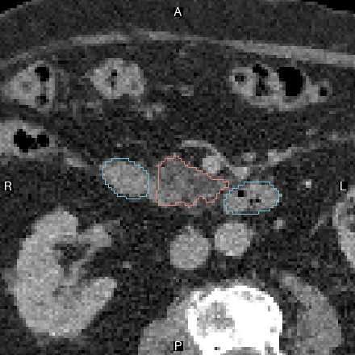
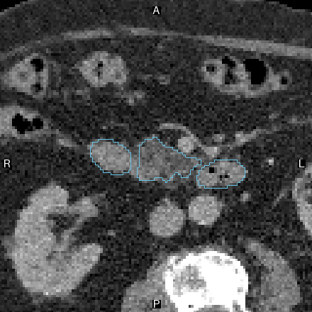

# 这个器官标签是否吞入了邻近组织？

**器官分割审查 · BR-017 · 约 4 分钟**

**图解导览：** [交互导览](../../../presentation/tours/index.html?tour=segmentation) · [横屏视频](../../../presentation/tours/exports/segmentation-landscape.mp4) · [竖屏视频](../../../presentation/tours/exports/segmentation-portrait.mp4)。[来源与复现](../../../presentation/tours/README.md)。

CT 是一叠人体切面图。分割为每个小体积元素——体素——赋予肝、胰腺、肠道等标签。这里 CT 没变，但部分胰腺组织被划进邻近的十二指肠标签。通用编码智能体能否发现、指出并解释这处错误？

**Sol 在宽泛审查中漏掉局部错误，之后在聚焦两个受影响器官的新运行中发现了它。** 所给数据相同；以下比较检查过程。

## 查看任务

| 原始标签 | 组织重新归属后 |
| --- | --- |
|  |  |

*鲑红色轮廓为胰腺，蓝色为十二指肠。CT 像素相同，标签归属不同。这是作者制作的前后说明图，不是以这种形式提供给智能体的图像。改动覆盖完整三维区域中的 21.04 mL；此处只显示一个切面。TotalSegmentator 来源，CC BY 4.0。[图像来源](../../../presentation/assets.json)。*


## 研究意义

器官掩膜用于体积测量与规划。边界看似整齐，仍可能把组织划给错误器官，改变下游测量的含义。本实验检验智能体审查已有分割的能力，不要求它从头分割或做治疗决定。

常规流程结合自动分割、视觉复核及修正。专用系统擅长前一环节：TotalSegmentator 原论文在 104 个结构上的测试集 Dice 为 **0.943**（1 代表分割区域完全一致）。这是分割质量背景，不是本次组织归属审查的分数。[Wasserthal 等](https://arxiv.org/abs/2208.05868)

## 智能体收到并交付了什么

病例为 TotalSegmentator **s1233**。Sol 收到拟议器官名称、已有掩膜、完整 CT 及渲染工具。受控改动将 **21.04 mL** 来源胰腺组织移入十二指肠标签，原 CT 与总体前景保持不变，全部 13 个名称仍存在。

所需答案很短：报告至少 **5 mL** 的组织混入，命名宿主对象与被包含器官，并给出混入组织附近的一个物理坐标点。不要求精确轮廓或质心。

聚焦运行实际返回：

```json
{"findings": [{"object_id": "o327", "included_label": "pancreas", "point_lps_mm": [-22.9, -199.9, 324.7]}]}
```

`o327` 是提供的十二指肠对象；三个数字表示扫描物理坐标系中的位置。[记录的答案与评分](../../../docs/evidence/br017-results.json)

## Sol 如何检查

| 阶段 | 宽泛审查 | 聚焦审查 |
| --- | --- | --- |
| 建立整体布局 | 对提供器官做数值筛查 | 检查胰腺与十二指肠的几何关系 |
| 检查可疑解剖 | 查看该器官对的三个平面，再看其余器官 | 用旋转三维视图与更细切面检查交界 |
| 作出判断 | 接受局部外观，返回空发现 | 整体形状看似合理后仍继续检查，找到被包含的胰腺组织 |
| 交付 | 空发现列表 | 正确的宿主／器官对及获接受的内部点 |

两次运行都结合代码测量与图像检查。宽泛运行确实查看过受影响器官对，不能简单说“一次看见、一次没看见”。轨迹支持检查如何深入的差异，但未分离出原因。[轨迹说明](../../../docs/research-rounds/BR-017-traces.md)

## 结果与代价

| 条件 | 结果 | 智能体时间 | 输出 token | 估计 API 费用 |
| --- | --- | ---: | ---: | ---: |
| 宽泛局部错误审查 | 漏检 | 6 分 44 秒 | 10,593 | $1.011 |
| 相同数据、聚焦审查 | 通过 | 5 分 51 秒 | 12,009 | $0.932 |
| 整个胰腺被吞入 | 通过 | 5 分 49 秒 | 15,102 | $1.120 |
| 标签未改动 | 通过：无假发现 | 7 分 33 秒 | 11,864 | $1.260 |

时间不含准备与核验；费用由运行框架估算。每种条件各有一次新的 Sol/xhigh 尝试。聚焦运行耗时较短却输出更多 token，不能由此推断一般效率收益。[结果](../../../docs/research-rounds/BR-017-results.md)

## 为什么这是一项有用的挑战

整个胰腺被吞入时，其独立标签消失，提示明显；局部吞入则保留胰腺标签及表面上合理的邻近形状。未改动对照检查过度报告，聚焦复测检查将注意力指向受影响器官对后能否成功。

能力边界因此更清楚：智能体可以识别混入，但在这两种审查范围下并不稳定。聚焦通过只是提示，不能证明注意力单独造成差异；来源轮廓准确性及跨患者表现尚未建立。

## 检查或复现

- [任务摘要](card.json)、[冻结协议](../../../docs/research-rounds/BR-017-absorbed-anatomy.md)及[评分结果](../../../docs/evidence/br017-results.json)。
- [重建指南](../../../probes/revisions/br017/authoring/README.md)：前后图与轨迹呈现的保留来源和命令。
- 完整本地报告位于 `runs/br017-absorption/review/index.html`；原生数组与原始会话只留本地。[可用性与复现等级](../../../presentation/references.md)。

[下一篇：寻找动脉瘤 →](../../lesion-localization/presentation/story.md)
