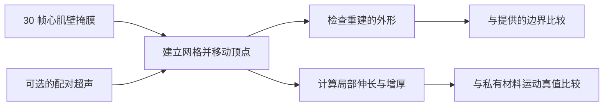
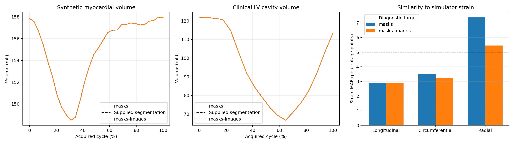

# 心脏形状会动，并不等于已知道组织怎样运动

**从分割到心脏力学 · BR-035 · 约 4 分钟**

**图解导览：** [交互导览](../../../presentation/tours/index.html?tour=cardiac) · [横屏视频](../../../presentation/tours/exports/cardiac-landscape.mp4) · [竖屏视频](../../../presentation/tours/exports/cardiac-portrait.mp4)。[来源与复现](../../../presentation/tours/README.md)。

心脏跳动时，心肌壁不断改变外形。重建随时间变化的边界是一项工作；恢复每块肌肉如何伸长、缩短、变厚，则是另一项。

**Sol 根据连续提供的掩膜构建了动态三维网格，并正确计算其形变。** 两次尝试都通过构建检查，但局部径向应变都未足够准确地恢复模拟器参考。必须区分“从运动中计算正确”与“推断出正确运动”。

## 查看任务

*掩膜只说明各帧中哪些位置被组织占据，不指出同一块组织下一帧移到何处。这是任务示意，不是临床成像流程。*

## 研究意义

心脏功能涉及泵出的血量及心肌壁运动。**射血分数（EF）**概括一次心搏排出的腔内血液体积分数。**应变**衡量组织尺寸变化：沿心脏长轴缩短、沿周向收缩及壁厚增加。

常规流程用图像轮廓或分割表示几何，用追踪方法估计运动。本实验直接提供分割，以便分别考察重建和力学计算，而不把边界检测混入其中。这些测量可辅助评估，但临床诊断还需结合其他证据。[NHLBI 临床背景](https://www.nhlbi.nih.gov/health/heart-failure)

## 智能体收到并交付了什么

两种条件都提供公开 **STRAUS 模拟**中、1.5 mm 网格上的 **30 帧三维二值心肌壁掩膜**；一种条件另提供配对超声。没有提供原始网格、持续的顶点身份、材料运动或参考应变。

输出是可执行的重建及动态四面体网格：把体积划分为四顶点小单元，并给出各时点坐标。这些坐标可用于几何检查及局部形变计算。模拟器提供真实患者图像通常不具备的材料运动真值。[实验设计](../../../docs/research-rounds/BR-035-segmentation-mechanics.md)

## Sol 如何建立和移动网格

两个求解器都将顶点置于体素单元角点，再将被占据的单元划分为四面体。它们对齐由掩膜计算的距离场、平滑形变，并逐帧修正，使重建的质心及总体积与给定掩膜一致。

超声辅助求解器还使用平滑后的纹理残差，同时限制边界位移。代码检查证实它确实使用了超声，而非仅名义上包含该输入。

这是实质性的工具构建：两个求解器都建立了 **63,326 个顶点**的网格，并计算形变梯度与应变。独立重算与这些计算一致；剩余问题是推断的内部运动是否匹配模拟器。[方法与独立检查](../../../docs/research-rounds/BR-035-results.md)

## 结果与代价

| 独立测量 | 仅掩膜 | 掩膜＋超声 |
| --- | ---: | ---: |
| 构建检查 | 通过 | 通过 |
| 全体积掩膜平均 Dice | 0.9461 | 0.9328 |
| 材料运动 RMSE | 1.615 mm | 1.717 mm |
| 纵向应变误差 | 2.87 pp | 2.90 pp |
| 周向应变误差 | 3.51 pp | 3.22 pp |
| 径向应变误差 | **7.37 pp** | **5.45 pp** |
| 智能体时间 | 21.55 分钟 | 13.26 分钟 |

*Dice 衡量体积重叠，1 为完全相同。应变误差是体积加权的平均绝对百分点差（pp）。两项径向误差都超过单独设定的 5 pp 研究目标。时间仅计智能体执行，不是作业全程。*

*左：提供与重建的合成心肌壁体积；中：下文另述的临床腔体迁移；右：合成应变误差。体积曲线几乎重合，是因为显式进行了体积匹配，不能独立验证组织运动。来源图未经修改重现；[定义与来源](../../../presentation/assets.json)。*

超声辅助条件伴随较低径向误差及较短智能体时间，但整体心脏运动误差与掩膜重叠略差。两个智能体独立设计了求解器，因此不能把这种差异视为向固定算法添加单一功能后受控得到的速度或准确度收益。

## 为什么边界匹配还不够

想象扭转圆柱而不改变其外形。分割可保持相同，内部材料却走了不同路径。解析对照证明这种歧义存在，并不证明智能体恰好犯了该扭转错误。

两个网格各有六条非流形边界边，属于冻结检查之外的质量问题。通过构建检查只确立特定数值和几何性质，不能证明完整生物力学有效性。[详细限定](../../../docs/research-rounds/BR-035-results.md)

## 任务如何修订

提供全部时相的掩膜使重建可行，同时仍不提供材料点对应。这暴露一项有用能力——建立动态模型——又不假装掩膜能唯一决定真实组织应变。

在另一项迁移检查中，未经修改的可执行程序在临床**腔体掩膜**序列上保留了几何。相对于原始来源表面的 EF 误差为 **0.0249 pp**，主要因为提供的掩膜已经编码体积曲线，求解器也将体积归一到它。这说明几何保留，而不是独立发现 EF。两个程序也正确报告：腔体模型不能确定心肌应变。

## 检查或复现

- [任务摘要](card.json)、[结果](../../../docs/research-rounds/BR-035-results.md)及[独立测量](../../../docs/evidence/br035-segmentation-mechanics-results.json)。
- [重建、评分与回放指南](../../../probes/cardiac-reconstruction/authoring/segmentation_mechanics/README.md)。
- 完整超声、动态网格及本地查看器需要保留的运行资产。另一项[原始图像重建研究](../../../docs/research-rounds/BR-032-real-echo-results.md)没有临床 EF 参考，不能并入此准确度表。[可用性说明](../../../presentation/references.md)。

[← 血管工作流](../../tubular-anatomy/presentation/story.md) · [下一篇：命名并定位解剖标志点 →](../../anatomical-landmarks/presentation/story.md)
