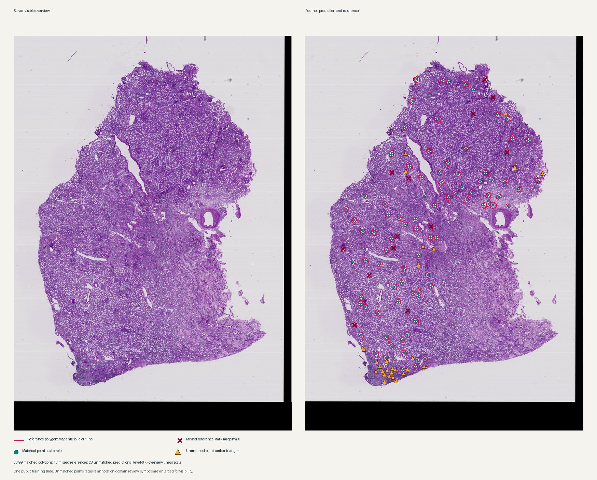
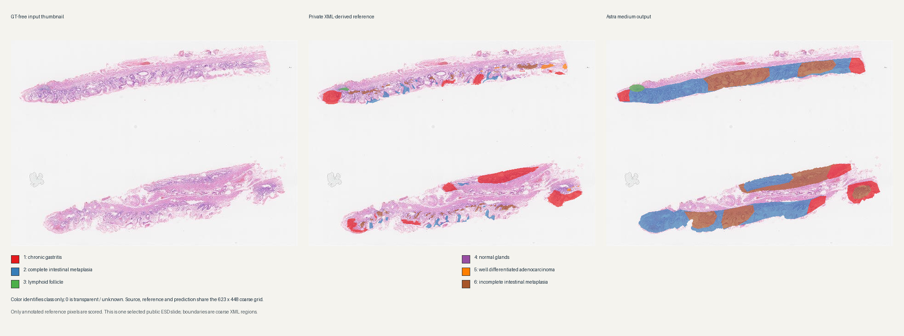

# Astra medium WSI diagnostic studies

Five `openai/gpt-6-astra` medium conditions completed on four selected public pathology sources. Every final answer passed Harbor's **artifact contract**; their private task measures show partial agreement with the released references. These are one-case or three-ROI diagnostics, not population estimates or qualified clinical tasks. The [pinned evidence inventory](evidence/wsi-astra-medium-diagnostic-synthesis.json) retains task digests, attempts, evaluations and local raw-artifact pointers.

## At a glance

| Condition | Frozen private-reference measure | Reading |
| --- | --- | --- |
| HuBMAP full-slide glomerulus inventory | 86/99 polygons matched by 114 points; 13 missed references, 28 unmatched predictions | Object search worked on much of this slide; unmatched points need annotation-domain review. |
| TIGER image-only, three fixed ROIs | Cells matched 9/20, 136/175, 250/323; matched-cell compartment accuracy 0%, 12.5%, 64% | Cell localization was partial; attribution was weak in two ROIs. |
| TIGER tissue masks supplied, same ROIs | Cells matched 7/20, 141/175, 232/323; compartment accuracy 100%, 100%, 99.1% | The supplied mask made attribution nearly exact; cell matching changed in mixed directions. |
| CAMELYON16 positive-slide search | 4/6 Tumor polygons hit by 7 points; 3 points outside Tumor, 0 in Exclusion | Polygon hits on one large-region positive slide; no negative or sparse-lesion estimate. |
| HiESD coarse gastric map | 10,088/11,290 annotated pixels labeled (89.4%); 3,222/11,290 correct (28.5%) | Broad output covered annotated tissue but often assigned the wrong class. |

Harbor `reward=1` in each row means the answer file had the required shape and type. It is not the task score, a clinical verdict or task promotion. All four experiment records remain **Draft / Not assessed**.

## Task and reference boundary

| Task | Solver-visible input and requested output | Evaluator-only reference and scoring |
| --- | --- | --- |
| HuBMAP | Native PAS kidney TIFF, physical scale, GT-free overview and coordinate crop helper; submit deduplicated level-0 glomerulus centers. | 99 released polygons; one-to-one point inside a polygon or within 50 µm of its edge. |
| TIGER | Three fixed H&E ROI PNGs; submit merged lymphocyte/plasma-cell centers and compartment codes. The paired condition additionally supplies the official tissue masks. | Source cell boxes and tissue masks; centers within 20 ROI-local pixels, then compartment code at the matched source cell. |
| CAMELYON16 | Native positive lymph-node TIFF, GT-free overview and crop helper; submit level-0 suspected metastasis points. | Six Tumor polygons and one Exclusion polygon; fraction of polygons with a point, supported/outside/excluded points. Polygons are not independent lesions. |
| HiESD | Native gastric ESD SVS, GT-free overview and crop helper; submit a 623 × 448 one-channel six-class map with 0 for unknown. | Released coarse-grid XML raster; coverage and class correctness only at annotated pixels. Unannotated tissue is not known-normal GT. |

All conditions used pinned Docker task inputs and private separate verifiers. HuBMAP, CAMELYON and HiESD crop helpers logged calls, but direct TIFF reads were possible, so those counts are descriptive rather than enforced read budgets. The inspected model command traces had no explicit access to private `tests/` or `solution/` paths. This trace inspection does not establish absence of public-data pretraining exposure.

## Result and reference inspection

**HuBMAP post-hoc view.** Left: solver-visible GT-free overview of the complete `aaa6a05cc` PAS TIFF. Right: the same 814 × 1156 overview with evaluator-only polygons (magenta solid outlines), matched submitted centers (teal circles), unmatched predictions (amber triangles) and missed polygons (dark magenta X). The 13,013 × 18,484 level-0 coordinates were scaled linearly to the overview; symbols were enlarged for legibility. Matching is one-to-one with the frozen 50 µm edge tolerance. Amber points are unmatched to this reference, not adjudicated clinical false positives; many cluster near the lower tissue edge. The overlay was made **after** scoring and was not a search hint to the agent.

**HiESD post-hoc view.** The GT-free source thumbnail, evaluator-only XML-derived mask and submitted map share the 623 × 448 coarse grid. Display colors identify classes 1–6 only, with 0 transparent/unknown; the legend is inside the figure and is not a success/failure scale. The output assigns broad regions where the reference has smaller annotated regions. The model never emitted codes 4 (normal glands) or 5 (well differentiated adenocarcinoma). On annotated pixels, class 1 chronic gastritis was correct on 1,252/6,911; class 2 on 1,106/1,796; class 3 on 71/100; class 4 on 0/121; class 5 on 0/361; class 6 on 793/2,001. Those are selected-slide counts, not class-level population rates. Predicted labels on unannotated tissue cannot be judged against this reference.

## Trace and condition comparison

- **HuBMAP:** The submitted file contained 114 level-0 points. The helper recorded 22 crop calls; the trace shows the agent iterating over native crops, marking candidates and submitting a sorted point file. Whether the 28 unmatched predictions are glomeruli outside annotation-valid coverage, duplicates or lookalikes needs image/reference adjudication.
- **TIGER:** The two conditions share the same three public ROIs, merged cell target, model and scorer, but task digests differ because the tissue masks are supplied in one condition. This is a **diagnostic** assistance comparison, with one independent stochastic attempt per condition. Near-perfect tissue-supplied compartment accuracy is expected when the evaluated mask is an input. Cell matching fell in roi1 and roi3 and rose in roi2; the pair does not establish a causal detection improvement. ROI1 contains only 20 reference cells.
- **CAMELYON:** The agent submitted seven points after eight logged crop calls. Four Tumor polygons received a point, three points were outside Tumor, and none fell in Exclusion. A polygon-hit fraction is not independent-lesion sensitivity. No negative case was run.
- **HiESD:** The helper logged 19 crops. The map covered 89.4% of annotated pixels but was correct on 31.9% of those it labeled. Classes 4 and 5 were absent from the entire output. Coarse XML boundaries and unannotated tissue limit finer pathology conclusions.

The four task families have different units, targets, references and scorers, so their numeric scores are **not comparable** or poolable. The only within-source paired contrast is TIGER, marked diagnostic above. All five completed conditions used Astra medium; there is no Sol-versus-Astra WSI performance comparison.

## Infrastructure and limits

Two earlier HuBMAP Sol/xhigh invocations ended before image analysis from credential/routing errors. The first Astra HuBMAP launch was interrupted after repeated WSI-sidecar `Network unreachable` errors. They remain separate `no_verdict` execution evidence; neither is a model miss. A corrected, restricted sidecar route then completed the five Astra conditions. Tiny route tests also showed that Sol/xhigh is accessible through the corrected route; the old host CLI error did not establish account-wide unavailability.

These public training examples may have appeared in model pretraining; exposure is unknown. Each source contributes one slide, except TIGER's three fixed ROIs from one slide. No model ranking, population sensitivity/specificity, clinical cell-count score, margin, invasion-depth or exact gland-boundary claim follows. The next evidence-changing work is independent slides and CAMELYON negative/small-lesion cases, adjudication of HuBMAP unmatched points, replicated TIGER assistance runs, and reference-domain review for HiESD. Existing scores and frozen bytes should remain unchanged.

## Provenance

- [Evidence manifest](evidence/wsi-astra-medium-diagnostic-synthesis.json) — 31 pinned records and 20 present selected local artifacts when collected; recheck it before reuse.
- [HuBMAP protocol](../experiments/wsi-hubmap-inventory-astra-medium/protocol.md), [TIGER protocol](../experiments/wsi-tiger-context-astra-medium/protocol.md), [CAMELYON protocol](../experiments/wsi-camelyon-search-astra-medium/protocol.md), [HiESD protocol](../experiments/wsi-hiesd-map-astra-medium/protocol.md).
- The overview figures were derived offline after model completion from each task's GT-free source overview, saved answer and private evaluator reference. HuBMAP markers use the frozen one-to-one scorer rule; HiESD overlays use the same coarse grid and a display-only categorical palette. Full native images, raw answers, traces and credential material remain local under `.local/`.
