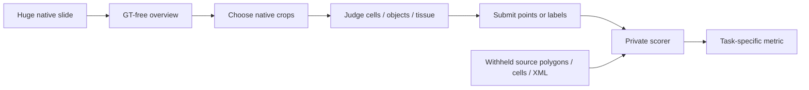
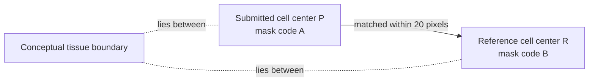

# Astra and Sol on whole-slide pathology: what changed, what failed, and what is comparable

## Executive summary

Five Astra-medium attempts and seven revised Sol-xhigh attempts completed across four whole-slide pathology task families. Every final answer met Harbor's **file-format contract**; that pass says nothing about medical correctness. An additional two early Sol HuBMAP launches and one Astra launch stopped at the auth/transport layer before image analysis and remain **no verdict**. The [Astra finding](wsi-astra-medium-diagnostic-synthesis.md), [Sol finding](wsi-sol6-xhigh-v2-diagnostic-synthesis.md), and [combined pinned inventory](evidence/wsi-astra-sol-method-comparison.json) are the evidence base.

- **HuBMAP is the closest shared endpoint:** both runs marked 86 of the same 99 released glomerulus polygons on the same PAS slide. Astra submitted 114 points, Sol 110. Their 28 versus 24 unmatched candidates await annotation-domain review, and Sol's revised contract explicitly treats them as a queue, so these counts are not validated false-positive rates. Different methods and one run each do not establish equal model ability.
- **TIGER keeps the same three ROIs but changed the instructions and evaluator disclosure.** Image-only matched-cell tissue coding was much weaker for Astra; Sol's prompt clarified the difficult class-6 definition. Supplying the *official evaluated mask* made tissue coding near exact in both runs, while cell matching moved in mixed directions. This demonstrates assisted lookup at predicted coordinates, not an independent tissue-reasoning comparison or a causal mask effect on detection.
- **CAMELYON changed both the question and evidence base.** On the shared positive slide, Astra submitted seven points and hit four of six source polygons; Sol submitted none and hit zero of four **grouped lesions**. Sol also submitted none on a second positive (0/30 groups) and a source-named normal (correct empty). The empty positives are a real diagnostic concern, but polygon hits and lesion-group hits are different endpoints; three selected slides do not estimate sensitivity or specificity.
- **HiESD changed task grain:** Astra drew a six-class coarse map and got 3,222/11,290 annotated pixels correct; Sol classified 8/12 fixed, GT-selected annotated patches correctly. Fixed-location patch classification removes the search and drawing burden. These scores cannot rank the models.

## WSI in one minute

A whole-slide image (WSI) is a digitized tissue section so large that an agent usually sees a small **overview**, chooses high-resolution **crops**, and submits locations or tissue labels in a declared coordinate system. A source **polygon** is a region traced in the reference; a **point** is one agent-selected location. An **ROI** is a fixed region of interest, so an ROI task may remove the whole-slide search problem. The **private reference** is withheld from the solver and appears only in post-hoc figures and scoring.



This diagram is **conceptual**, not a traced run. Four different metrics emerge at the right: object matches, cell matches plus tissue codes, tumor-location hits, or annotated-pixel/patch labels. Their percentages cannot be averaged.

| Family | Plain-language job | Solver output | What the reference actually measures |
| --- | --- | --- | --- |
| HuBMAP kidney | Find glomeruli, the kidney's filtering units, across one slide. | Level-0 center points. | One point per released polygon, inside or within 50 µm of its edge. |
| TIGER breast tissue | Find immune cells in three provided ROIs and say which tissue compartment each belongs to. | ROI-local cell centers and compartment codes. | Cell centers within 20 pixels; code at matched reference center, plus the revised Sol diagnostic at submitted center. |
| CAMELYON lymph node | Search for metastatic tissue and place a point in each found region. | Level-0 tumor points, or an empty list. | Astra: hits among six Tumor polygons on one positive. Sol: hits among study-grouped lesions on two positives and one negative. |
| HiESD gastric ESD | Assign one of six histology classes to tissue. | Astra: 623 × 448 coarse map. Sol: one label per 12 fixed patches. | Astra: correctness only on XML-annotated pixels. Sol: correctness on GT-selected patch locations. |

The tasks used pinned native images or ROIs, GT-free overviews, separately held private references, and oracle/no-op controls. A valid file is not a correct diagnosis. Neither public-data pretraining exposure nor clinical validity was established.

## Side-by-side result and methodology

| Family | Astra medium, first task | Sol xhigh, revised task | Comparison status |
| --- | --- | --- | --- |
| **HuBMAP** | 86/99 polygons matched; 114 points; 28 unmatched. Read overview and native crops, manually marked candidates through `marks.py` / `add.py`, then checked a marked overview. | 86/99 matched; 110 points; 24 unmatched. Tiled the slide, used a dark-round candidate detector, reviewed candidate and zoom sheets, then consolidated points with uncertainty notes. | **Endpoint only** for recall on the same slide/reference/matching tolerance. Different task digest, prompt, answer fields, candidate method and model. |
| **TIGER image-only** | Cell matches by ROI: 9/20, 136/175, 250/323. Correct tissue code among matches: 0/9, 17/136, 160/250. Enlarged four quadrants per ROI and assigned codes visually; all roi2 predictions used code 2. | Cell matches: 11/20, 158/175, 259/323. Correct codes: 11/11, 130/158, 247/259. Revised prompt defined code 6 as inflamed tumor-associated stroma and disclosed both center conventions; candidate detection script differed. | **Diagnostic**, same ROIs and cell matching unit, but prompt, scorer diagnostics, method and model changed. No controlled model effect. |
| **TIGER mask-supplied** | Cell matches: 7/20, 141/175, 232/323. Correct codes: 7/7, 141/141, 230/232. Sampled official mask at each submitted center. | Cell matches: 5/20, 141/175, 286/323. Correct source-center codes: 5/5, 141/141, 285/286; all 286 roi3 submitted-center codes matched the supplied mask. | **Diagnostic assistance contrast**, not independent tissue inference. The mask contains evaluated compartment labels. Detection procedures and single attempts differ. |
| **CAMELYON** | Shared `tumor_091`: seven points, four of six Tumor polygons hit; three points outside released Tumor polygons. Used low-resolution survey and eight logged high-resolution helper crops. | Shared `tumor_091`: empty answer, 0/4 grouped lesions. Additional `tumor_084`: empty, 0/30 groups; `normal_108`: empty with 0 reference groups. Surveyed low-resolution regions, sampled native crops, judged suspicious pale regions non-metastatic. | **Not numerically comparable**: polygon versus 50-µm grouped-lesion endpoint, plus extra Sol cases. On the shared positive, nonempty versus empty is a valid qualitative contrast. |
| **HiESD** | 10,088/11,290 annotated coarse pixels labeled; 3,222 correct. Read crops, hand-drew broad class regions and a tissue clip; never emitted codes 4 or 5. | Twelve GT-selected patches all labeled; eight correct. Read target and wider-context crops, contact sheets and public histology descriptions; four class confusions. | **Not comparable**: pixel map versus fixed-location patch classification, with different output grain and selection assistance. |

The Sol revised results and task changes are pinned in the [Sol evidence receipt](evidence/wsi-sol6-xhigh-v2-diagnostic-synthesis.json) and linked protocols, such as the [HuBMAP Sol protocol](../experiments/wsi-hubmap-inventory-v2-sol6-xhigh/protocol.md). Astra's more detailed trace reconstruction and reference audit remain in the [Astra report](wsi-astra-medium-diagnostic-synthesis.md). Wall time, token usage and helper crop counts are descriptive for single attempts, not efficiency rankings: startup, direct TIFF reads, task redesign and effort differ.

## Where the workflows lost information

The stage diagram below locates **observable** gaps. It does not assign a psychological cause to the model.

```mermaid
flowchart TD
  subgraph H[HuBMAP: find glomeruli]
    H1[Slide crops / candidate sheets] --> H2[Mark and deduplicate centers]
    H2 --> H3[86 / 99 reference polygons matched in each run]
    H2 --> H4[13 reference objects unmarked in each run]
  end
  subgraph T[TIGER: cells plus tissue]
    T1[Locate cell centers] --> T2[Match within 20 px]
    T2 --> T3[Assign tissue code]
    T3 --> T4[Mask supply nearly fixes code agreement]
  end
  subgraph C[CAMELYON: metastasis search]
    C1[Low-resolution survey] --> C2[Selected detail crops]
    C2 --> C3{Submit tumor point?}
    C3 -->|Astra, shared positive| C4[7 points; 4 / 6 polygons hit]
    C3 -->|Sol, two positives| C5[Empty lists; 0 / 4 and 0 / 30 groups]
  end
  subgraph E[HiESD: tissue class]
    E1[Inspect slide or given patch] --> E2[Assign class]
    E2 --> E3[Astra broad map: 28.5% annotated-pixel correct]
    E2 --> E4[Sol fixed patches: 8 / 12 correct]
  end
```



**HuBMAP.** Astra's 13 missed reference centroids fall inside generated crop rectangles. This rules out *geometric crop omission* as a complete explanation, but a generated image does not prove attention to every glomerulus. Sol's candidate detector and zoom pass found additional tufts, yet its final reference recall remained 86/99. We have not established whether both runs missed the *same* 13 polygons; equal totals are not pairwise agreement. Unmatched candidate profiles, especially at Astra's lower tissue edge, require blinded pathology review under explicit inclusion rules before calling them false glomeruli. The source features carry no sclerosis or partial-profile flags.

**TIGER.** Astra image-only assigned all nine matched roi1 cells code 0 even though their reference code was 7, and every roi2 point code 2 although 118/136 matched reference cells have code 6. That is an observed coding choice; the original prompt's short class-6 description could also have contributed. Sol's revised prompt supplied the fuller class definition. Both mask-supplied runs sampled the official tissue mask at the submitted center. Astra's two residual roi3 errors occur 1.4 and 3.6 pixels from matched reference centers across mask boundaries; Sol has one analogous roi3 source-center disagreement despite exact submitted-center mask use. This is a scoring-location convention, not a bad mask. Detection changes by ROI are mixed; independent stochastic scripts prevent a causal mask or model claim.



The sketch is conceptual, not a measured crop. The submitted answer can reproduce the supplied mask exactly at **P** and still disagree with the original scorer, which checks tissue code at **R**.

**CAMELYON.** Astra found four polygons on the shared positive, but the two unhit polygons are 24.4 and 32.0 µm from hit polygons and together under 1% of the source Tumor polygon area. Thus 4/6 overstates the distinct-lesion gap; the 99.1% *area of hit polygons* is a reference-geometry diagnostic, not a segmentation score. Sol's empty answers on both positives are more consequential: a valid abstention is wrong against nonempty tumor references. Its explicit native helper crops contained 2/4 and 11/30 oracle lesion-group points, respectively, while direct pyramid reads may have shown more. The trace records cautious benign interpretations of pale areas. Sparse detail sampling and recognition/threshold errors are both live explanations. Two post-hoc source-centered native crops were visually inspected; they do not show an obvious empty GT or coordinate offset, but are not pathology adjudication. The single normal empty answer is a control observation, not a specificity estimate.

**HiESD.** Astra's map covered 89.4% of XML-annotated pixels but classified only 28.5% correctly; it omitted classes 4 and 5 entirely and labeled 31,865 pixels outside the annotated region that the scorer cannot assess. Sol's fixed-patch task removes the search and map-drawing steps; 8/12 labels were correct, with confusions including tub1 versus incomplete intestinal metaplasia in both directions. The target squares are small and source labels are coarse regions; a blinded specialist review would be needed before alleging label error. XML covers only 4.0% of Astra's coarse grid, and a fresh XML raster matched its private mask exactly.

## Pseudocode: why a valid artifact can still fail

This is **teaching pseudocode**, distilled from task contracts and observed trace methods. It is not copied agent code and does not imply that every crop was reviewed equally.

```text
# Point-search tasks (HuBMAP or CAMELYON)
for region chosen from the GT-free overview:
    crop = read_native_slide(region)          # small field within huge slide
    candidates = inspect_or_propose(crop)
    for candidate in candidates:
        if judged_target(candidate):
            answer.points += level_0_coordinates(candidate)
write_valid_answer_file(answer)               # Harbor checks this shape

# Private evaluator, after submission only
for reference_unit in released_GT:
    match at most one submitted point under this task's rule
report hits, misses, and unassessed or unmatched points separately
```

```text
# TIGER paired task
for predicted_cell_center in fixed_ROI:
    if official_tissue_mask_is_supplied:
        code = mask[predicted_cell_center]     # assisted lookup
    else:
        code = visual_compartment_judgment()
    submit(predicted_cell_center, code)

# Private cell match allows centers up to 20 pixels apart.
# Original source-center score compares code with mask[matched_reference_center].
# A near-boundary point may be correct at its submitted center and disagree there.
```

For CAMELYON, an empty `points: []` file satisfies the output contract on any slide. On a positive slide, it produces zero tumor hits. For HiESD, a PNG of the right size can likewise pass the artifact contract while assigning the wrong classes.

## Actual views and what they establish


**HuBMAP, selected public PAS slide.** Left is the solver-visible overview; right is a **post-hoc** overlay of private released polygons (solid magenta), matched Astra points (teal circles), unmatched Astra points (amber triangles), and missed polygons (dark-magenta crosses). Level-0 coordinates were scaled to the 814 × 1156 overview; symbols are enlarged. The overlay supports the lower-edge concentration observation, not anatomical adjudication of the 28 unmatched points. It depicts Astra only; equal Sol recall does not imply the same point locations.


**HiESD, selected public ESD slide.** GT-free input, **post-hoc private** XML-derived coarse reference and Astra map share the 623 × 448 grid. The image legend maps classes 1–6; 0 is transparent/unknown. The wide output bands versus sparse XML regions illustrate why annotated coverage and class correctness diverge. This view depicts the Astra map; Sol's 12 patch task has no directly aligned whole-slide output image.

The local browsable report additionally shows two **post-hoc reference-centered** CAMELYON native crops from the Sol positive slides. Red circles mark released reference locations and were never solver-visible. Their selected locations remove the search problem, so they can check image/reference alignment but cannot measure how well either agent searched the full slide.

## Task and reference fitness, alternatives, and next tests

| Question | Evidence for an agent/workflow gap | Alternative or reference limit | Discriminating next observation |
| --- | --- | --- | --- |
| Why did HuBMAP miss 13? | Astra crop rectangles contain all 13; Sol swept tiles and reviewed zoom sheets. Both final outputs omit 13 released objects. | Crop containment is not recognition; altered/partial profile inclusion is undefined. Equal counts may hide different misses. | Compare matched-polygon identities and blind-review missed and unmatched native crops under a written inclusion rule. |
| Did TIGER masks improve detection? | Matched-cell counts change, but ROI directions disagree in both rounds. | Mask arm changes assistance; runs use different tile layouts/scripts and one stochastic attempt each. | Fix detector/tiles, repeat both arms, report cell matching separately from tissue coding and boundary stratum. |
| Why were Sol positives empty? | Two nonempty released references, empty files, and sampled crops containing some reference centers. | Low-detail sampling and cautious morphology judgments both plausible; public labels are not pathologist-revalidated here. | Prespecify a search/crop budget, inspect selected suspicious and GT-centered crops blind, repeat on independent positive and negative slides. |
| Did HiESD recognize tissue classes? | Astra omitted two codes and mislabeled many annotated pixels; Sol confused four fixed patches. | Different granularity, GT-selected patches, sparse XML and coarse grouped-gland labels. | Use more independently annotated slides/patches and blinded review of disputed histotypes before any model comparison. |

The strongest shared conclusion is methodological: **output-contract success, reference agreement, search coverage, tissue coding and clinical truth are different layers**. This study can contrast trace behavior and task design, but it cannot isolate a model effect because model, effort, prompt, task version, scorer, case set and sampling procedure changed together. No frozen score is revised here.

## Provenance and verification

- [Combined evidence manifest](evidence/wsi-astra-sol-method-comparison.json): nine experiment records, including the original Sol HuBMAP no-verdict route; current record and selected raw-artifact hashes checked separately from scientific interpretation.
- [Astra detailed finding](wsi-astra-medium-diagnostic-synthesis.md), [Astra trace diagnostic](evidence/wsi-astra-medium-trace-diagnostics.json), and [specification/reference audit](evidence/wsi-spec-reference-audit.json): five completed conditions and their post-hoc checks. The earlier Astra manifest pins the original dataset-index versions; those four index files later gained Sol-v2 links/cases while frozen Astra task digests and outputs remained unchanged.
- [Sol revised finding](wsi-sol6-xhigh-v2-diagnostic-synthesis.md) and [39-path Sol receipt](evidence/wsi-sol6-xhigh-v2-diagnostic-synthesis.json): seven completed conditions. The receipt is a task-specific pinned inventory, so `med evidence check` does not parse it; its 39 local paths were checked directly against recorded SHA-256 values.
- Original execution, scores, answers and GT remain unchanged. Post-hoc diagrams, selected figures and teaching pseudocode were prepared after both rounds and were never solver inputs.
