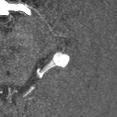
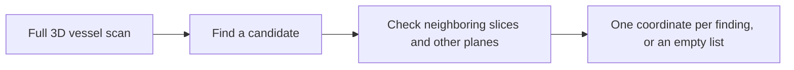

# Find a small bulge in a branching vessel network

**Aneurysm localization · BR-016 · about 4 minutes**

An aneurysm is a localized bulge in a blood vessel. In a brain angiography scan, the search problem is deceptively simple: follow many bright, winding branches and decide whether one contains a suspicious outpouching.

**A general agent localized the finding in one scan, missed another, and answered a negative case after identifying its public source.** These three attempts show different ways an image-and-code workflow can reach an answer.

## See the task



*A guided close-up from N02, produced afterward for readers. The rounded bright region near the center is the reference neighborhood. Bright signal shows vessels; overlapping branches can be misleading in a projection. This image combines seven native slices and is centered near the reference region—it is not the full search space the agent received. OpenNeuro ds003949, CC0. [Figure provenance](../../../presentation/assets.json).*



[Explore the guided tour](../../../presentation/tours/index.html?tour=aneurysm) · [Landscape video](../../../presentation/tours/exports/aneurysm-landscape.mp4) · [Portrait video](../../../presentation/tours/exports/aneurysm-portrait.mp4). Pause to inspect three native planes and toggle the weak reference label.

## Why this work matters

Localization is an early step toward reviewing a possible vascular abnormality. This task stops at pointing to a source-annotated finding; it does not estimate rupture risk or decide treatment.

A conventional review uses successive slices and projections to examine vessel shape. Dedicated detection software can assist that search. Here, no specialist aneurysm detector was supplied or observed: the agent wrote its own viewing and numerical checks. No matched human or specialist-detector score was measured on these three tasks. [Study record](../../../docs/research-rounds/BR-016-results.md)

## What the agent received and returned

Each task supplied original and skull-stripped TOF-MRA volumes, metadata, and a slice/projection helper. TOF-MRA makes flowing blood bright, helping reveal vessels. The agent could inspect the full native arrays; it was not given lesion-centered crops or reference masks.

The successful N02 output was:

```json
{"aneurysms": [[312, 213, 94]]}
```

These are native voxel indices: positions in the stored 3D image grid. Scoring matches one point to each weak source reference region, allowing an additional **1 mm** around that region. This is coarse localization, not “within 1 mm of the exact aneurysm center.” Extra or missing findings fail. [Scoring and source audit](../../../docs/evidence/br016-audit.json)

## How Sol searched

**N02: candidate, confirmation, coordinate.** Sol selected an apparent outpouching, generated consecutive views in three planes, and surveyed other branches. It measured bright connected regions at several thresholds and used local centroid checks to choose its final point. The answer matched the reference region.

**N01: extensive computation, missed finding.** Sol rendered slices and projections, then added repeated erosion and multiscale shape filters to rank candidates. Images covered the reference region, but the final close-ups concentrated elsewhere. After rejecting those candidates, it returned an empty list. Image coverage establishes an opportunity to see a finding, not recognition of it.

**N03: images followed by retrieval.** Sol inspected images, measured vessel widths, and produced rotated projections. It then fetched the public dataset inventory, downloaded a candidate source scan, and confirmed exact array equality with the input. The final empty answer followed exposure to the annotation inventory. This was permitted tool use, but it changes what the success demonstrates. [Trace-backed walkthroughs](../../../docs/research-rounds/BR-016-results.md)

## What worked, and what it cost

| Case | Output | Result | Agent time | Output tokens | Estimated cost |
| --- | --- | --- | ---: | ---: | ---: |
| N01 · sub-013 | Empty list | Missed reference finding | 6m 40s | 9,908 | $1.04 |
| N02 · sub-022 | One coordinate | Localized | 5m 46s | 8,763 | $0.98 |
| N03 · sub-000 | Empty list | Source-assisted pass | 7m 32s | 13,806 | $1.56 |

All three Sol/xhigh attempts completed normally. Time excludes setup/verification; costs are estimates. The most elaborate geometric search did not produce the best result. The practical observation is that useful candidate selection and well-chosen views mattered alongside numerical tools—not that a particular filter caused success or failure.

## How the task stayed challenging and solvable

No lesion was added or made smaller. Fixed source-order selection admitted two positive scans and one negative scan. A candidate with a very small weak label was held before trials. The answer remained one point per finding, avoiding an unnecessary segmentation requirement.

Source-grid checks and positive/negative scoring controls tested the task mechanics. They did not turn weak source labels into precise clinical truth. With one attempt per selected scan, these outcomes illustrate capability and limits; they are not a diagnostic accuracy estimate.

## Inspect or reproduce

- [Task summary](card.json), [protocol](../../../docs/research-rounds/BR-016-aneurysm-localization.md), and [results ledger](../../../docs/evidence/br016-results.json).
- [Authoring and local explorer guide](../../../probes/revisions/br016/README.md): source acquisition, scoring, retained traces, and linked native-slice viewing.
- Guided figures are portable. Full exploration requires the retained local arrays under `runs/br016-aneurysm/blind-review/`. [Availability guide](../../../presentation/references.md).

[← Organ auditing](../../anatomy-audit/presentation/story.md) · [Next: matching anatomy after a breath →](../../registration/presentation/story.md)
