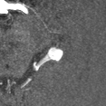
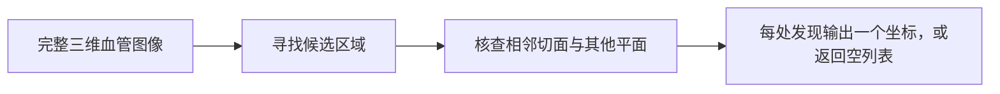

# 在分支血管中寻找局部膨出

**动脉瘤定位 · BR-016 · 约 4 分钟**

动脉瘤是血管的局部膨出。在脑血管造影图像中，智能体需要沿着明亮、弯曲的分支搜索，并判断哪一处可能向外凸出。

**一位通用智能体在一例中定位成功，在另一例中漏检；它在识别公开数据来源后正确回答了一例阴性病例。** 这三次尝试展示了图像与代码结合的工作流如何走向不同结论。

## 查看任务



*事后为读者制作的 N02 局部视图。中央附近的圆形明亮区域为参考区域；明亮信号显示血管，投影中重叠的分支可能误导判断。图像合成了七张原生切面，并以参考区域为中心，不是智能体接收的完整搜索范围。OpenNeuro ds003949，CC0。[图像来源](../../../presentation/assets.json)。*



[查看交互导览](../../../presentation/tours/index.html?tour=aneurysm) · [横屏视频](../../../presentation/tours/exports/aneurysm-landscape.mp4) · [竖屏视频](../../../presentation/tours/exports/aneurysm-portrait.mp4)。可暂停查看三个原生平面，并切换较粗的参考标签。

## 研究意义

定位是复核疑似血管异常的早期步骤。任务仅要求指出来源标注支持的位置，不估计破裂风险，也不决定治疗。

常规复核会连续查看切面与投影，专用检测软件也可辅助搜索。这里未提供或观察到专门的动脉瘤检测器；智能体自行编写视图和数值检查。三例任务均未测量与人工或专用检测器相匹配的分数。[研究记录](../../../docs/research-rounds/BR-016-results.md)

## 智能体收到并交付了什么

每个任务提供原始及去颅骨的 TOF-MRA 体数据、元数据和切面／投影工具。TOF-MRA 使流动血液明亮，有利于显示血管。智能体可检查完整原生数组；没有提供以病灶为中心的裁图或参考掩膜。

N02 成功输出为：

```json
{"aneurysms": [[312, 213, 94]]}
```

三个数字是原生体素索引，即存储的三维网格位置。评分把每个点匹配到较粗的来源参考区域，并在该区域外再容许 **1 mm**；这属于粗定位，不能解读为“距精确动脉瘤中心 1 mm 以内”。多报或漏报均不通过。[评分与来源审查](../../../docs/evidence/br016-audit.json)

## Sol 如何搜索

**N02：候选、核查、坐标。** Sol 选出一处疑似膨出，在三个平面生成连续视图并巡视其他分支；它在多个阈值下测量明亮连通区域，结合局部质心检查选出终点。答案匹配参考区域。

**N01：计算很多，仍然漏检。** Sol 生成切面和投影，又使用反复腐蚀及多尺度形状滤波排序候选。图像覆盖参考区域，但最终放大检查集中在别处；否定这些候选后，它返回空列表。曾有机会看到病灶，不等于已识别病灶。

**N03：看图之后检索来源。** Sol 查看图像、测量血管宽度并生成旋转投影，然后获取公开数据目录，下载候选来源扫描，确认其数组与任务输入完全一致。最终的空答案发生在接触标注目录之后。工具使用获准，但改变了这次通过所能证明的能力。[有轨迹依据的过程说明](../../../docs/research-rounds/BR-016-results.md)

## 结果与代价

| 病例 | 输出 | 结果 | 智能体时间 | 输出 token | 估计费用 |
| --- | --- | --- | ---: | ---: | ---: |
| N01 · sub-013 | 空列表 | 漏检参考发现 | 6 分 40 秒 | 9,908 | $1.04 |
| N02 · sub-022 | 一个坐标 | 定位成功 | 5 分 46 秒 | 8,763 | $0.98 |
| N03 · sub-000 | 空列表 | 借助来源信息通过 | 7 分 32 秒 | 13,806 | $1.56 |

三次 Sol/xhigh 尝试均正常完成。时间不含准备与核验，费用为估计值。最复杂的几何搜索没有取得最好结果；观察显示有效候选选择及合适视图与数值工具都重要，不能据此认定某个滤波器造成成败。

## 任务如何保持可解而有挑战

没有人为增加或缩小病灶。按固定来源顺序选择两例阳性和一例阴性；一例参考标签很小的候选在试验前暂缓。每处发现仍只需一个点，未增加不必要的分割要求。

来源网格检查及阳性／阴性评分对照验证了任务机制，却不能把较粗的来源标签变成精确临床真值。每片只有一次尝试，这些结果说明能力与限制，不是诊断准确率估计。

## 检查或复现

- [任务摘要](card.json)、[协议](../../../docs/research-rounds/BR-016-aneurysm-localization.md)与[结果账本](../../../docs/evidence/br016-results.json)。
- [作者实现与本地浏览指南](../../../probes/revisions/br016/README.md)：来源获取、评分、保留的轨迹及原生切面查看。
- 导览图像可移植；完整探索需要 `runs/br016-aneurysm/blind-review/` 下保留的本地数组。[可用性说明](../../../presentation/references.md)。

[← 器官审查](../../anatomy-audit/presentation/story.md) · [下一篇：呼吸前后的解剖对应 →](../../registration/presentation/story.md)
