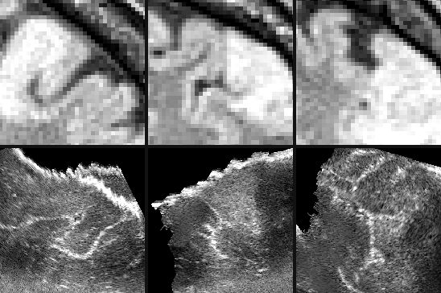
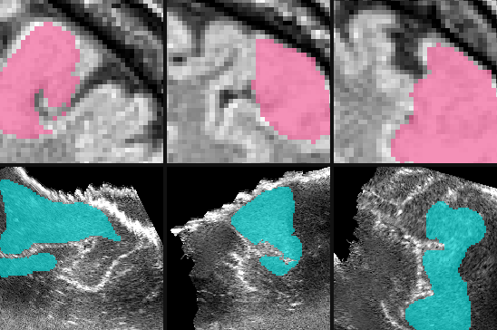
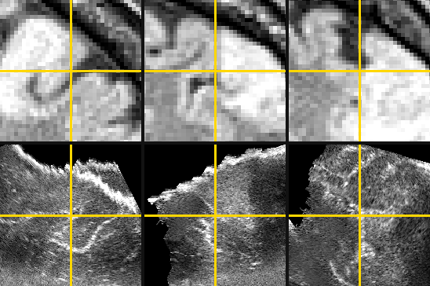
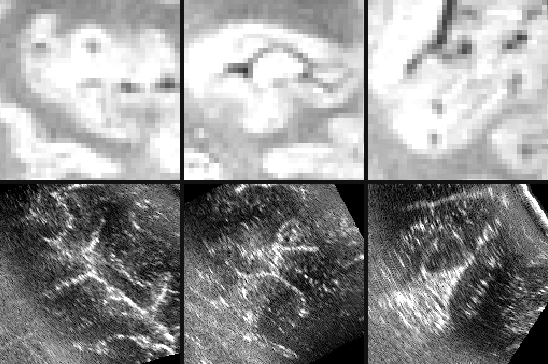
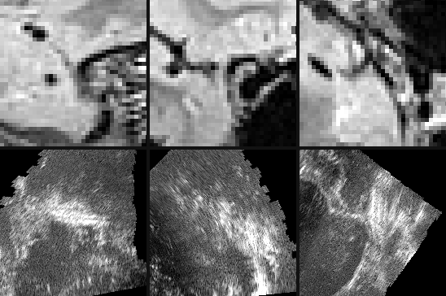

# Audit MRI-to-intraoperative-ultrasound correspondences

Given a marked point in pre-operative FLAIR MRI and its same-world-coordinate
candidate in pre-resection 3D ultrasound, retain or move the US point to the
homologous anatomy.

## Value

This probes whether an agent can inspect two very different image modalities and
correct neuronavigation misalignment caused by brain shift. It does not establish
clinical safety or improved surgery.

## Given

### Original data

Full native NIfTI volumes: T2-FLAIR MRI (about 1 mm voxels) and tracked B-mode 3D
ultrasound before resection (about 0.2 mm isotropic) from the same operation.
The three locally staged cases each contain 15 published point pairs.

### Supplied helpers

The base condition supplies the MRI query point and the same physical coordinate
as an initial US candidate. A separate helper condition adds MRI and US tumor
masks; they constrain the search region but do not reveal the landmark.

### Callable tools

A proposed viewer should expose orthogonal slices, linked world coordinates,
zoom/window controls and point placement in the complete volumes. The rendered
crops below are reader-only and selected after inspecting reference annotations.

### Reference-only material

The matching US coordinate from the MNI `.tag` file is evaluator-only. Each tag
row stores MRI `(x,y,z)` then US `(x,y,z)` in world millimetres. Tumor masks and
the example crop selection are also withheld in the base condition.

## Task specification

For one query, inspect both full volumes and return a corrected US voxel point,
confidence and a short description of the matching feature. Do not read tag files.
The initial candidate may be retained. This is a proposed definition; there is no
frozen prompt or experiment yet.

## Expected output

`{"us_voxel_ijk":[125.2,248.6,139.1],"confidence":0.7,"evidence":"sulcal corner"}`.
The evaluator maps the native continuous voxel coordinate into world millimetres.

## Evaluation

Primary: final 3D target-registration error (TRE) in mm and improvement over the
same-world-coordinate no-op. Report per-case median/mean/max, fraction improved
and movement magnitude; retain worse corrections as collateral damage. An oracle
returns the paired tag coordinate. Acceptance thresholds and ambiguous-point
handling remain to be preregistered. Published MRI↔pre-US inter-rater variability
was 0.33 ± 0.08 mm, but this does not itself define a fair agent threshold.

## Visual explanation

### Workflow

- Full FLAIR + pre-resection 3D US + MRI query and initial US candidate
- Inspect local anatomy across modalities; retain or correct the candidate
- Native US voxel coordinate + confidence + concise visual evidence

### Input

Case 2. Top: FLAIR; bottom: US. Columns are native array axes 0, 1 and 2,
resampled only for display. Each 18 mm-radius view is centered using an
evaluator-only landmark, so this crop is not a proposed solver input.

### Supplied helpers

Same views. Pink: FLAIR tumor mask. Cyan: pre-resection US tumor mask. These
RESECT-SEG masks are a proposed helper condition, not correspondence GT.

### Reference or output

Reader/evaluator reveal only. Gold crosshairs mark published pair 13 (zero-based
index 12): MRI `[19.918, 76.773, 63.580]` mm and US
`[19.290, 79.958, 57.191]` mm. Their initial separation is 7.17 mm.

## Conditions

| Condition | Supplied help | Work remaining |
| --- | --- | --- |
| Shared-frame base | Query point + same-world-coordinate US candidate | Decide whether and where to correct from image evidence |
| Mask assisted | Base + paired tumor masks | Match local structure within a narrowed region |
| Coordinate-only control | Coordinates, no voxels | Quantify how much shared geometry solves without images |

## Difficulty

MRI and US have different appearance, sampling and fields of view; the US also
contains speckle and acquisition shadows. The shared navigation frame is useful
but can be a shortcut. In the staged data, simply copying the MRI world point
gives mean error 1.82 mm (Case 1), 5.68 mm (Case 2) and 9.58 mm (Case 3).
Improving Cases 2–3 without degrading Case 1 is the useful hypothesis.

## Cases

| Case | FLAIR shape / spacing | US shape / spacing | Published pairs | No-op mean (max) TRE |
| --- | --- | --- | ---: | ---: |
| 1 | 192×256×256 / 1.0 mm | 348×313×275 / 0.216 mm | 15 | 1.82 (3.84) mm |
| 2 | 176×224×256 / 1.0×1.016×1.016 mm | 306×385×254 / 0.208 mm | 15 | 5.68 (8.99) mm |
| 3 | 192×256×256 / 1.0 mm | 337×313×246 / 0.200 mm | 15 | 9.58 (10.34) mm |

## Sources

- [RESECT dataset article](https://doi.org/10.1002/mp.12268)
- [Original dataset DOI](https://doi.org/10.11582/2017.00004)
- [Legacy DOI cited in the dataset article](https://doi.org/10.11582/2016.00003)
- [RESECT-SEG annotation article](https://doi.org/10.1002/mp.17317)
- [Pinned three-case acquisition and figure manifest](../sources/resect-sample.json)
- [Pinned combined re-host](https://huggingface.co/datasets/MedOtter/RESECT-SEG/tree/e86fb37dd93f7a9c64e48952f71410af59b04b9b)
- [Proposed idea and controls](../../ideas/resect-mri-us-correspondence.md)

## Coverage

One proposed MRI→pre-resection-US point-audit definition, three assistance/control
conditions and three locally acquired cases (45 published point pairs). Raw
volumes remain local; the compact source-derived previews are retained here.

## Gaps

No executable task bundle, viewer contract, decoy policy or scorer is frozen.
Affines may leak a strong initial guess, while GT-centered crops leak the search
region entirely; both require explicit condition design. These public cases were
used by CuRIOUS/Learn2Reg and are unsuitable as unseen test data for models exposed
to those benchmarks. The legacy official landing page was unreliable during this
acquisition, so files came from the pinned re-host with checksums and terms retained.
Current landing pages/re-host use DOI `10.11582/2017.00004`, while the original
article's data-access section cites `10.11582/2016.00003`; this discrepancy remains
explicit rather than being silently normalized.
