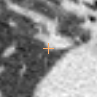
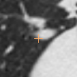
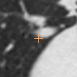
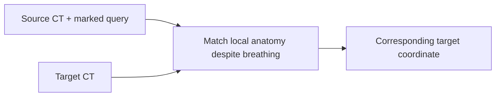

# Find the same anatomical point after a breath

**Matching lung CT scans · BR-028 · about 4 minutes**

**Guided illustration:** [interactive tour](../../../presentation/tours/index.html?tour=registration) · [landscape video](../../../presentation/tours/exports/registration-landscape.mp4) · [portrait video](../../../presentation/tours/exports/registration-portrait.mp4). [Sources and reproduction](../../../presentation/tours/README.md).

Take two chest scans at different breathing phases. The lungs change shape, so the same branch junction no longer sits at the same image coordinates. Image registration is the process of finding that correspondence.

**With both scans available in 3D, Sol substantially improved its eight-point match by moving from unsuccessful whole-volume registration to a custom local search.** One point still missed the frozen distance threshold; the user later accepted its appearance on review.

## See the task

| Source point | Target reference | Agent's final target |
| --- | --- | --- |
|  |  |  |

*Three review crops for q04 in the same dataset plane. Each is centered on its own point, so visual similarity alone does not measure displacement. The final 3D point error is 1.408 mm. These are author review views, not necessarily the agent's exact working patches. Learn2Reg LungCT, CC BY 4.0. [Figure provenance](../../../presentation/assets.json).*

## Why this work matters

Matching anatomy across scans helps compare positions and measurements when a body moves. Respiratory imaging is one setting where a simple global shift is insufficient. This experiment evaluates eight sparse correspondences, not an entire deformation field or a treatment plan.

Conventional approaches include manually marking matching features and using registration software to align image intensities. The experiment retained an author-built translation matcher that already passed from the original 2D source view: **2.133 mm RMS**, with a **3.416 mm** worst point. It establishes a feasible solution route, not a blinded human-performance score. [Baseline and protocol](../../../docs/research-rounds/BR-028-results.md)

## What the agent received and returned

The data come from **Learn2Reg LungCT 1.11**. The earlier task supplied one complete oblique source slice, eight query pixels with plane geometry, and the full 3D target CT. BR-028 added the full source CT while preserving those inputs and the reference answers.

The output is eight corresponding target positions in physical millimeters. For example, Sol's final q06 position was **[219.3, 162.3, 150.2] mm**. Success required an RMS distance of at most **3 mm** and no individual error above **5 mm**. RMS summarizes all eight errors while giving larger misses more weight.

## How Sol changed approach

| Stage | What it did | What the saved artifacts show |
| --- | --- | --- |
| Try established registration tools | Loaded both 3D scans into SimpleITK; compared several smooth deformation fields | Four saved Demons candidates and a B-spline candidate failed when scored afterward |
| Broaden local search | Searched actual 3D source patches over a broad target neighborhood using normalized cross-correlation | The search region contained all eight reference destinations |
| Refine and compare | Used local translation/affine fits, different patch sizes, and image checks | Recovered the two large earlier misses, but retained a weaker q06 estimate |
| Write the answer | Selected and rounded final coordinates after comparisons | No single saved executable rule fully captures that final selection |

Cross-correlation asks whether local intensity patterns match; the agent built this search after the library methods disagreed. Earlier fields contained better q06 estimates but were wrong elsewhere. Computing candidate answers and choosing which to trust were distinct parts of the work. [Saved-stage analysis](../../../docs/evidence/br028-stage-analysis.json)

## What worked, and what it cost

| Same eight targets | RMS error | Worst point | Frozen result |
| --- | ---: | ---: | --- |
| Earlier Sol attempt: 2D source | 12.731 mm | 32.203 mm | Fail |
| Sol with full 3D source | 2.604 mm | 6.412 mm | Fail: q06 only |
| Retained author 2D matcher | 2.133 mm | 3.416 mm | Pass |

The enriched attempt completed in **14m 53s**, with **26,364 output tokens** and an estimated cost of **$1.405**. The expensive unsuccessful searches remain part of that runtime. The agent recovered through an alternative method, but the fixed conventional baseline shows that this fixture did not require such a long workflow. These are not matched runtime measurements on identical implementations. [Measured receipt](../../../docs/evidence/br028-results.json)

The other seven final points were within 2.2 mm. Later, the user judged q06 visually good enough. That is a separate review outcome: it does not replace the frozen score or constitute an independent clinical panel. [Adjudication record](../../../docs/evidence/br028-adjudication.json)

## How the task was refined

The change added useful source depth; it did not make the task harder. The original slice and passing author method remained available. This made the comparison fairer to an agent that wanted to reason over 3D anatomy.

Both input information and the chosen strategy changed across fresh attempts. The improvement therefore cannot be assigned entirely to depth. What is directly demonstrated is a successful shift toward local matching, with a remaining candidate-selection problem.

## Inspect or reproduce

- [Task summary](../../../site_med/task_cards/med_reg_br028_respiratory.json), [frozen protocol](../../../docs/research-rounds/BR-028-registration-3d-source.md), and [complete result](../../../docs/research-rounds/BR-028-results.md).
- [Rebuild guide](../../../probes/registration-deformation/authoring/br028_README.md) links scoring, captured intermediate states, and review rendering.
- The full local comparison is `runs/br028-registration-3d-source/review/index.html`. [Source and availability guide](../../../presentation/references.md).

[← Aneurysm search](../../lesion-localization/presentation/story.md) · [Next: repair and unfold a vessel →](../../tubular-anatomy/presentation/story.md)
