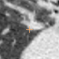
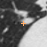
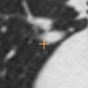
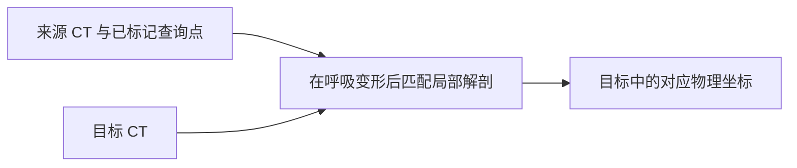

# 呼吸之后，寻找同一个解剖点

**肺部 CT 配准 · BR-028 · 约 4 分钟**

**图解导览：** [交互导览](../../../presentation/tours/index.html?tour=registration) · [横屏视频](../../../presentation/tours/exports/registration-landscape.mp4) · [竖屏视频](../../../presentation/tours/exports/registration-portrait.mp4)。[来源与复现](../../../presentation/tours/README.md)。

两次胸部扫描处于不同呼吸时相，肺形状会改变，同一个血管分叉不再位于相同图像坐标。图像配准要找回这处对应关系。

**获得两套完整三维扫描后，Sol 从失败的全体积配准转向自建局部搜索，使八点对应明显改善。** 仍有一个点超过冻结的距离阈值；用户后来根据视图接受了它的外观。

## 查看任务

| 来源点 | 目标参考 | 智能体最终目标 |
| --- | --- | --- |
|  |  |  |

*同一数据切面中 q04 的三张复核裁图。每张图以自己的点为中心，视觉相似本身不能量出位移。最终三维点误差为 1.408 mm。这些是作者的复核视图，未必是智能体工作时的原始图块。Learn2Reg LungCT，CC BY 4.0。[图像来源](../../../presentation/assets.json)。*

## 研究意义

身体运动时，跨扫描匹配解剖有助于比较位置与测量。呼吸图像中的变化无法总由简单的整体平移解释。本实验评价八个稀疏对应点，而不是完整形变场或治疗方案。

常规做法包括人工标记匹配特征，以及用配准软件对齐图像强度。实验保留一套作者自建的平移匹配方法：仅使用最初的二维来源视图就已通过，**RMS 误差 2.133 mm**，最大单点误差 **3.416 mm**。这说明存在可行解法，不是盲测的人类表现分数。[基线与协议](../../../docs/research-rounds/BR-028-results.md)

## 智能体收到并交付了什么

数据来自 **Learn2Reg LungCT 1.11**。早期任务提供一张完整的来源斜切面、八个查询像素及切面几何，以及完整三维目标 CT。BR-028 额外提供完整来源 CT，同时保留先前输入及参考答案。

输出是八个目标位置，以物理毫米表示。例如 Sol 最终的 q06 为 **[219.3, 162.3, 150.2] mm**。通过要求 RMS 不超过 **3 mm**，且任一点误差不超过 **5 mm**。RMS 汇总八处误差，对较大失误给予更高权重。

## Sol 如何调整方法

| 阶段 | 操作 | 保留产物说明 |
| --- | --- | --- |
| 尝试现有配准工具 | 将两套三维扫描载入 SimpleITK，比较数种平滑形变场 | 事后评分显示四个保存的 Demons 候选和一个 B-spline 候选未通过 |
| 扩大局部搜索 | 在宽泛目标区域中，用归一化互相关搜索实际三维来源图块 | 搜索区包含八个参考目标位置 |
| 细化与比较 | 结合局部平移／仿射拟合、不同图块尺寸和视图核查 | 修复早先两个大偏差，但 q06 估计仍弱 |
| 写出答案 | 比较后选择并四舍五入最终坐标 | 没有一套保存的可执行规则完整重现最终选择 |

互相关比较局部强度图案；库方法意见不一之后，智能体构建了这套搜索。早先的形变场曾给出更好的 q06 估计，却在其他点出错。产生候选和决定信任哪一个，是两项不同工作。[保存阶段分析](../../../docs/evidence/br028-stage-analysis.json)

## 结果与代价

| 相同八个目标 | RMS 误差 | 最大单点误差 | 冻结结果 |
| --- | ---: | ---: | --- |
| 较早 Sol 尝试：二维来源 | 12.731 mm | 32.203 mm | 未通过 |
| Sol 使用完整三维来源 | 2.604 mm | 6.412 mm | 未通过：仅 q06 |
| 保留的作者二维匹配方法 | 2.133 mm | 3.416 mm | 通过 |

输入增加后的尝试耗时 **14 分 53 秒**，输出 **26,364 token**，估计费用 **$1.405**。失败的高成本搜索也包含在这段时间内。智能体靠另一方法恢复，但固定的传统基线说明该任务并不需要如此长的工作流。这些并非相同实现的配对运行时间比较。[测量收据](../../../docs/evidence/br028-results.json)

最终其余七点均在 2.2 mm 内。用户之后认为 q06 的视觉外观可以接受。这是另一次复核结论，不会改写冻结分数，也不构成独立临床委员会的裁定。[裁定记录](../../../docs/evidence/br028-adjudication.json)

## 任务如何修订

增加来源深度提供更多可用信息，并未让任务更难。原切面及已通过的作者方法仍可用，这使希望分析三维解剖的智能体比较更公平。

新旧尝试的输入信息与所用策略都变了，因此不能把改善完全归因于深度。直接可见的是转向局部匹配后取得的改善，同时仍有候选选择问题。

## 检查或复现

- [任务摘要](card.json)、[冻结协议](../../../docs/research-rounds/BR-028-registration-3d-source.md)及[完整结果](../../../docs/research-rounds/BR-028-results.md)。
- [重建指南](../../../probes/registration-deformation/authoring/br028_README.md)连接评分、保留的中间状态与复核渲染。
- 完整本地比较位于 `runs/br028-registration-3d-source/review/index.html`。[来源与可用性说明](../../../presentation/references.md)。

[← 动脉瘤搜索](../../lesion-localization/presentation/story.md) · [下一篇：修复并展开血管 →](../../tubular-anatomy/presentation/story.md)
