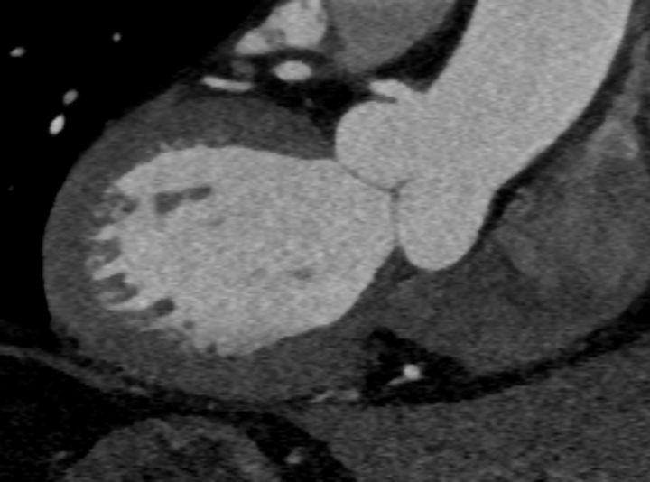
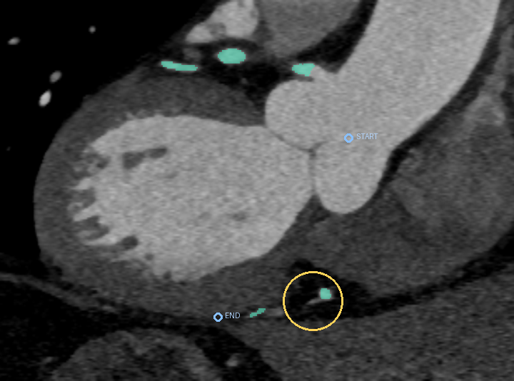
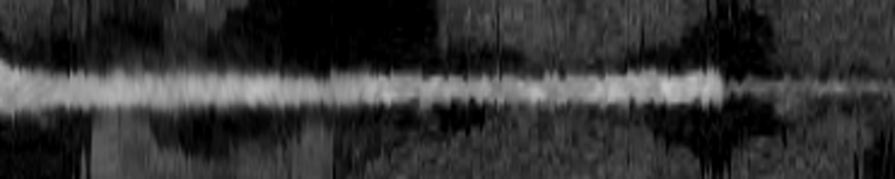

# Repair a vessel gap and unfold the route

Reconnect a local coronary-mask gap, trace the requested branch and produce consistent curved views and a surface.

## Value

A curved planar reformation unfolds a winding vessel for inspection. This task does not score stenosis or a diagnosis.

## Given

### Original data

An ImageCAS CT angiography crop.

### Supplied helpers

A supplied CAS-Net prediction, an 8 mm editable review sphere and two route anchors. The gap is a natural prediction defect.

### Callable tools

Agent-authored processing code; reference and scoring are retained separately.

### Reference-only material

Reference mask and geometry support the frozen scorer. The shown CPR is a post-run artifact, not a supplied input.

## Task specification

Repair inside the review region while preserving the mask outside it; keep coordinates, sampled intensities and path distances consistent.

## Expected output

Corrected mask, centerline in physical mm, eight curved CT planes with coordinates/distances, and a closed mesh.

## Evaluation

Frozen repair, preservation, trace, curved-view and mesh checks. Geometry-only and image-guided author methods both passed this fixture.

## Visual explanation

### Workflow

- CTA + mask + anchors
- Repair, trace and resample
- Mask + route + views + mesh

### Input

Delivered CT, shown on one native coronal plane selected using the supplied review marker. The solver received the full 3D crop. RAS X increases rightward and Z upward; physical aspect is preserved. Window: −100 to 700 HU. ImageCAS case 1; this is a reader view, not the complete task input.

### Supplied helpers

Same plane. Green: supplied CAS-Net mask. Gold: the supplied 8 mm review sphere. Blue: supplied start/end anchors projected into this view, potentially outside the slice. These helpers constrain where to repair and which route to follow; no reference or agent output is shown here.

### Reference or output

Post-run visualization from the author-corrected Terra package. Only distance metadata was corrected; the original attempt remains a failure on that check. ImageCAS / ImageCAS-X. Display aspect is explanatory, not a measurement scale.

## Conditions

| Condition | Supplied help | Work remaining |
| --- | --- | --- |
| Published supplied-helper condition | Predicted mask + editable sphere + route anchors | Repair and produce mutually consistent geometric outputs. |

## Difficulty

The mask, review sphere and endpoints remove much of the search problem. Consistency across outputs remains a real requirement.

## Sources

- [Apache 2.0 license text](../../../../presentation/task-explorer/assets/Apache-2.0.txt)

- [Preview image notices](../../../../presentation/task-explorer/assets/NOTICES.md)
- [Preview image manifest](../../../../presentation/task-explorer/assets/manifest.json)

- [Input/helper visual derivation and exact hashes](br030-visuals.json)
- [Source attribution and recorded terms](../../../../docs/evidence/br030-sources.json)

- [Current task card](../card.json)
- [Existing illustrated story](../story.md)
- [Frozen protocol context](../../../../docs/research-rounds/BR-030-vessel-diagnostic-geometry.md)

## Coverage

An internal example showing that the same brief format can sit before an existing results story.

## Gaps

Input/helper views are source-derived but show only one plane, not full connectivity. The selected input/helper PNGs are retained with source notices; rebuilding the underlying scans still requires local input files. The existing curved-view figure is an actual post-run artifact, not a reference answer. No population difficulty claim follows from this case.
