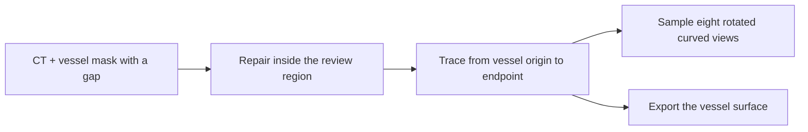
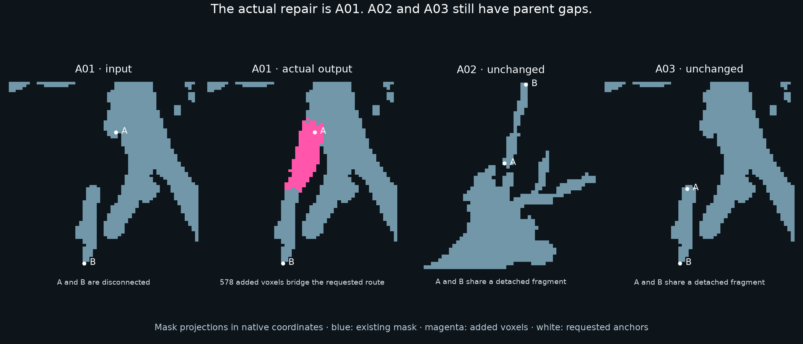

# Repair a vessel, then unfold it for inspection

**Vessel repair and curved views · BR-030, with an airway contrast · about 4 minutes**

**Guided illustration:** [interactive tour](../../../presentation/tours/index.html?tour=vessels) · [landscape video](../../../presentation/tours/exports/vessels-landscape.mp4) · [portrait video](../../../presentation/tours/exports/vessels-portrait.mp4). [Sources and reproduction](../../../presentation/tours/README.md).

Coronary arteries supply the heart muscle. A vessel winds through many image slices. To inspect its length, software can follow its centerline and sample a curved plane through it. The resulting image looks like an unfolded ribbon: a curved planar reformation, or **CPR**.

**Terra repaired a real coronary-mask gap, traced the requested branch, and produced curved images and a closed mesh.** Its remaining failure was small but concrete: the distance labels described an earlier version of the line, not the line it saved.

## See the task

*Conceptual workflow, not a patient image. The input already includes a predicted mask and route anchors. The agent must turn these into mutually consistent outputs.*

*One retained CPR preview from the author-corrected Terra package. The bright band is the contrast-filled vessel interior; the image follows the saved centerline. The correction changed distance metadata, not the underlying sampled CT values. This enlarged preview is not a uniform physical-scale measurement image. ImageCAS / ImageCAS-X source; [provenance](../../../presentation/assets.json).*

## Why this work matters

Following a vessel in a curved view helps a reviewer examine its interior and surrounding tissue along its length. CPR is an established visualization technique, rather than a new diagnostic method introduced by the agent. [Kanitsar et al.](https://www.cg.tuwien.ac.at/research/publications/2002/kanitsar-2002-CPRX/)

The conventional workflow uses a segmented vessel, a centerline, and image-resampling software, with review of the chosen route. Here the question is whether a general agent can assemble and check that workflow. No plaque, stenosis severity, or blood-flow diagnosis was scored.

## What the agent received and returned

The anchor case is **ImageCAS case 1**, with ImageCAS-X references. A released CAS-Net checkpoint produced a real internal gap of approximately **5 mm** despite **94.14% whole-mask Dice overlap**. The author supplied an unchanged crop of that prediction, the CT, an 8 mm review sphere, and route endpoints. The error was not injected.

Four outputs were required:

| Output | What a reader should expect |
| --- | --- |
| Corrected mask | Reconnect the local gap; preserve every voxel outside the editable sphere |
| Centerline | An ordered path in physical millimeters along the requested coronary branch |
| Eight CPR planes | CT intensity values, source coordinates, and matching distances along the path |
| Surface mesh | A closed 3D boundary containing both coronary trees |

The case belongs to the source training split. It is a development example, not held-out population performance. [Curation and task record](../../../docs/research-rounds/BR-030-results.md)

## How Terra assembled the workflow

The retained trace shows image inspection and CT-intensity checks. Terra added **103 voxels**, preserved the surrounding mask, and produced a centerline with **100% reference coverage within 0.8 mm**. The mesh passed the frozen surface checks.

For CPR, it resampled the centerline but retained distances computed along the original voxel skeleton. Resampling cuts corners, shortening the saved line. Its image samples matched the saved geometry; its distance metadata did not:

| Quantity | Length |
| --- | ---: |
| Saved distance axis, from the earlier skeleton | 184.809 mm |
| Actual cumulative length of the saved line | 175.918 mm |
| Inconsistency | **8.891 mm** |

An author correction to the distance array alone made the same package pass the unchanged verifier. This isolates the failure to output consistency; it does not convert the original attempt into a model pass. [Result and diagnostic correction](../../../docs/evidence/br030-results.json)

## What worked, and what it cost

| Method | Repair | Trace | CPR | Mesh |
| --- | --- | --- | --- | --- |
| Image-guided author baseline | Pass | Pass | Pass | Pass |
| Geometry-only repair/trace baseline | Pass | Pass | Pass | Pass |
| Terra/high, original output | Pass | Pass | Distance-axis failure | Pass |
| Author-corrected copy | Unchanged | Unchanged | Pass | Unchanged |

The agent job took about **9 minutes including setup and verification**. The fixed image-guided author method ran locally in **6.46 seconds**, after its development. These measure different work: one includes tool construction and investigation; the other executes an existing algorithm. Both author baselines were developed with source knowledge, though execution used delivered inputs.

Image guidance improved baseline local Dice from **0.900 to 0.951**, but geometry alone still passed. This case demonstrates workflow assembly better than difficult anatomical discrimination. [Full comparison](../../../docs/research-rounds/BR-030-results.md)

## How the task was refined: an airway contrast

BR-033 moved to airway gaps where tested geometric shortcuts chose a poor connection. An image-guided baseline and Terra both passed. Terra restored the requested A01 connection with **578 added voxels**.

*Retained author review of Terra's airway outputs. A01 is repaired; A02 and A03 remain detached from their parent trees. Their requested endpoints were already connected inside those fragments, and both masks stayed unchanged. AeroPath source; attribution and recorded terms are in the [asset manifest](../../../presentation/assets.json).*

That exposes a scope limit, not disobedience: the agent satisfied the requested local routes. A useful whole-tree repair task needs a whole-tree connection requirement. The contrast makes the agent's capability more precise—image-guided local repair worked, while broad anatomical completeness was not established. [Airway audit](../../../docs/research-rounds/BR-033-results.md)

## Inspect or reproduce

- [Task summary](card.json) and [coronary rebuild guide](../../../probes/vessel-geometry/README.md), including frozen inputs, scoring and local viewers.
- [Airway implementation and reproduction](../../../probes/airway-routing/authoring/README.md).
- The original failure and corrected copy remain distinct. Full meshes, CT arrays and trial files require local runtime material. [Availability guide](../../../presentation/references.md).

[← Matching scans](../../registration/presentation/story.md) · [Next: reconstruct a moving heart →](../../cardiac-motion/presentation/story.md)
