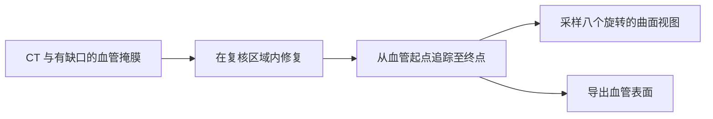
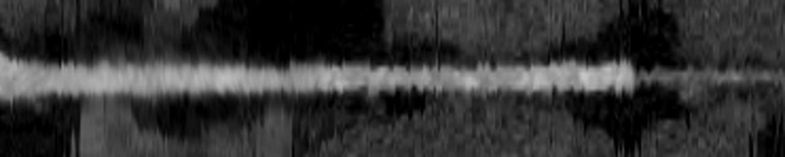
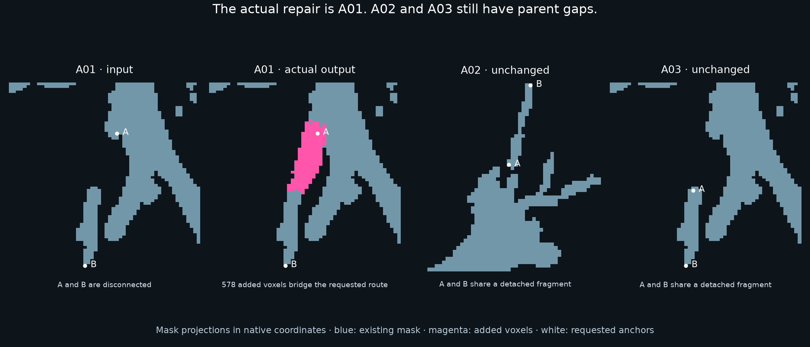

# 修复血管，并将其展开供检查

**血管修复与曲面视图 · BR-030，另附气道对比 · 约 4 分钟**

**图解导览：** [交互导览](../../../presentation/tours/index.html?tour=vessels) · [横屏视频](../../../presentation/tours/exports/vessels-landscape.mp4) · [竖屏视频](../../../presentation/tours/exports/vessels-portrait.mp4)。[来源与复现](../../../presentation/tours/README.md)。

冠状动脉为心肌供血，血管在许多图像切面中弯曲前行。软件可沿中心线采样一张弯曲的切面，把整段血管像缎带一样展开；这种图像称为**曲面重建（CPR）**。

**Terra 修复了一处真实的冠脉掩膜缺口，追踪所需分支，并生成曲面图像与封闭网格。** 剩余错误虽小却具体：距离标签对应的是旧版中心线，而不是最终保存的中心线。

## 查看任务

*概念工作流，不是患者图像。输入已包含预测掩膜与路线锚点；智能体要使所有输出相互一致。*

*作者修正的 Terra 软件包中保留的一张 CPR 预览。明亮条带是造影剂充盈的血管内部；图像沿保存的中心线采样。修正只改了距离元数据，底层采样的 CT 值不变。放大的预览不能用作统一物理比例尺的测量图。ImageCAS／ImageCAS-X 来源；[来源信息](../../../presentation/assets.json)。*

## 研究意义

沿曲面视图追踪血管，便于复核其全长的内部及周围组织。CPR 是既有的可视化技术，不是智能体发明的新诊断方法。[Kanitsar 等](https://www.cg.tuwien.ac.at/research/publications/2002/kanitsar-2002-CPRX/)

常规流程使用血管分割、中心线与图像重采样软件，并复核所选路线。本研究问的是通用智能体能否组装并检查这套流程；没有评分斑块、狭窄程度或血流诊断。

## 智能体收到并交付了什么

锚定病例是 **ImageCAS 病例 1**，参考来自 ImageCAS-X。一份已发布的 CAS-Net 检查点生成约 **5 mm** 的真实内部缺口，尽管完整掩膜 Dice 重叠为 **94.14%**。作者提供未经改变的该预测局部、CT、半径 8 mm 的复核球及路线两端点；错误并非人为注入。

任务要求四项输出：

| 输出 | 读者应看到什么 |
| --- | --- |
| 修正掩膜 | 接通局部缺口，保持可编辑球外每个体素不变 |
| 中心线 | 沿所需冠脉分支、以物理毫米表示的有序路径 |
| 八张 CPR 图 | CT 灰度、来源坐标及沿路径匹配的距离 |
| 表面网格 | 包含左右冠脉树的封闭三维边界 |

病例属于来源训练划分，只是开发示例，不代表留出集或人群表现。[整理与任务记录](../../../docs/research-rounds/BR-030-results.md)

## Terra 如何组装流程

保留轨迹显示图像检查与 CT 灰度核查。Terra 添加 **103 个体素**，保留周围掩膜；所生成中心线在 **0.8 mm** 内达到 **100% 参考覆盖率**。网格通过冻结的表面检查。

制作 CPR 时，它对中心线重采样，却保留沿旧体素骨架计算的距离。重采样会切去转角，使最终保存的线变短。图像采样与保存几何一致，距离元数据则不一致：

| 量 | 长度 |
| --- | ---: |
| 保存的距离轴，来自旧骨架 | 184.809 mm |
| 保存中心线的实际累计长度 | 175.918 mm |
| 不一致量 | **8.891 mm** |

作者仅修正距离数组后，同一软件包通过未改变的验证器。这把失败定位到输出一致性，不能把原始智能体尝试改写为通过。[结果与诊断性修正](../../../docs/evidence/br030-results.json)

## 结果与代价

| 方法 | 修复 | 追踪 | CPR | 网格 |
| --- | --- | --- | --- | --- |
| 作者图像引导基线 | 通过 | 通过 | 通过 | 通过 |
| 仅几何修复／追踪基线 | 通过 | 通过 | 通过 | 通过 |
| Terra/high 原始输出 | 通过 | 通过 | 距离轴失败 | 通过 |
| 作者修正副本 | 未改 | 未改 | 通过 | 未改 |

智能体作业连同准备与核验约耗时 **9 分钟**。固定的作者图像引导方法在开发完成后，本地执行耗时 **6.46 秒**。前者包括构建工具与调查，后者只运行已有算法，不是同一工作量。两套作者基线都在有来源知识的情况下开发，尽管执行时使用交付输入。

图像引导使基线局部 Dice 从 **0.900** 提高到 **0.951**，但仅靠几何仍能通过。此例更能说明工作流组装，而非困难的解剖判别。[完整比较](../../../docs/research-rounds/BR-030-results.md)

## 任务如何修订：气道对比

BR-033 转向气道缺口；在其中，所测几何捷径选择了较差的连接。图像引导基线与 Terra 都通过；Terra 给 A01 补回所需连接，添加 **578 个体素**。

*保留的作者复核图显示 Terra 的气道输出。A01 已修复；A02 与 A03 仍和各自主干树分离。两处请求的端点在其碎片内部原本就连通，两份掩膜均保持不变。AeroPath 来源；归属和已记录条款见[资产清单](../../../presentation/assets.json)。*

这体现的是任务范围限制，不是不服从：智能体满足了所请求的局部路线。若要检验整树修复，就必须明确要求接回整棵树。对比使能力边界更准确——图像引导的局部修复有效，更广泛的解剖完整性尚未建立。[气道审查](../../../docs/research-rounds/BR-033-results.md)

## 检查或复现

- [任务摘要](card.json)及[冠脉重建指南](../../../probes/vessel-geometry/README.md)，包含冻结输入、评分与本地查看器。
- [气道实现与复现](../../../probes/airway-routing/authoring/README.md)。
- 原始失败与修正副本分别保留。完整网格、CT 数组与试验文件需要本地运行材料。[可用性说明](../../../presentation/references.md)。

[← 扫描配准](../../registration/presentation/story.md) · [下一篇：重建跳动的心脏 →](../../cardiac-motion/presentation/story.md)
