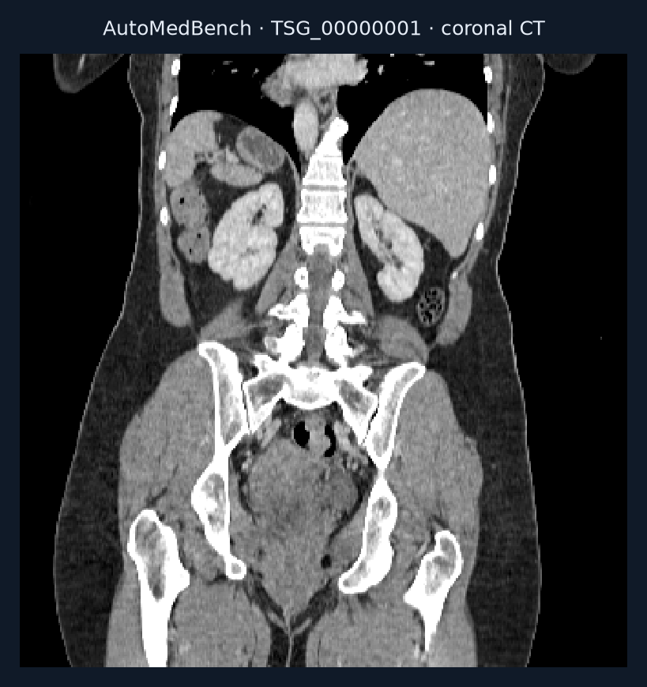
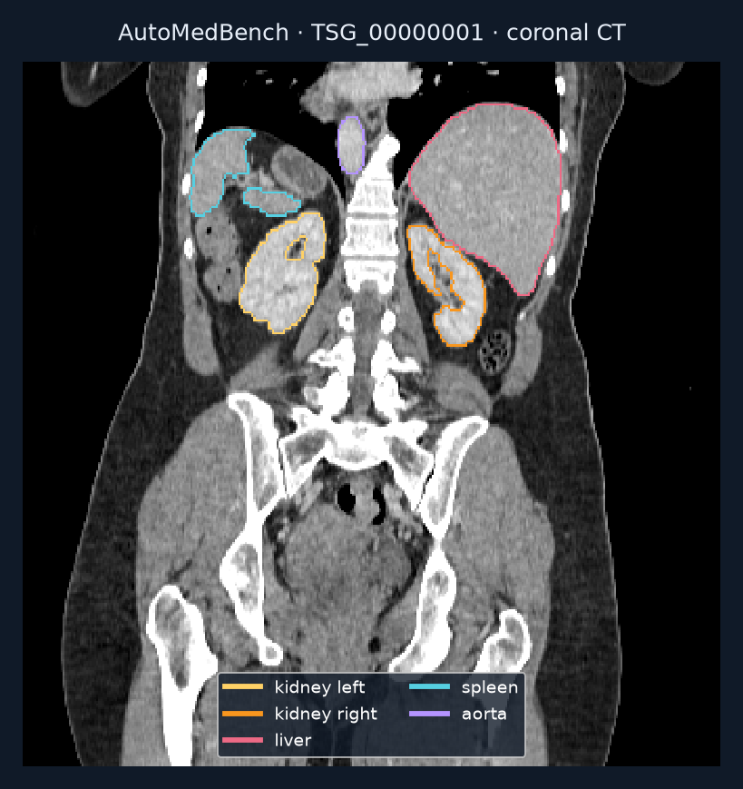

# Build a multi-organ CT segmentation pipeline

Produce a 3D integer-label map assigning CT voxels to 117 anatomical classes.

## Value

Organ masks localize anatomy for measurement or review. This task evaluates whether an agent can assemble and validate a working research pipeline.

## Given

### Original data

Forty CT cases in the packaged Lite release. This example is TSG_00000001, mapped by the release to TotalSegmentator source s1366.

### Supplied helpers

Lite instructions point to TotalSegmentator v2, explain installation/cache conventions, and describe remapping model labels to the benchmark scheme.

### Callable tools

A coding environment for setup and inference. Model weights and runtimes were not downloaded for this survey.

### Reference-only material

Masks in private/ are evaluator references, even though they are downloadable for offline scoring.

## Task specification

Plan, set up, validate, infer and submit within the configured 3,600 seconds. Preserve image geometry and remap labels correctly.

## Expected output

One dseg.nii.gz per CT, with integer values 0–117; 0 is background.

## Evaluation

The config claims a mean over nonempty reference classes, but the pinned Lite scorer
loops over all **117** configured classes, assigning Dice 1 to empty/empty pairs.
Seven nonclinical fixtures reproduce that implementation: with two occupied classes
and 115 empty classes, an all-background output scores **115/117 = 0.9829**. This
toy result is not anatomical performance or a score on the illustrated patient.

Present outputs must have valid integer IDs and matching native geometry, including
active qform/sform consistency. Missing files do not make the aggregate format flag
false; the scorer omits them from its class averages, then aggregation scales Dice
by completed-patient fraction. Malformed present outputs count in completeness but
receive zero Dice. Medal assignment occurs before completeness scaling and remains
unchanged afterward. Read format, coverage and final task score together. S1–S3
remain unscored in this deterministic path; no judge was executed.

## Visual explanation

### Workflow

- CT + model guidance
- Set up, validate and infer
- Multi-class organ map

### Input

Native 1.5 mm CT, coronal plane 164; window −160 to 240 HU. This plane was selected post hoc using kidney references. One plane of a 333 × 333 × 336 volume; right increases rightward, superior upward.

### Supplied helpers

Model and label-remapping guidance are supplied; this patient's reference masks are not. The model's native label numbers must be converted before submission.

For the separately pinned TotalSegmentator 2.4.0 `total` map, left kidney maps 3→42,
right kidney 2→43, liver 5→44, spleen 1→84 and aorta 52→3. These are five example
conversions, not a full map. Requirements allow later versions; inspect the actual
checkpoint's labels. No model output is fabricated for this explanation.

### Reference or output

Five downloaded references: both kidneys, liver, spleen and aorta. The release lists 78 classes present in this case, out of 117 possible. A partial illustration, not a complete reference set or agent prediction. TotalSegmentator via AutoMedBench Lite; CC BY 4.0.

## Conditions

| Condition | Supplied help | Work remaining |
| --- | --- | --- |
| Packaged Lite | TotalSegmentator guidance + label conventions | Set up, preserve geometry, remap labels and submit. |

## Difficulty

A plausible mask can fail if class numbers or geometry are wrong. The task requires much more output coverage than the five structures shown.

## Sources

- [Preview image notices](../../../presentation/task-explorer/assets/NOTICES.md)
- [Preview image manifest](../../../presentation/task-explorer/assets/manifest.json)

- [Pinned config and label map](https://huggingface.co/datasets/MitakaKuma/AutoMedBench-Lite-release/blob/8928073d5c3f3b842a4a4278d9b44f6e8ceaa9c5/benchmarks/AutoMedBench-segmentation/eval_seg/tsg-multiorgan-seg-task/config.yaml)
- [Lite supplied guidance](https://huggingface.co/datasets/MitakaKuma/AutoMedBench-Lite-release/blob/8928073d5c3f3b842a4a4278d9b44f6e8ceaa9c5/benchmarks/AutoMedBench-segmentation/eval_seg/tsg-multiorgan-seg-task/lite_s1.md)
- [Data card and attribution](https://huggingface.co/datasets/MitakaKuma/AutoMedBench-Lite-release/blob/8928073d5c3f3b842a4a4278d9b44f6e8ceaa9c5/DATA_CARD.md)
- [Sample download and rendering receipt](../samples.json)
- [Pinned Lite source and nonclinical evaluator audit](../sources/automed-multiorgan-audit.json)
- [Canonical operation story](../stories/automed-multiorgan.story.md)
- [Native teaching assets and attribution](../../../presentation/task-explorer/automed-multiorgan/NOTICE.md)
- [Pinned model label table](https://github.com/wasserth/TotalSegmentator/blob/2e0c20058df8acb17acd54a7adf25bf7a0a33c90/totalsegmentator/map_to_binary.py)

## Coverage

One illustrated case from the 40-case Lite segmentation track. The Lite release has seven tracks; the separate Full release defines 48 tasks with Lite and Standard conditions.

## Gaps

Only five reference masks were downloaded. No model run, full-case scoring or
private-reference isolation audit was performed. The audit acquired 29 pinned Lite
source files through `hf-mirror.com`, matching revision headers and Git blob ETags;
it does not claim authenticated primary-host transport. The separate Full-release
task package has a different revision/config and was not substituted for Lite.

Assistant review decision: explain the observed all-class denominator and preserve
the contradictory config prose. Reopen the score interpretation for a new release,
an upstream clarification, or a changed evaluator; this is not a user research decision.

## Cases

Forty scans share the Lite segmentation task. TSG_00000001 has a local illustrated example; the other scans are indexed only.
