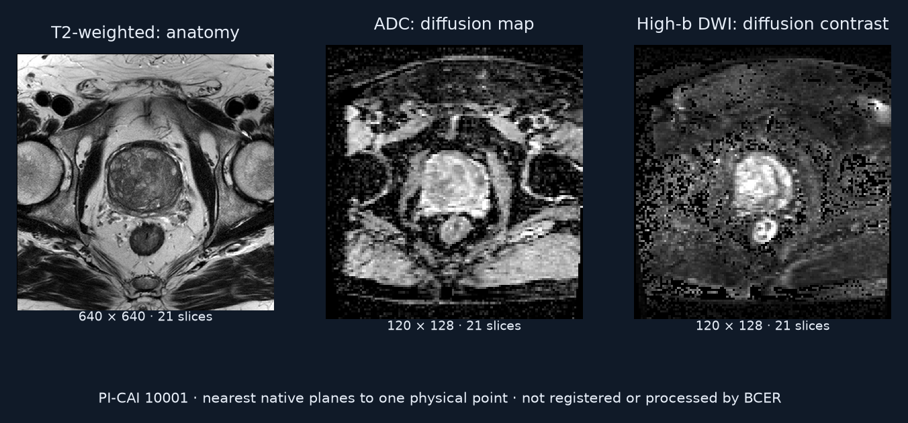

# Complete a prostate MRI processing workflow

Identify sequences, align them, segment the prostate, detect candidates, extract features and write a report.

## Value

This assembles intermediate imaging products that can support review. The pinned implementation reports stage success, path completeness and artifact invariants separately. None establishes clinical accuracy.

## Given

### Original data

Prostate MRI: T2-weighted plus ADC and/or high-b-value diffusion imaging.

### Supplied helpers

A case manifest, task contract and typed artifact references organize the supplied case.

### Callable tools

A predefined collection of MRI processing tools, with controller variants and bounded recovery.

### Reference-only material

The inspected contract checks required stages and artifact invariants. It does not supply an independent anatomical accuracy comparison.

## Task specification

Run the six required stages and retain their required artifacts.

## Expected output

Prostate mask, lesion-candidate JSON, feature table and report JSON.

## Evaluation

For `long_prostate_full`, the base success rule checks six tool-success flags. TCR counts six stage checks and four path-existence checks, for a denominator of ten. Five invariants are computed separately: nonempty mask, matching geometry, basic candidate JSON, a CSV data row and truthy report JSON. The metrics documentation describes SR as requiring TCR=1; this is not the selected contract and runner behavior reproduced by the bounded audit. Fault-specific handling is outside this replay.

Five author nonclinical fixtures reproduce `(base success, TCR, invariants)`: missing files `(pass, 6/10, 0/5)`; empty files `(pass, 10/10, 0/5)`; one-voxel grid and trivial records `(pass, 10/10, 5/5)`; shifted mask origin `(pass, 10/10, 4/5)`; failed report stage `(fail, 9/10, 5/5)`. These are mechanical examples, not model outcomes.

## Visual explanation

### Workflow

- MRI + case manifest
- Six processing stages
- Mask + candidates + report

### Input

PI-CAI 10001_1000001: T2 anatomy, ADC diffusion map and high-b diffusion image. Different resolution and contrast illustrate sequence identification and alignment. Nearest native planes to one physical point, not a registration result.

### Supplied helpers

The original locally authored manifest uses lowercase `t2w/adc/dwi` keys; exact selected-rule replay does not recognize them. Its bytes are preserved. A fresh derived example uses canonical `T2w/ADC/DWI_highb` keys inferred from the prepared filenames and satisfies the selected contract. Filename inference does not validate acquisition metadata. Original MHA arrays and prepared NIfTI arrays match exactly; geometry agrees within 1e-5. This preparation is ours, not a released BCER run.

### Contract and provenance

The eight-node planning template makes DWI registration and feature extraction optional, while the benchmark contract requires feature extraction. Dependency arrows refer to this static template, not a run trace. Lesion detection consumes typed registration and mask paths.

The segmentation source includes an explicitly degraded geometric fallback when the MONAI dependency check raises; it creates an ellipse from array dimensions. Missing model weights with an available stack raise separately. No medical fallback is executed here. Preserve degraded-mode flags, warnings and source revision when interpreting outputs.

### Reference or output

No BCER run was launched. Mask, candidates, feature table and report would be generated outputs; downloaded MRI images do not stand in for them.

## Conditions

| Condition | Supplied help | Work remaining |
| --- | --- | --- |
| Full prostate workflow | Typed tools + case references | Choose valid calls, preserve artifact relationships and complete all stages. |

## Difficulty

A wrong sequence, spatial mismatch or broken artifact dependency can derail a later stage. This differs from recognizing anatomy without specialist tools.

## Sources

- [Source and validator audit](../sources/bcer-workflow-audit.json)
- [Native source asset notice](../../task-explorer/bcer-workflow/NOTICE.md)
- [Pinned benchmark runner](https://github.com/Albertlongzi/BCER/blob/d10816712793a9e27f2e70640f9afc06f08a0c5c/benchmark/benchmark_runner.py#L918-L1349)
- [Pinned planning template](https://github.com/Albertlongzi/BCER/blob/d10816712793a9e27f2e70640f9afc06f08a0c5c/agent/plans/templates/prostate_full_pipeline.json)
- [Segmentation implementation](https://github.com/Albertlongzi/BCER/blob/d10816712793a9e27f2e70640f9afc06f08a0c5c/tools/prostate_segmentation.py)

- [Preview image notices](../../../presentation/task-explorer/assets/NOTICES.md)
- [Preview image manifest](../../../presentation/task-explorer/assets/manifest.json)

- [Task contracts](https://github.com/Albertlongzi/BCER/blob/d10816712793a9e27f2e70640f9afc06f08a0c5c/configs/tasks_registry.json)
- [Public suite template](https://github.com/Albertlongzi/BCER/blob/d10816712793a9e27f2e70640f9afc06f08a0c5c/benchmark/benchmark_suite.template.json)
- [Metrics](https://github.com/Albertlongzi/BCER/blob/d10816712793a9e27f2e70640f9afc06f08a0c5c/docs/METRICS.md)

- [Dataset and manifest instructions](https://github.com/Albertlongzi/BCER/blob/d10816712793a9e27f2e70640f9afc06f08a0c5c/docs/DATASETS.md)
- [PI-CAI public data, Twilt et al.](https://zenodo.org/records/6624726)
- [Sample download and rendering receipt](../samples.json)

## Coverage

Also: short denoising, brain segmentation, reconstruction, registration, and full brain/cardiac workflows.

## Gaps

Public sample acquisition is resolved: three sequences, about 12 MB, verified against ZIP CRCs. PI-CAI uses CC BY-NC 4.0. A BCER run is still needed for output comparisons; no fixed released BCER patient split was found.
