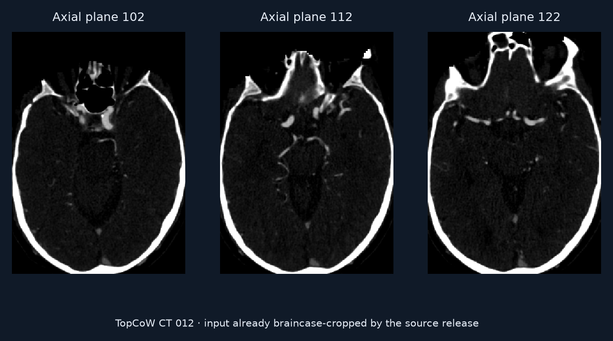
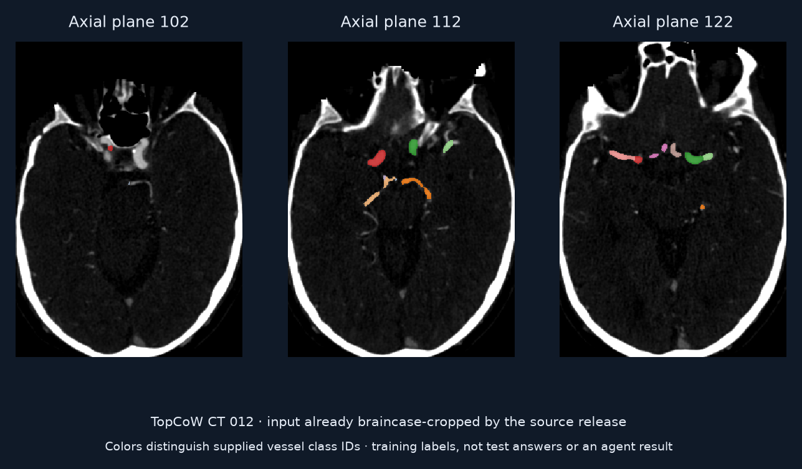

# Learn to label the brain’s arterial ring in CTA

Build a segmentation model that assigns anatomical vessel classes in Circle of Willis CT angiography.

## Value

Named vessel maps help describe cerebrovascular anatomy. This task tests medical ML engineering across training and unseen predictions.

## Given

### Original data

Labeled training CTA volumes and test CTA volumes. The pinned preparer sorts matched CTA filenames and applies an 80/20 split with seed 42. Replaying it on filenames from the complete 125-pair TopCoW 2024 release produces 100 training and 25 test cases.

### Supplied helpers

Training segmentation labels, the challenge description, public grader, leaderboard and submission conventions. Test labels are withheld. The preparer copies no ROI or vessel-edge annotations into the task.

### Callable tools

An ML engineering environment for preparing data, training models and producing competition submissions.

### Reference-only material

Training labels are supplied assistance; test labels are withheld for grading. Case 012 belongs to the private test-label subset under the pinned complete-release preparation, despite coming from the upstream challenge's public training release. Its mask and annotation-derived crop are reader references.

## Task specification

For TopCoW CTA track 1 task 1, train a model and predict 13 foreground vessel classes (IDs 1–12 and 15; 0 is background) in the input image geometry. Shared instructions require training and test inference and prohibit hand-labeling test data. The native view illustrates the condition, not a completed ML pipeline.

## Expected output

`submission.csv` contains `image_id`, `modality` and `predicted_mask_path`, linking each test ID to an integer-label NIfTI in `predictions/`. The source example for 012 uses `CTA` and `predictions/topcow_ct_012_0000.nii.gz`. Preserve native shape, spacing, origin, direction and label identities. The inspected grader checks ID sets and files but does not enforce modality or duplicate row counts; follow the declared contract.

## Evaluation

The description names mean Dice, but the pinned grader returns nine measures and normally ranks them against its leaderboard. Final `overall` is mean position, lower better, with minimum-rank ties; ranking failure falls back to negative Dice.

- **Overlap and continuity:** Dice and B0 average reference-present foreground classes. Predicted-only classes are omitted from these class averages. clDice merges all positive IDs; swapping vessel names can retain clDice 1 while class Dice is 0. B0 uses 26-connectivity.
- **Simplified topology:** For anterior IDs 10, 11, 12, 15 and posterior IDs 2, 3, 8, 9, every present-reference class must have IoU ≥ 0.25 and every absent class must remain absent. This does not test graph adjacency. The two graph-accuracy fields duplicate the corresponding regional verdict rates. Group-2 F1 covers 8, 9, 10, 15 and assigns 0 to an all-true-negative class.
- **Geometry preprocessing:** Shape mismatch triggers nearest-neighbor resampling. A separate source-fragment replay confirms UInt8 casting truncates fractional labels and `CopyInformation` overwrites prediction metadata. These observations do not establish whole-grader acceptance or correct physical alignment.
- **HD95 limit:** Source inspection shows prediction-to-reference edge distances, reference spacing and a 90 mm empty-mask fallback. MONAI is absent from the existing environment; HD95 and the full grader were not executed.

Five nonclinical 9³ fixtures reproduce eight selected metrics, including a disconnected vessel that passes the simplified topology verdict. A separate leaderboard tie gives mean position 19/9. These are evaluator-mechanics examples, not patient or model scores. The [source audit](../sources/rex-topcow-audit.json) retains exact code locators, commands, versions, fixture values and limits.

## Visual explanation

### Workflow

- Training CTAs + labels
- Build and train a model
- Masks for test CTAs

### Input

TopCoW 2024 CT 012, reused from the retained download and checked against its hashes and the complete release ZIP directory's sizes/CRCs. Native CT and mask share 266 × 371 × 311 voxels, spacing 0.498046875 × 0.498046875 × 0.5 mm, LPS native axes and an RAS physical affine. The earlier preview bytes remain unchanged. The canonical story uses native axial z108/118/128, 5 mm apart, selected post hoc using the Acom annotation. Right increases rightward, anterior upward; the display window is −100 to 700 HU.

### Supplied helpers

Training labels and the public vessel-ID vocabulary support model development. Case 012's mask is not a supplied helper in the pinned complete-release split.

### Reference or output

The historical filename and image bytes are retained, but the former “supplied training helper” interpretation is superseded by the split audit. The canonical story gates the mask and source-ROI crop behind explicit reader reference reveal. Its 13-color key matches vessel IDs; 11 classes occupy the full annotation, with IDs 8 and 15 unannotated. Annotation absence is not independent clinical absence. The 102 × 65 pixel ROI crop is magnified without resampling; source labels can extend beyond it. No model training or held-out prediction was produced.

## Conditions

| Condition | Supplied help | Work remaining |
| --- | --- | --- |
| Competition workflow | Labeled training cases + task definition | Develop, train, validate and submit a generalizing model. |

## Difficulty

The agent must develop a pipeline that generalizes beyond training examples; this is much larger work than inspecting one supplied scan.

## Sources

- [Preview image notices](../../../presentation/task-explorer/assets/NOTICES.md)
- [Preview image manifest](../../../presentation/task-explorer/assets/manifest.json)

- [TopCoW task description](https://github.com/rajpurkarlab/ReX-MLE/blob/b3d8f7c3ff1df5af46d8f3e5312760af3ad18a53/rex-mle/rexmle/challenges/topcow-track1-task1/description.md)
- [Challenge catalogue](https://github.com/rajpurkarlab/ReX-MLE/tree/b3d8f7c3ff1df5af46d8f3e5312760af3ad18a53/rex-mle/rexmle/challenges)

- [TopCoW release and terms, Yang et al.](https://zenodo.org/records/15692630)
- [Retained download provenance](../../../docs/evidence/br030-sources.json)
- [Sample download and rendering receipt](../samples.json)
- [Pinned source and split audit](../sources/rex-topcow-audit.json)
- [Canonical story](../stories/rex-topcow.story.md)
- [Native source pack and terms](../../task-explorer/rex-topcow/NOTICE.md)
- [Grader at the inspected revision](https://github.com/rajpurkarlab/ReX-MLE/blob/b3d8f7c3ff1df5af46d8f3e5312760af3ad18a53/rex-mle/rexmle/challenges/topcow-track1-task1/grade.py)
- [Preparer at the inspected revision](https://github.com/rajpurkarlab/ReX-MLE/blob/b3d8f7c3ff1df5af46d8f3e5312760af3ad18a53/rex-mle/rexmle/challenges/topcow-track1-task1/prepare.py)

## Coverage

Also: stroke, pancreas, dental, cell/pathology, enhancement and other vessel challenges; 20 challenge tasks in the inspected tree.

## Gaps

The split reproduction uses filenames from the complete release, not native bytes for all 125 cases. It does not certify deployed runtime isolation. The full grader, HD95 and the other 19 challenge tasks remain outside this review. TopCoW requires source attribution and owner permission for commercial use; the exact source license is retained with the teaching derivatives. Raw volumes are local, and no benchmark run or clinical performance result is represented.
