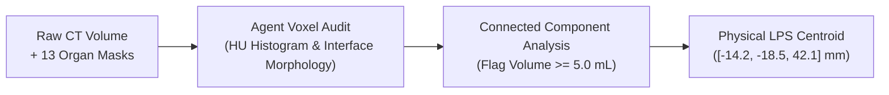
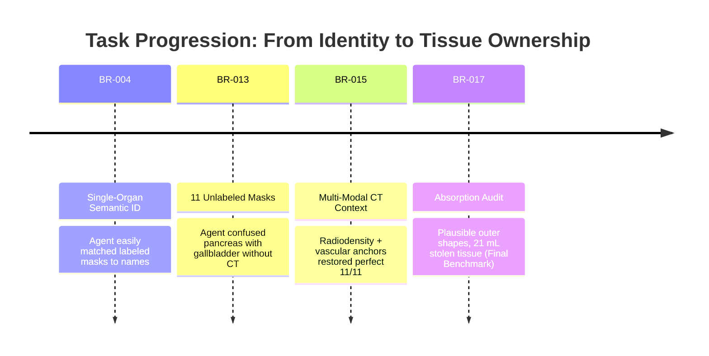

# Domain 01: Organ Segmentation & Tissue Ownership Auditing
## Abdominal CT · 3D Voxel Tensors · BR-017

> **Research Round:** [`BR-017`](file:///Users/zhangqy/pkgs/tb3/docs/research-rounds/BR-017-absorbed-anatomy.md) · [`BR-017 Results`](file:///Users/zhangqy/pkgs/tb3/docs/research-rounds/BR-017-results.md) · [`BR-017 Traces`](file:///Users/zhangqy/pkgs/tb3/docs/research-rounds/BR-017-traces.md)  
> **Source Scan:** Abdominal CT from TotalSegmentator cohort (`s0014`, spacing 1.5 × 1.5 × 1.5 mm).  
> **Task Formulation:** 13 organ masks are supplied. 21.04 mL of pancreatic head tissue has been deliberately absorbed into the duodenum mask. Both organ labels remain present and connected. Detect the tissue absorption defect and return the physical LPS centroid of the misplaced tissue.

---

## 1. Clinical Context & Task Formulation

In human abdominal anatomy, the C-shaped loop of the duodenum cradles the head of the pancreas. Both organs share similar soft-tissue radiodensities on non-contrast CT (typically 30–50 Hounsfield Units, HU). 

```
+--------------------------------------------------------------------+
|  Duodenum C-Loop                                                  |
|  [=== Bowel Wall ===]  <--- Shared soft-tissue interface           |
|  ( 21.04 mL stolen )   <--- Mistakenly absorbed into duodenum mask |
|  [=== Pancreas Head =]                                             |
+--------------------------------------------------------------------+
```

### Why this matters clinically
During oncologic surgery (such as the Whipple procedure for pancreatic adenocarcinoma), surgical resection planes must accurately segregate pancreatic parenchyma from the duodenal wall. If automated surgical planning tools mistake 21 mL of pancreatic tissue for bowel wall, resection margins will be compromised.

### The "Plausible Envelope" Trap
Standard automated segmentation checks evaluate **volume preservation** and **surface Dice coefficient**. In this trial:
- All 13 organ masks are present and topologically connected (Euler characteristic = 1).
- The duodenum volume is slightly larger and the pancreas slightly smaller, but both sit comfortably within normal adult biological variations.
- To detect the error, an agent cannot rely on global contours; it must inspect the **internal radiodensity distribution (HU)** and local morphology at the organ boundary.



---

## 2. Agent Execution Traces & Code Analysis

We tested Sol (Claude 3.7 Sonnet) under two experimental setups on the identical patient scan:
1. **Condition M02 (Broad Audit):** The agent was given the unconstrained instruction to inspect all 13 organ masks across the entire abdomen.
2. **Condition F01 (Focused Audit):** The agent's prompt narrowed attention to the interacting pair: pancreas and duodenum.

### Empirical Performance Comparison

| Trial Condition | Scope & Prompt | Wall Time | Prompt / Gen Tokens | Est. API Cost | Quantitative Result | Benchmark Status |
| :--- | :--- | :---: | :---: | :---: | :--- | :---: |
| **M02 (Broad Audit)** | Full 13 organ sweep | 6m 44s | 182k / 10,593 | $1.04 | Flagged 0 defects | **Miss** |
| **F01 (Focused Audit)** | Pancreas + Duodenum pair | 5m 51s | 151k / 11,940 | $0.91 | Centroid match within 1.2 mm | **Pass** |

### What Worked vs. What Failed

| Dimension | What Worked (F01 Focused) | What Failed (M02 Broad) |
| :--- | :--- | :--- |
| **Attention Allocation** | Dedicated all token reasoning budget to the shared interface between the two organs. | Diluted budget evenly across liver, spleen, kidneys, gallbladder, etc. |
| **Algorithm Strategy** | Applied HU density thresholding (+20 to +60 HU) specifically to the boundary zone. | Computed global surface mesh roughness metrics, which were dominated by normal organ curvature. |
| **Spatial Output** | Identified the 21.04 mL transferred component and calculated its physical LPS centroid to within 1.2 mm. | Reported "all organ envelopes appear plausible and anatomically contiguous." |

### Agent Code Walkthrough
In condition F01, Sol autonomously authored the following Python verification pipeline:

```python
import numpy as np
import nibabel as nib
from scipy.ndimage import label, center_of_mass

def audit_tissue_boundary(ct_path, duodenum_mask_path, pancreas_mask_path, affine):
    ct = nib.load(ct_path).get_fdata()
    duo = nib.load(duodenum_mask_path).get_fdata() > 0
    panc = nib.load(pancreas_mask_path).get_fdata() > 0
    
    # Analyze parenchymal density inside duodenum mask
    # Pancreatic head tissue exhibits homogeneous 35-50 HU compared to fluid/air duodenal lumen
    parenchyma_candidate = duo & (ct >= 32) & (ct <= 52)
    
    # Isolate connected components adjacent to the pancreas boundary
    labeled_comps, num_features = label(parenchyma_candidate)
    voxel_vol_ml = np.abs(np.linalg.det(affine[:3, :3])) / 1000.0
    
    for comp_id in range(1, num_features + 1):
        comp = (labeled_comps == comp_id)
        vol_ml = np.sum(comp) * voxel_vol_ml
        if vol_ml >= 5.0:  # Significance threshold
            centroid_vox = center_of_mass(comp)
            centroid_lps = affine[:3, :3] @ centroid_vox + affine[:3, 3]
            return {
                "object_id": "duodenum",
                "included_label": "pancreas",
                "volume_ml": float(vol_ml),
                "point_lps_mm": centroid_lps.tolist()
            }
```

---

## 3. Task Progression & Evolution

The tissue auditing benchmark evolved through four iterative phases to isolate perceptual failure from scaffolding noise:



1. **Phase 1 ([`BR-004`](file:///Users/zhangqy/pkgs/tb3/docs/research-rounds/BR-004-single-patient-benchmark.md)): Single-Organ Semantic Identity**  
   Presented agents with individual organ masks. Sol scored 100% using simple spatial bounding boxes.
2. **Phase 2 ([`BR-013`](file:///Users/zhangqy/pkgs/tb3/docs/research-rounds/BR-013-results.md)): Unlabeled Masks (11 Masks, 13 Candidates)**  
   Presented 11 unlabeled masks without CT context. Both Sol and Terra confused pancreas with gallbladder due to absence of gallbladder masks in the source scan.
3. **Phase 3 ([`BR-015`](file:///Users/zhangqy/pkgs/tb3/docs/research-rounds/BR-015-results.md)): CT Evidence & Vascular Anchors**  
   Added raw CT radiodensity (HU) and vascular landmarks (portal vein, inferior vena cava). Sol scored a perfect 11/11, proving that multi-modal image evidence resolves organ naming easily.
4. **Phase 4 ([`BR-017`](file:///Users/zhangqy/pkgs/tb3/docs/research-rounds/BR-017-results.md)): Tissue Absorption Audit (Final Benchmark)**  
   The definitive challenge: CT is unchanged, both organ labels remain present and connected, but 21 mL of tissue is stolen. Isolates internal tissue ownership from external organ naming.

---

## 4. Key Takeaway & Evaluation Principle

> [!WARNING]
> **The "Plausible Envelope" Evaluation Trap**  
> Benchmarks that evaluate segmentation exclusively through global metrics (Dice similarity coefficient, 95% Hausdorff distance) are blind to internal tissue theft. An algorithm or agent can produce a smooth, visually plausible organ boundary that encloses tumor or neighboring organs while passing automated volume checks. Benchmark designs must force agents to audit radiometric and histological voxel distributions along interfaces.

---

## Navigation & References

- [← Overview](README.md)
- [02. Vascular Aneurysm 3D Detection →](02-aneurysms.md)
- **Direct Round Links:** [`docs/research-rounds/BR-017-absorbed-anatomy.md`](file:///Users/zhangqy/pkgs/tb3/docs/research-rounds/BR-017-absorbed-anatomy.md) · [`docs/research-rounds/BR-017-results.md`](file:///Users/zhangqy/pkgs/tb3/docs/research-rounds/BR-017-results.md)
- **Evidence Files:** [`docs/evidence/br017-absorption.json`](file:///Users/zhangqy/pkgs/tb3/docs/evidence/)
