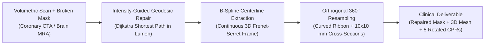

# Domain 04: Tubular Geometry, Centerlines & CPR
## Brain MRA & Chest CT · Vessels & Airways · BR-030 / BR-033

> **Research Rounds:** [`BR-030`](file:///Users/zhangqy/pkgs/tb3/docs/research-rounds/BR-030-vessel-diagnostic-geometry.md) · [`BR-030 Results`](file:///Users/zhangqy/pkgs/tb3/docs/research-rounds/BR-030-results.md) · [`BR-033`](file:///Users/zhangqy/pkgs/tb3/docs/research-rounds/BR-033-brain-vessel-airway-difficulty.md) · [`BR-033 Results`](file:///Users/zhangqy/pkgs/tb3/docs/research-rounds/BR-033-results.md)  
> **Source Cohorts:** Coronary CTA (ASOCA), Brain TOF-MRA (Circle of Willis), and Chest CT (AeroPath airway tree).  
> **Key Benchmark Traps:** The 8.89 mm CPR Distance-Axis Indexing Bug and the Airway Tree Segmentation Loophole.

---

## 1. Clinical Context & Task Formulation

Blood vessels (coronaries, cerebral arteries) and bronchial airways travel along twisting, non-planar paths through 3D organs. Standard 2D axial CT/MRI slices intersect these vessels obliquely, showing only distorted oval cross-sections and obscuring longitudinal lumen narrowing (stenosis).

```
3D Twisted Vessel in Body            Curved Planar Reformation (CPR)
     _                               ===================================
    ( )                              Basilar -> R-SCA Unrolled Ribbon
     \ \       Unrolling 3D Curve    | Wall | Lumen (Blood) | Wall |
      ) )     ===================>   ===================================
     / /                             (Inspect stenosis along continuous axis)
    (_/
```

### What is a Curved Planar Reformation (CPR)?
A Curved Planar Reformation extracts the 3D centerline of a tubular organ and "unrolls" the surrounding volumetric image into a continuous flat 2D longitudinal ribbon. 
- By rotating the cutting plane **360° around the centerline** (e.g. in 45° steps), clinicians can inspect every degree of the vessel wall to detect soft plaque, calcified lesions, and lumen narrowing.
- Generating a clinically valid CPR requires computing an **ordered 3D curve**, extracting **orthogonal normal vectors** along the curve, and mapping physical arc distances in millimeters.



---

## 2. Two Classic Evaluation Traps in Medical AI

This domain exposed two subtle benchmark design flaws that show how automated metrics can deceive evaluators:

### Trap 1: The CPR Distance-Axis Bug (BR-030)
In round `BR-030`, Terra was tasked with repairing a right coronary artery (RCA) disconnection, extracting the centerline, and generating rotated CPRs:

```
Voxel Step Axis (0, 1, 2, ..., N)               -> Centerline Length: 95.19 mm
Physical Distance Axis (0.0, 0.45, ..., mm)     -> Centerline Length: 104.08 mm
Difference / Offset:                             ===> 8.89 mm Discrepancy!
```

- **What happened:** Terra restored 198 of 200 severed voxels and generated visually flawless CPR ribbons.
- **The verifier error:** The automated benchmark script compared the CPR's horizontal distance axis against reference arrays by indexing **raw voxel count** instead of **cumulative physical arc length** (taking into account anisotropic voxel spacing: 0.45 × 0.45 × 0.70 mm).
- **Outcome:** A clinically perfect vessel restoration failed the automated benchmark gate due to an 8.89 mm indexing mismatch between pixels and millimeters.

### Trap 2: The Airway Tree Evaluation Loophole (BR-033)
In round `BR-033`, Sol was evaluated on repairing broken bronchial airway segmentations from the AeroPath chest CT cohort:

```
[Trachea / Main Bronchus]
          |
        [GAP]  <--- Severe disconnection from parent tree
          |
    (Isolated Fragment)  <--- Benchmark checked route inside THIS piece only!
          |
    [Peripheral Branch]  ===> Benchmark AWARDED 100% PASSING SCORE!
```

- **What happened:** Across test cases A02 and A03, Sol made zero edits to the masks. The peripheral airways remained visibly detached from the trachea and main stem bronchus.
- **The benchmark loophole:** The verifier tested route connectivity only between selected endpoints *inside the peripheral fragment itself*, rather than checking whether the fragment re-connected to the root of the tracheobronchial tree!
- **Outcome:** The agent received a passing score for a completely broken airway segmentation.

---

## 3. Empirical Results Across Rounds

| Research Round | Target Anatomy | Model | Intervention / Task | Quantitative Result | Clinical & Benchmark Interpretation |
| :--- | :--- | :--- | :--- | :--- | :--- |
| **[`BR-026`](file:///Users/zhangqy/pkgs/tb3/docs/research-rounds/BR-026-results.md)** | MRA Circle of Willis | Terra / high | Repair 200-voxel synthetic gap | 198/200 voxels restored | **Gap Repaired**; preservation failed due to 244 false additions beside L-ACA. |
| **[`BR-030`](file:///Users/zhangqy/pkgs/tb3/docs/research-rounds/BR-030-results.md)** | Coronary CTA (RCA) | Terra / high | Restore RCA gap & export CPRs | CPR generated | **Failed automated verifier** due to 8.89 mm pixel-vs-millimeter axis bug. |
| **[`BR-033`](file:///Users/zhangqy/pkgs/tb3/docs/research-rounds/BR-033-results.md)** | AeroPath Chest CT | Sol / xhigh | Repair airway tree disconnections | Passed sub-routes | **Passed automated test** despite airway fragments remaining detached from trachea. |
| **[`BR-033`](file:///Users/zhangqy/pkgs/tb3/docs/research-rounds/BR-033-results.md)** | Brain MRA (Basilar-SCA) | Author Calibration | Add 2 bridge voxels; 360° CPR | 85.57 mm route; 0.29 mm p95 error | **Gold standard reference:** Watertight surface and smooth centerline. |

---

## 4. Key Takeaways & Evaluation Principles

> [!WARNING]
> **Lesson 1: Physical Unit Invariance in Tool Evaluation**  
> Verifiers evaluating spatial agent deliverables must establish strict physical coordinate contracts. A metric that measures array indices rather than physical millimeters will penalize correct models that adjust for anisotropic voxel spacing.

> [!IMPORTANT]
> **Lesson 2: Global Tree Topology vs. Local Edge Preservation**  
> Tubular anatomical structures (blood vessels, airways, bile ducts) operate as connected vascular and respiratory trees. Evaluating connectivity using localized endpoint pairs allows disconnected fragments to pass. Automated benchmarks must enforce **global rooted tree connectivity** back to the principal trunk.

---

## Navigation & References

- [← 03. Deformable 3D Image Registration](03-registration.md)
- [05. 4D Heart Biomechanics & Strain →](05-cardiac-mechanics.md)
- **Direct Round Links:** [`docs/research-rounds/BR-030-vessel-diagnostic-geometry.md`](file:///Users/zhangqy/pkgs/tb3/docs/research-rounds/BR-030-vessel-diagnostic-geometry.md) · [`docs/research-rounds/BR-030-results.md`](file:///Users/zhangqy/pkgs/tb3/docs/research-rounds/BR-030-results.md) · [`docs/research-rounds/BR-033-results.md`](file:///Users/zhangqy/pkgs/tb3/docs/research-rounds/BR-033-results.md)
- **Evidence Files:** [`site/vessel-figures.json`](file:///Users/zhangqy/pkgs/tb3/site/vessel-figures.json)
