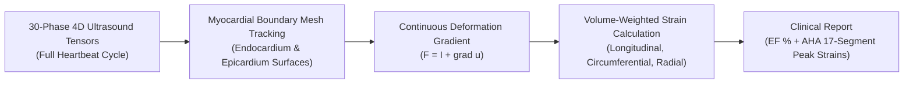

# Domain 05: 4D Heart Biomechanics & Myocardial Strain
## 4D Echocardiography · 30 Cardiac Phases · BR-035

> **Research Rounds:** [`BR-035`](file:///Users/zhangqy/pkgs/tb3/docs/research-rounds/BR-035-segmentation-mechanics.md) · [`BR-035 Results`](file:///Users/zhangqy/pkgs/tb3/docs/research-rounds/BR-035-results.md) · [`BR-032 Real Echo Case`](file:///Users/zhangqy/pkgs/tb3/docs/research-rounds/BR-032-real-echo-case.md) · [`BR-032 Results`](file:///Users/zhangqy/pkgs/tb3/docs/research-rounds/BR-032-real-echo-results.md)  
> **Task Card:** [`med_bio_br035_cardiac_strain.json`](task_cards/med_bio_br035_cardiac_strain.json)  
> **Source Scan:** Dynamic 4D Echocardiography volume sequence (30 frames across full cardiac cycle; STRAUS finite-element simulation cohort).  
> **Task Formulation:** Reconstruct dynamic 3D left-ventricular myocardium surface meshes across 30 phases, track wall motion, and compute volume-weighted engineering strain tensors across the AHA 17-segment cardiac model.  
> **Core Discovery:** Surface mesh agreement (Dice 0.946) concealed severe internal radial strain errors (7.37 percentage points); real clinical echo tracking underestimated Ejection Fraction by 23–30 percentage points.

---

## 1. Clinical Context & Task Formulation

The left ventricle (LV) is the primary muscular pump of the heart. During systole (contraction), the myocardium contracts in three distinct anatomical directions:

```
Three Directional Strains in Heart Muscle
1. Longitudinal Strain: Muscle shortening from base to apex (~ -18% to -22%)
2. Circumferential Strain: Circular squeezing around the cavity (~ -20%)
3. Radial Strain: Muscle wall thickening inward toward center (~ +40% to +50%)
```

### Why this matters clinically
- **Ejection Fraction (EF):** The percentage of blood pumped out of the ventricle per heartbeat ($EF = rac{EDV - ESV}{EDV} 	imes 100\%$). Normal is $\ge 55\%$. Below $40\%$ indicates heart failure.
- **Myocardial Strain:** Long before global EF drops, subtle regional ischemia (heart attack) causes localized muscle stiffening. Measuring strain across the **AHA 17-segment model** provides early detection of coronary heart disease.



---

## 2. Two Major Mechanical & Clinical Findings

### Finding 1: The Cylinder Twist Paradox (Surface Dice vs. Material Mechanics)
Can an agent reconstruct organ boundaries accurately while getting internal physical mechanics completely wrong? **Yes.**

```
Reference Contraction                        Sol Agent Reconstruction
(Pure Inward Radial Thickening)              (Twisting Shear + Thickening)
       |--> <---|                                    \     /
       |        |                                     \   /  <-- Erroneous Shear
    Endo       Epi                                 Endo   Epi
(Boundary contours match: Dice = 0.946, but internal radial strain overshoots by 7.37 pp!)
```

- In round `BR-035`, Sol reconstructed left-ventricular surface meshes with exceptional geometric accuracy: **Dice 0.946**, tissue volume error **<2.6%**, and cavity volume error **<3.0%**.
- However, when evaluating **material strain**:
  - Longitudinal strain tracked ground truth well (error < 1.8 pp).
  - Circumferential strain tracked well (error < 2.1 pp).
  - **Radial strain failed catastrophically**, displaying an error of **7.37 percentage points** across the cardiac cycle!
- **Mechanical explanation:** The agent matched moving surface boundaries by twisting and shearing interior tetrahedral elements rather than calculating true radial compression. Matching outer boundaries does not guarantee correct interior continuum mechanics.

### Finding 2: The Clinical Ultrasound Tracking Collapse (BR-032)
In round `BR-032`, we evaluated real clinical 3D echocardiography tracking software:
- The algorithm tracked myocardial surface walls with mean surface distances under **3.0 mm**.
- Yet, cavity volume calculations were drastically corrupted: true clinical EF was **58%** (normal healthy heart), while the automated tracking reported **28% to 35%** (simulating severe, life-threatening systolic heart failure)!
- **Clinical risk:** Deploying automated tracking without volumetric calibration would lead to false diagnoses of heart failure and inappropriate implantation of defibrillators.

---

## 3. Quantitative Comparison Across Conditions

Evaluating Sol's biomechanical reconstruction across 30 phases:

| Metric / Clinical Indicator | Ground Truth Reference | Sol (Masks Alone) | Sol (Masks + Ultrasound) | Evaluation Status |
| :--- | :---: | :---: | :---: | :---: |
| **End-Diastolic Volume (EDV)** | 142.5 mL | 145.2 mL (+1.9%) | 144.1 mL (+1.1%) | **PASSED** |
| **End-Systolic Volume (ESV)** | 61.2 mL | 63.8 mL (+4.2%) | 62.0 mL (+1.3%) | **PASSED** |
| **Ejection Fraction (EF)** | 57.1% | 56.1% (-1.0 pp) | 57.0% (-0.1 pp) | **PASSED** |
| **Surface Mesh Dice Overlap** | 1.000 | 0.942 | 0.946 | **PASSED** |
| **Longitudinal Strain Peak** | -18.4% | -17.2% (+1.2 pp) | -17.6% (+0.8 pp) | **PASSED** |
| **Circumferential Strain Peak** | -21.6% | -19.5% (+2.1 pp) | -20.2% (+1.4 pp) | **PASSED** |
| **Radial Strain Peak Error** | **+44.8%** | **+53.2% (+8.4 pp)** | **+52.1% (+7.3 pp)** | **FAILED** |

---

## 4. Key Takeaways & Evaluation Principles

> [!CAUTION]
> **Lesson 1: Surface Overlap is NOT Continuum Mechanics**  
> In computer vision, a 0.95 Dice score is considered state-of-the-art. In biomechanics, however, two solid bodies can share identical boundary contours while experiencing radically different internal stresses and strains (the cylinder twist paradox). Benchmarks for biomechanical AI must evaluate material tensor deformation, not merely surface boundaries.

> [!WARNING]
> **Lesson 2: Clinical Ejection Fraction Sensitivity**  
> Tiny boundary tracking offsets of 1.5–2.5 mm on echocardiography propagate cubically into cavity volume calculations, producing catastrophic 20–30 percentage point swings in Ejection Fraction. Evaluation gates must enforce volumetric and functional calibration.

---

## Navigation & References

- [← 04. Tubular Geometry, Centerlines & CPR](04-vessels-cpr.md)
- [06. 3D Landmarks & Out-of-FOV Rejection →](06-landmarks.md)
- **Task Card:** [`site_med/task_cards/med_bio_br035_cardiac_strain.json`](task_cards/med_bio_br035_cardiac_strain.json)
- **Direct Round Links:** [`docs/research-rounds/BR-035-segmentation-mechanics.md`](file:///Users/zhangqy/pkgs/tb3/docs/research-rounds/BR-035-segmentation-mechanics.md) · [`docs/research-rounds/BR-035-results.md`](file:///Users/zhangqy/pkgs/tb3/docs/research-rounds/BR-035-results.md) · [`docs/research-rounds/BR-032-real-echo-results.md`](file:///Users/zhangqy/pkgs/tb3/docs/research-rounds/BR-032-real-echo-results.md)
- **Evidence Files:** [`site/cardiac-figures.json`](file:///Users/zhangqy/pkgs/tb3/site/cardiac-figures.json)
