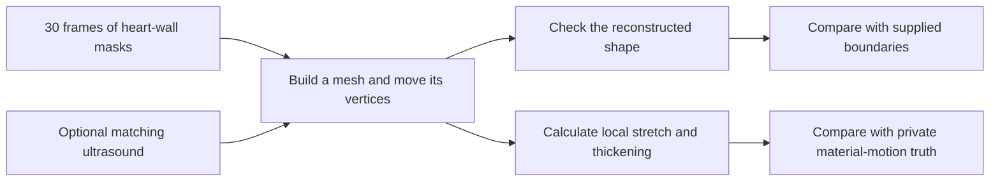
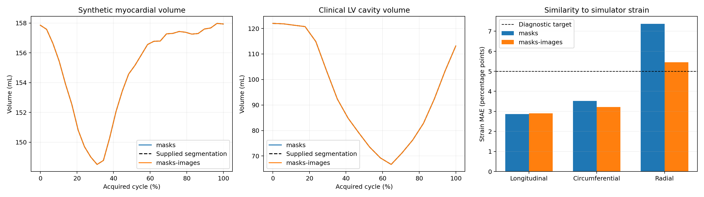

# A moving heart shape is only part of the answer

**Segmentation to cardiac mechanics · BR-035 · about 4 minutes**

**Guided illustration:** [interactive tour](tours/index.html?tour=cardiac) · [landscape video](tours/exports/cardiac-landscape.mp4) · [portrait video](tours/exports/cardiac-portrait.mp4). [Sources and reproduction](tours/README.md).

A heart wall changes shape as it beats. Reconstructing that changing boundary is one problem. Recovering how each piece of muscle stretches, shortens and thickens is another.

**Sol built moving 3D meshes from a sequence of supplied masks and correctly calculated deformation from them.** Both attempts passed the construction checks, but neither recovered the reference's local radial strain accurately enough. The distinction is between calculating motion correctly and inferring the right motion.

## See the task

*A mask gives the occupied region in each frame. It does not identify which piece of tissue moved from one location to another. This diagram describes the task, not a clinical imaging pipeline.*

## Why this work matters

Heart function involves both the volume pumped and the movement of the wall. **Ejection fraction (EF)** summarizes the fraction of cavity blood volume expelled in a beat. **Strain** measures changes in tissue dimensions: shortening along the heart, squeezing around it, and thickening through the wall.

Conventional workflows use image contours or segmentations for geometry and tracking methods to estimate motion. This experiment gives the agent the segmentations, letting us examine reconstruction and mechanics separately from boundary detection. Such measurements can inform assessment, but a clinical diagnosis combines imaging with other evidence. [NHLBI clinical context](https://www.nhlbi.nih.gov/health/heart-failure)

## What the agent received and returned

Both conditions supplied **30 binary 3D heart-wall masks** on a 1.5 mm grid from the public **STRAUS simulation**. One also included matching ultrasound. No original mesh, persistent vertex identities, material motion, or reference strain was supplied.

The output was an executable reconstruction plus a moving tetrahedral mesh: a volume divided into small four-cornered elements, with coordinates at each time point. These coordinates support geometry checks and calculations of local deformation. Simulation supplies material-motion truth that ordinary patient images do not. [Experiment design](../docs/research-rounds/BR-035-segmentation-mechanics.md)

## How Sol built and moved the mesh

Both solvers placed vertices at voxel-cell corners and divided occupied cells into tetrahedra. They aligned distance fields derived from the masks, smoothed the deformation, and corrected each frame to match the supplied mask's centroid and total volume.

The ultrasound-assisted solver also used a smoothed texture residual, with capped displacement along the boundary. Code inspection confirms the ultrasound was used; its presence was not merely nominal.

This is substantial tool construction: both solvers built meshes with **63,326 vertices**, then calculated deformation gradients and strain. Independent recomputation agreed with those calculations. The question remaining was whether their inferred interior motion matched the simulator. [Methods and independent checks](../docs/research-rounds/BR-035-results.md)

## What worked, and what it cost

| Independent measurement | Masks alone | Masks + ultrasound |
| --- | ---: | ---: |
| Construction checks | Pass | Pass |
| Mean full-volume mask Dice | 0.9461 | 0.9328 |
| Material-motion RMSE | 1.615 mm | 1.717 mm |
| Longitudinal strain error | 2.87 pp | 2.90 pp |
| Circumferential strain error | 3.51 pp | 3.22 pp |
| Radial strain error | **7.37 pp** | **5.45 pp** |
| Agent time | 21.55 min | 13.26 min |

*Dice measures volume overlap; 1 means identical. Strain errors are volume-weighted mean absolute differences in percentage points (pp). Both radial errors exceed the separate 5 pp research target. Time is agent execution, not end-to-end job time.*

*Left: supplied and reconstructed synthetic wall volumes. Middle: the separate clinical cavity transfer discussed below. Right: synthetic strain error. The nearly overlapping volume curves reflect explicit volume matching; they do not independently validate tissue motion. Source plot reproduced without modification; [definitions and provenance](assets/manifest.json).*

Ultrasound assistance accompanied lower radial error and shorter agent time, but also slightly worse whole-heart motion and mask overlap. The agents independently designed their solvers, so this is not a controlled timing or accuracy gain from adding one feature to a fixed algorithm.

## Why matching the boundary is not enough

Imagine twisting a cylinder without changing its outside shape. Its segmentation can stay the same while material inside it moves differently. An analytic control demonstrates this ambiguity; it does not prove that the agent made exactly that twisting error.

The meshes also had six nonmanifold boundary edges each, a quality issue outside the frozen checks. Passing construction therefore establishes specific numerical and geometric properties, not complete biomechanical validity. [Detailed qualifications](../docs/research-rounds/BR-035-results.md)

## How the task was refined

Supplying all-phase masks made reconstruction feasible while withholding material correspondence. That exposes a useful capability—building a moving model—without pretending that masks uniquely determine true tissue strain.

As a separate transfer check, the unchanged executables preserved geometry on a clinical **cavity-mask** sequence. Their EF error against the original source surface was **0.0249 pp**, largely because supplied masks already encoded the volume curve and the solvers normalized to it. This demonstrates geometry preservation, not independent EF discovery. Both correctly reported that a cavity model does not establish myocardial strain.

## Inspect or reproduce

- [Task summary](task_cards/med_bio_br035_cardiac_strain.json), [results](../docs/research-rounds/BR-035-results.md), and [independent measurements](../docs/evidence/br035-segmentation-mechanics-results.json).
- [Reconstruction, scoring and replay guide](../probes/cardiac-reconstruction/authoring/segmentation_mechanics/README.md).
- Full ultrasound, moving meshes and local viewers require retained runtime assets. The separate [raw-image reconstruction study](../docs/research-rounds/BR-032-real-echo-results.md) had no reference clinical EF and should not be merged into this accuracy table. [Availability guide](references.md).

[← Vessel workflows](04-vessels-cpr.md) · [Next: name and locate anatomical landmarks →](06-landmarks.md)
