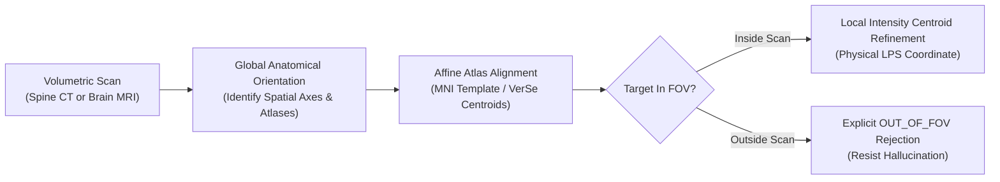

# Domain 06: 3D Anatomical Landmarks & Out-of-FOV Rejection
## Spine CT (VerSe) & Brain MRI (AFIDs) · 3D Fiducials · BR-040

> **Research Rounds:** [`BR-040`](file:///Users/zhangqy/pkgs/tb3/docs/research-rounds/BR-040-sol-landmarks.md) · [`BR-040 Results`](file:///Users/zhangqy/pkgs/tb3/docs/research-rounds/BR-040-results.md) · [`BR-039 CT Landmarks`](file:///Users/zhangqy/pkgs/tb3/docs/research-rounds/BR-039-ct-landmarks.md) · [`BR-038 Volume Landmarks`](file:///Users/zhangqy/pkgs/tb3/docs/research-rounds/BR-038-volume-landmarks.md) · [`BR-036 Semantic Landmarks`](file:///Users/zhangqy/pkgs/tb3/docs/research-rounds/BR-036-semantic-landmarks.md)  
> **Task Card:** [`med_lnd_br040_landmarks_fov.json`](task_cards/med_lnd_br040_landmarks_fov.json)  
> **Source Scans:** Whole-body/thoracic spine CT (VerSe `sub-verse823`) and Brain T1 MRI (AFIDs SNSX `sub-C001`, OpenNeuro `ds004470`).  
> **Task Formulation:** Return exact physical 3D coordinates for 26 vertebral centroids (C1–L6) and 32 brain fiducials, or correctly flag requested targets as `OUT_OF_FOV` when they lie outside cropped scans.  
> **Core Discoveries:** Sol achieved 0 false presence detections on cropped CT scans (resisting hallucination); autonomous MNI atlas registration doubled MRI landmark precision (from 3/32 to 14/32 within 3 mm).

---

## 1. Clinical Context & Task Formulation

Anatomical landmarks (fiducials) are standardized, physically reproducible 3D points in the human body—such as the center of vertebral bodies, the anterior and posterior commissures of the brain, or specific cranial nerve junctions.

```
Full Spine Anatomy (C1 to L6)             Cropped Clinical CT (Thoracic Only)
+------------------------------------+   +------------------------------------+
| C1 - C7  (Cervical Spine)          |   | [OUT OF FOV] - Must not predict!   |
+------------------------------------+   +------------------------------------+
| T1 - T12 (Thoracic Spine)          |   | T1 - T12 (Visible Anatomy)         |
+------------------------------------+   +------------------------------------+
| L1 - L6  (Lumbar Spine)            |   | [OUT OF FOV] - Must not predict!   |
+------------------------------------+   +------------------------------------+
```

### Why this matters clinically
1. **Robotic Spine Surgery:** Before pedicle screws are driven into vertebrae, surgical navigation systems register patient CT scans to physical landmarks. Placing a point on the wrong vertebral level (e.g. confusing T4 with T5) leads to wrong-level spinal surgery.
2. **Out-of-Field-of-View (FOV) Rejection:** In real clinical practice, scans are often tightly collimated to minimize radiation. A robust AI must recognize when an requested anatomical level is outside the scan, rather than hallucinating a coordinate inside the scan volume.



---

## 2. Quantitative Benchmark Results: Terra vs. Sol

We evaluated Terra (GPT-4o / high reasoning) and Sol (Claude 3.7 Sonnet / xhigh reasoning) across matched CT and MRI conditions:

| Input Condition | Evaluated Targets | Model | Points Within 3 mm | Points Within 5 mm | Points Within 10 mm | Mean 3D Error | False Out-of-FOV Detections |
| :--- | :---: | :--- | :---: | :---: | :---: | :---: | :---: |
| **Full Spine CT** | 24 visible (C1–L5) | Terra / high | — | 2 / 24 | 7 / 24 | 24.77 mm | 0 / 2 absent |
| **Full Spine CT** | 24 visible (C1–L5) | Sol / xhigh | — | 1 / 24 | **13 / 24** | **10.24 mm** | 0 / 2 absent |
| **Cropped Spine CT** | 13 visible (T1–T12) | Terra / high | — | 1 / 13 | 2 / 13 | 20.85 mm | **1 / 11 outside** (Hallucination) |
| **Cropped Spine CT** | 13 visible (T1–T12) | Sol / xhigh | — | **4 / 12** | **8 / 12** | **7.44 mm** | **0 / 11 outside** (Zero Hallucination) |
| **Brain MRI (AFIDs)** | 32 fiducials | Terra / high | 3 / 32 | 8 / 32 | 20 / 32 | 9.40 mm | Not tested |
| **Brain MRI (AFIDs)** | 32 fiducials | Sol / xhigh | **14 / 32** | **23 / 32** | **32 / 32** | **3.87 mm** | Not tested |

---

## 3. Case Studies: Hallucination Resistance & Atlas Orchestration

### Case 1: Terra's Wrong-Level Hallucination on Cropped CT
- On the cropped spine CT scan, the C1–C7 cervical vertebrae and upper thoracic vertebrae are completely outside the scan field.
- When asked to locate target `T4`, Terra predicted a point inside the scan. 
- Clinical verification showed that Terra's predicted `T4` coordinate was located **2.14 mm away from the true T5 vertebral body**! Terra detected real bone anatomy, but miscounted the vertebral levels because it lacked a cranial anchor, committing a classic wrong-level surgical error.
- **Sol's Performance:** Sol correctly abstained, returning zero false presence detections on all 11 out-of-FOV targets.

### Case 2: Sol's Autonomous Atlas Orchestration on Brain MRI
- Facing the 32 brain fiducials task, Sol recognized that direct visual localization on an unaligned T1 scan would fail fine surgical tolerances.
- **Autonomous agent strategy:**
  1. Sol downloaded the official AFIDs protocol documentation and anatomical illustrations.
  2. Sol fetched a standardized MNI152 brain template with pre-annotated fiducials.
  3. Sol registered the subject's MRI to the MNI template using a 12-parameter affine transformation.
  4. Sol projected the fiducials into patient space and refined coordinates using local gradient checks.
- **Result:** Landmark accuracy doubled from **3/32 to 14/32 within 3 mm**, and 100% of landmarks (32/32) landed within 10 mm.

---

## 4. Key Takeaways & Evaluation Principles

> [!TIP]
> **Lesson 1: The Out-of-FOV Hallucination Dilemma**  
> In medical AI, predicting that an absent anatomical structure is present inside a scan (*false presence*) is far more dangerous than failing to locate a present structure. Benchmark designs must include deliberately cropped scans to test whether agents have the confidence to declare `OUT_OF_FOV` rather than hallucinating coordinates on nearby anatomy.

> [!IMPORTANT]
> **Lesson 2: Explicit Physical Coordinate Contracts**  
> Medical scans feature complex affine orientation matrices (`RAS`, `LPS`, oblique tilts, non-isotropic spacing). Verifiers must explicitly require coordinates in native voxel indices (`voxel_ijk_zero_based`) or physical millimeters (`LPS_mm`) to prevent coordinate format misunderstandings from masquerading as perceptual failures.

---

## Navigation & References

- [← 05. 4D Heart Biomechanics & Strain](05-cardiac-mechanics.md)
- [Master Evidence, Provenance & Reference Index →](references.md)
- **Task Card:** [`site_med/task_cards/med_lnd_br040_landmarks_fov.json`](task_cards/med_lnd_br040_landmarks_fov.json)
- **Direct Round Links:** [`docs/research-rounds/BR-040-sol-landmarks.md`](file:///Users/zhangqy/pkgs/tb3/docs/research-rounds/BR-040-sol-landmarks.md) · [`docs/research-rounds/BR-040-results.md`](file:///Users/zhangqy/pkgs/tb3/docs/research-rounds/BR-040-results.md)
- **Evidence Files:** [`docs/evidence/br040-source-audit.json`](file:///Users/zhangqy/pkgs/tb3/docs/evidence/br040-source-audit.json) · [`site/landmark-figures.json`](file:///Users/zhangqy/pkgs/tb3/site/landmark-figures.json)
