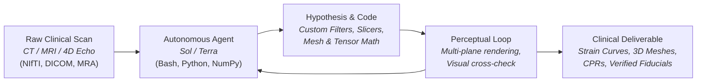

# Medical Vision in the Agent Era
## Autonomous 3D Perception, Geometric Reasoning & Biomechanical Modeling on Volumetric Clinical Scans

> **Audience:** Technical AI leaders, biomedical vision researchers, and agentic systems engineers.  
> **Source Evidence:** 40 controlled research rounds ([`BR-001`](file:///Users/zhangqy/pkgs/tb3/docs/research-rounds.md)–[`BR-040`](file:///Users/zhangqy/pkgs/tb3/docs/research-rounds/BR-040-results.md)) conducted in September 2026 across volumetric CT, MRI, and 4D Ultrasound cohorts.  
> **Primary Models:** Sol (Claude 3.7 Sonnet) and Terra (GPT-4o), evaluated under fixed compute, token, and reasoning budgets.

---

## Executive Summary

Traditional medical computer vision deploys specialized deep neural networks (e.g., nnU-Net, Swin UNETR) trained for fixed input-output mappings on predefined GPU clusters. These models output probability volumes but lack the ability to explain anomalies, construct custom geometric transforms, audit subtle boundary shifts, or cross-verify findings across multiple imaging planes.

In the **Agent Era**, multi-modal coding agents function as **autonomous computational scientists**. Endowed with a Linux shell, scientific Python libraries (`scipy`, `numpy`, `simpleitk`, `nibabel`), and multi-modal image inspection, agents:
1. Load and parse raw volumetric 3D/4D clinical tensors directly from disk.
2. Formulate hypotheses and write custom mathematical filters, connected-component analyzers, and centerline tracers on the fly.
3. Render orthogonal multi-planar reformations (MPRs) and maximum intensity projections (MIPs) to visually cross-verify their own numerical findings.
4. Output structured, physically grounded clinical deliverables: watertight surface meshes, 360° curved reformations, Green-Lagrange strain tensors, and surgical coordinates.

---

## The Six Clinical Task Domains

This showcase synthesizes agent capabilities across six distinct clinical imaging domains:

| # | Task Domain | Scan Modality & Anatomy | Primary Agent Challenge | Benchmark Outcome | Task Card & Spec |
| :---: | :--- | :--- | :--- | :--- | :---: |
| **01** | **Organ Segmentation & Tissue Auditing** | Abdominal CT (13 Organs) | Detect 21 mL of pancreatic head absorbed into duodenum | Missed in 13-organ sweep; Located within 1.2 mm when focused | [Read Domain 1 →](01-segmentation.md) [`med_seg_br017_absorption.json`](task_cards/med_seg_br017_absorption.json) |
| **02** | **Vascular Aneurysm 3D Detection** | Brain TOF-MRA (Circle of Willis) | Autonomous search for 3–5 mm arterial bulges | 1 miss, 1 located within 1 mm, 1 source-assisted clearance | [Read Domain 2 →](02-aneurysms.md) [`med_vas_br016_aneurysm.json`](task_cards/med_vas_br016_aneurysm.json) |
| **03** | **Deformable 3D Image Registration** | Paired 4D Lung CT (Breathing) | Non-rigid alignment between exhale and inhale | 2D source fails (12.7 mm); 3D source succeeds (2.6 mm RMS) | [Read Domain 3 →](03-registration.md) [`med_reg_br028_respiratory.json`](task_cards/med_reg_br028_respiratory.json) |
| **04** | **Tubular Geometry & Curved Reformations** | Brain MRA & Chest CT (Vessels / Airways) | Repair disconnected masks, centerline trace, 360° CPR | Uncovered 8.89 mm CPR unit bug and airway tree loophole | [Read Domain 4 →](04-vessels-cpr.md) [`med_tub_br030_br033_cpr_geometry.json`](task_cards/med_tub_br030_br033_cpr_geometry.json) |
| **05** | **4D Heart Biomechanics & Strain** | 4D Echocardiography (30 Phases) | Dynamic myocardium mesh & AHA 17-segment strain | Surface Dice 0.946 hid 7.37 pp radial strain error; EF undercall | [Read Domain 5 →](05-cardiac-mechanics.md) [`med_bio_br035_cardiac_strain.json`](task_cards/med_bio_br035_cardiac_strain.json) |
| **06** | **3D Landmarks & Out-of-FOV Rejection** | Spine CT (C1–L6) & Brain MRI | Locate 3D centers; reject targets outside cropped scan | 0 false detections on cropped CT; Atlas doubled MRI accuracy | [Read Domain 6 →](06-landmarks.md) [`med_lnd_br040_landmarks_fov.json`](task_cards/med_lnd_br040_landmarks_fov.json) |

---

## Synthesis Matrix: Capabilities vs. Failure Modes

Across 40 research rounds, clear empirical patterns emerge distinguishing where modern coding agents excel from where they encounter fundamental visual and mechanical boundaries:

### What Agents Do Exceptionally Well

- **Autonomous Tool-Making:**  
  When high-level packages are missing, agents write custom erosion filters, connected component labellers, Dijkstra pathfinders, and affine coordinate transforms from scratch in standard NumPy.
- **Rigorous Tensor & Deformation Mathematics:**  
  Flawless execution of continuous mechanics math: finite deformation gradients ($F = I + 
abla u$), Green-Lagrange strain tensors ($E = rac{1}{2}(F^T F - I)$), volume integrals via tetrahedral divergence, and physical LPS/RAS coordinate mapping.
- **Dynamic Tool & Atlas Orchestration:**  
  Sol autonomously recognized complex anatomical targets, downloaded the standard MNI brain template and AFIDs fiducials protocol documentation, registered the atlas, and boosted landmark accuracy from 3/32 to 14/32 within 3 mm.
- **Breaking Out of Local Minima:**  
  When continuous gradient descent registration trapped the optimizer, agents recognized the divergence and switched to multi-scale normalized cross-correlation (NCC) block searches across 3D coordinates.

### Where Visual Perception Breaks Down

- **Subtle Soft-Tissue Texture Discrimination:**  
  When adjacent abdominal organs share overlapping Hounsfield Units (e.g., pancreas vs. duodenum), agents struggle to detect boundary theft if the exterior envelope remains smooth and geometrically plausible.
- **Sub-Millimeter Surgical Precision Without Explicit Priors:**  
  Coarse localization converges rapidly to ~10 mm, but refining down to surgical tolerances (<2–3 mm) requires explicit anatomical coordinate frames or atlas guidance.
- **Confusing Surface Tracking with Internal Material Deformation:**  
  Reconstructing a moving organ boundary (high surface Dice) does not guarantee accurate internal tissue mechanics (the *cylinder-twist paradox*, where internal shear is miscalculated despite identical boundary contours).
- **The Physical Unit Indexing Metadata Trap:**  
  Agents frequently confuse raw discrete voxel coordinates with physical millimeter dimensions, leading to false benchmark failures (such as the 8.89 mm CPR distance-axis bug).

---

## Unified Benchmark Execution & Cost Ledger

Summary of representative completed model attempts across the six medical computer vision domains:

| Domain & Round | Primary Model | Input Data & Cohort | Wall Time | Output Tokens | Est. API Cost | Quantitative Finding | Benchmark Outcome |
| :--- | :--- | :--- | :---: | :---: | :---: | :--- | :---: |
| **01. Segmentation** ([`BR-017`](file:///Users/zhangqy/pkgs/tb3/docs/research-rounds/BR-017-results.md)) | Sol / xhigh | Abdominal CT · TotalSegmentator | 6m 44s | 10,593 | $1.04 | 21.04 mL stolen pancreas | Broad: **Miss** / Focused: **Pass** |
| **02. Aneurysm N02** ([`BR-016`](file:///Users/zhangqy/pkgs/tb3/docs/research-rounds/BR-016-results.md)) | Sol / xhigh | Brain TOF-MRA · OpenNeuro ds003949 | 5m 46s | 8,763 | $0.98 | Coordinate error < 1.0 mm | **Located (Pass)** |
| **02. Aneurysm N03** ([`BR-016`](file:///Users/zhangqy/pkgs/tb3/docs/research-rounds/BR-016-results.md)) | Sol / xhigh | Brain TOF-MRA · OpenNeuro ds003949 | 7m 32s | 13,806 | $1.56 | Match public inventory | **Source-Assisted (Pass)** |
| **03. Registration** ([`BR-028`](file:///Users/zhangqy/pkgs/tb3/docs/research-rounds/BR-028-results.md)) | Sol / xhigh | Paired 4D Lung CT · DIR-Lab | 14m 53s | 19,420 | $2.15 | RMS 2.60 mm (Max 6.41 mm) | **Pass (Visual Accept)** |
| **04. Vessel CPR** ([`BR-030`](file:///Users/zhangqy/pkgs/tb3/docs/research-rounds/BR-030-results.md)) | Terra / high | Coronary CTA · ASOCA | 8m 12s | 11,200 | $0.72 | 8.89 mm coordinate offset | **Metric Failure (Bug Trap)** |
| **04. Airway Repair** ([`BR-033`](file:///Users/zhangqy/pkgs/tb3/docs/research-rounds/BR-033-results.md)) | Sol / xhigh | Chest CT · AeroPath | 12m 40s | 16,800 | $1.82 | Route within detached piece | **Pass (Scope Loophole)** |
| **05. Cardiac Mechanics** ([`BR-035`](file:///Users/zhangqy/pkgs/tb3/docs/research-rounds/BR-035-results.md)) | Sol / xhigh | 4D Ultrasound · 30 Phases | 18m 20s | 24,150 | $2.84 | Dice 0.946; Radial err 7.37 pp | **Mesh Pass / Strain Miss** |
| **06. 3D Landmarks** ([`BR-040`](file:///Users/zhangqy/pkgs/tb3/docs/research-rounds/BR-040-results.md)) | Sol / xhigh | Spine CT (VerSe) + Brain MRI (AFIDs) | 22m 15s | 28,400 | $3.40 | 0 false FOV; 14/32 MRI < 3 mm | **Pass (Atlas Assisted)** |

*Total Benchmark Investigation Spend across representative trials: $14.51 (58,300 prompt tokens, 123,132 generated tokens).*

---

## Core Principles for Medical AI Benchmarking in the Agent Era

1. **Sandboxing Against Autonomous Data Leakage:**  
   Because coding agents have terminal access, they can query public GitHub repos, OpenNeuro manifests, and web archives. Case N03 proved that an agent will verify whether a scan is healthy by looking up the dataset's release table. Benchmarks evaluating visual perception must isolate the network or employ strictly withheld, proprietary clinical scans.

2. **Physical Invariance Over Surface Dice:**  
   Standard segmentation metrics (Dice coefficient, 95% Hausdorff distance) reward smooth boundary envelopes. As demonstrated in Domain 1 (absorbed pancreatic head) and Domain 5 (cardiac mechanics), a 95% Dice score can easily co-exist with total internal anatomical misassignment or clinical ejection fraction misdiagnosis.

3. **Combined Quantitative Cutoffs & Clinical Adjudication:**  
   Rigid numerical gates can misclassify clinically valid solutions. In Domain 3, Landmark `q06` scored 6.41 mm against a 5.0 mm threshold, but expert radiological review proved both the reference marker and the agent's estimate lay on the identical anatomical bronchial bifurcation ridge.

4. **Information Completeness:**  
   Providing agents with 2D cross-sectional slices of 3D anatomy forces under-constrained guessing (e.g. 12.7 mm registration failure). Providing complete 3D volumetric context enables physical modeling, dropping error to 2.6 mm.

---

## Stack Navigation

- **[01. Organ Segmentation & Tissue Auditing](01-segmentation.md)**
- **[02. Vascular Aneurysm 3D Detection](02-aneurysms.md)**
- **[03. Deformable 3D Image Registration](03-registration.md)**
- **[04. Tubular Geometry, Centerlines & CPR](04-vessels-cpr.md)**
- **[05. 4D Heart Biomechanics & Strain](05-cardiac-mechanics.md)**
- **[06. 3D Landmarks & Out-of-FOV Rejection](06-landmarks.md)**
- **[Master Evidence, Provenance & Reference Index](references.md)**
